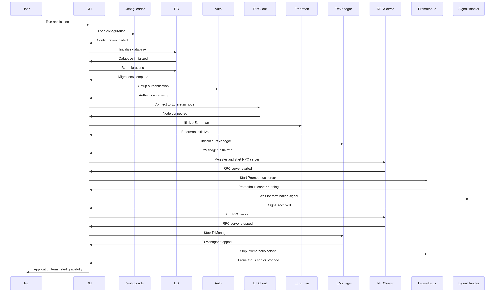

The AggLayer-go is a service designed to receive zero-knowledge (ZK) proofs  from various CDK chains and verify their validity before sending them to the L1 for final settlement.

!!! warning
    This service is being deprecated in favor of the more robust and efficient [Rust implementation](agglayer-rs.md).

## Architecture

The AggLayer Golang architecture supports interactions with multiple CDK chains for proof-verification. It uses a PostgreSQL database for storage and interacts with both L1 and L2 chains through configured RPC nodes.

The diagram below shows the full start-up, running, and shutdown sequence for the application and its components.

<center>

</center>

## Get started

### Run locally with Docker

1. Clone the repository:

    ```bash
    git clone https://github.com/AggLayer/agglayer-go
    ```

2. Execute the following command:

    ```bash
    make run-docker
    ```

## Production set up

1. Ensure only one instance of the AggLayer is running at a time.
2. Use a containerized setup, or OS level service manager/monitoring system, for automatic restarts in the case of failures.

### Prerequisites

#### Hardware

- For each CDK chain it's necessary to configure its corresponding RPC node, synced with the target CDK. 
- This node is for checking the state root after executions of L2 batches.
- We recommend a durable HA PostgresDB for storage, preferably AWS Aurora PostgreSQL or Cloud SQL for PostgreSQL in GCP.

#### Software

- Docker
- Docker Compose

### Installation

1. Clone the repository:

    ```bash
    git clone https://github.com/AggLayer/agglayer-go
    ```

2. Install Golang dependencies:

    ```bash
    go install .
    ```

### Configure key signing 

1. Install `polygon-cli`:

    ```bash
    go install github.com/maticnetwork/polygon-cli@latest
    ```

2. Create a new signature:

    ```bash
    polygon-cli signer create --kms GCP --gcp-project-id gcp-project --key-id mykey-tmp
    ```

3. Install `gcloud` CLI and set up ADC:

    ```bash
    gcloud auth application-default login
    ```

4. Configure `KMSKeyName` in `agglayer.toml`.

### Configure `agglayer.toml`

* `[FullNodeRPCs]` to point to the corresponding L2 full node.
* `[L1]` to point to the corresponding L1 chain.
* `[DB]` section with the managed database details.

## API

Refer to the `cmd` and `client` directories for API implementation details. Documentation and specific API routes can be generated from these sources.

---

For more information, visit the [AggLayer-go repository](https://github.com/AggLayer/agglayer-go).