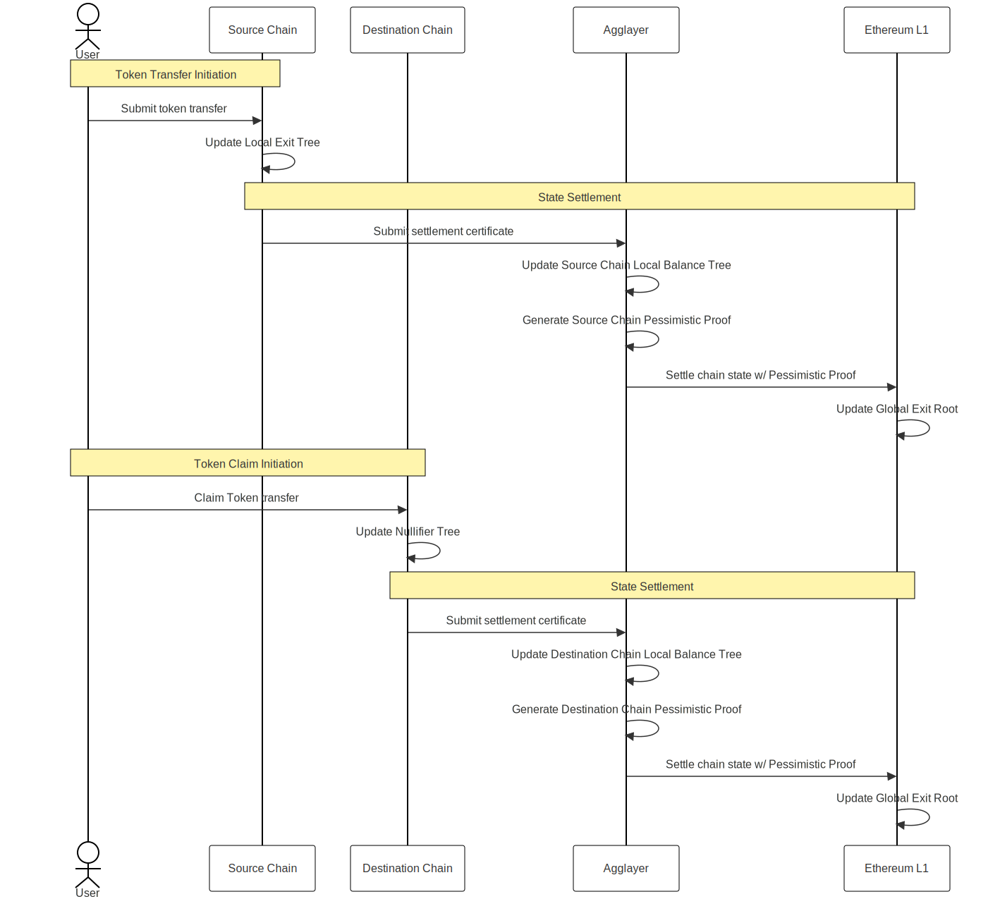

# Pessimistic Proof

## Overview
The pessimistic proof provides each chain connected to the AggLayer a way to cryptographically prove that any withdrawal claims made to the AggLayer are backed by deposits made to the unified bridge contract. The pessimistic proof is a novel ZK proof whose program logic is written in Rust and proven using the SP1 zkVM and the Plonky3 proving system.

## Design & Safety
The AggLayer is designed to be flexible enough to support blockchain architectures with different state transition functions, including Proof of Stake–style consensus or ZK rollups that use different proving systems.

The pessimistic proof does not extend security to chains integrated with the AggLayer; rather, each chain connected to the AggLayer is as secure as it would be if it were not integrated with the AggLayer.

The AggLayer uses per-chain pessimistic proofs to ensure a complete view of all token and message transfers occurring over the protocol. This allows chains that may not trust one another to safely interoperate.

## Building a Pessimistic Proof
For any cross-chain token transfer to be finalized such that the token may be withdrawn on the underlying L1, a valid pessimistic proof must be generated. Each chain connected to the AggLayer is required to provide some of the inputs necessary for building a valid pessimistic proof.

!!! note
      For more on how the Agglayer settles bridge claims to the underlying L1, see: [Unified Bridge](../architecture/unified-bridge/)

## Token State
Each chain maintains a data structure called a **Local Exit Tree**, which contains only the messages and token transfers originating from it. In the unified bridge, Ethereum holds a **Global Exit Root**, which represents a tree containing all of the Local Exit Roots of chains integrated with the AggLayer.

!!! note
      For a detailed breakdown of all data used by the Agglayer, see: [Unified Bridge: Data Structures](../../agglayer/architecture/unified-bridge.md#unified-bridge-data-structures)

In a simple token transfer, the source chain’s **Local Exit Tree** is used to reduce the balance of available tokens on its **Local Balance Tree**.

The **Local Balance Tree** is a sparse Merkle tree where each leaf represents the total amount of a particular token that is available to be withdrawn to the L1 from any individual chain.

For a simple token transfer, the Local Balance Tree of the **destination chain** must also be updated to increase the number of available tokens. This is done via a process called **importing a claim**.

Successfully importing a claim requires verification that the state of the source chain has first settled on the underlying L1.

Once verified, the AggLayer records a **Merkle proof** unique to that transfer in a **Nullifier Tree**, which acts as a record of all imported claims. The **Nullifier Tree** ensures that a token is claimed only once.

The **Local Balance Tree** and **Local Exit Root** are inputs for generating a pessimistic proof, which is then checked against the **Nullifier Tree**. A valid pessimistic proof allows the destination chain to prove to the AggLayer that its **Local Balance Tree** is valid with respect to both its own **Local Exit Tree** and the **Global Exit Root**.

The AggLayer then safely increases the token balance on the destination chain’s **Local Balance Tree** and updates the chain’s **Local Exit Root** on the L1.

## Chain State
Generating a pessimistic proof also requires the following inputs from both the source and destination chains:

- **Last Local Balance Root**: The last known state committed to and verified by the AggLayer.
- **Expected Local Balance Root**: The chain’s expected state after the token transfer.

With these inputs, the pessimistic proof cryptographically attests to two statements:

1. For both the source and destination chains:
   - `Last Local Balance Root ± Token Transfer = Expected Local Balance Root`
2. For the source chain:
   - `Available balance of a given token after transfer ≥ 0`

The first statement ensures that each chain has reached its latest state according to its state transition function. The second ensures that no chain is attempting to under-collateralize the unified bridge.

If the computation performed within the pessimistic proof is consistent, a valid proof is generated.

!!! note
      The Agglayer v0.2 allows rollups and validiums built with Polygon CDK to use the legacy settlement mechanism without generating a pessimistic proof.

