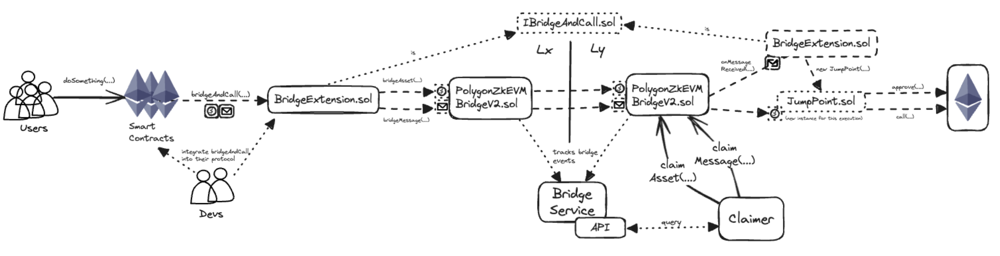

## Current unified bridge functionality

The unified bridge allows users/contracts to independently bridge an asset or bridge a message between AggLayer connected chains.

More complex operations such as bridge an asset and swap it for another asset, or bridge an asset and deposit it into a vault, require implementing custom logic. 

## Interim step

[chain indexer framework ??]

## New bridge and call functionality

The `bridgeAndCall` functionality supports these more complex operations by bridging a token with call data that is executed once bridged. A single call to bridge an asset also sends a message which executes a function.

<center>

</center>

## The `bridgeAndCall` function

```solidity
IBridgeAndCall(caller).bridgeAndCall(
  token, // the asset to bridge
  amount, // how much
  optionalPermitData, // instead of using approve
  destinationNetwork, // destination chain LxLy id
  callAddress, // target contract in the destination chain
  fallbackAddress, // in case of call error, fallback receives the asset
  callData, // the "message" (function+args)
  forceUpdateGlobalExitRoot // true to send this "ASAP"
);
```

The new [`BridgeExtension.sol`](https://github.com/AggLayer/lxly-bridge-and-call/blob/main/src/BridgeExtension.sol) contract exposes the [`bridgeAndCall(...)`](https://github.com/AggLayer/lxly-bridge-and-call/blob/2d83e96ff120fae7f1c8bb1fc1a6cb7f74afa4aa/src/BridgeExtension.sol#L33) function which has the logic for bridging an asset and, at the same time, passing `callData` which includes the logic for receiving the message and making the call to the target contract.

### Requirements and assumptions

- Instances of `BridgeExtension` must have the same address in all chains (because of how `CREATE2` works and we need to pre-compute the `JumpPoint` address).
  - This is achieved manually by making sure we deploy the proxy to the same address in all chains.
  - Non-manually, we have to keep track of all instances in all supported chains - for all instances of the `BridgeExtension`.

### Bridge and call process flow

#### `BridgeExtension.bridgeAndCall(...)`

1. Check what kind of asset is being bridged (i.e. is it more complex than a fungible asset).
2. Bridge the asset to a precomputed address (the `JumpPoint` address).
3. Create the message with the `callData` (and some additional information).
4. Bridge the message to the destination chain.

#### `claimAsset(...)` and `claimMessage(...)`

1. Claimer performs the claims (`claimAsset` must be executed before `claimMessage` or an error is thrown).
2. `claimAsset` transfers the asset to the `JumpPoint` address.
3. `claimMessage` calls the unified bridge's `BridgeExtension.onMessageReceived(...)` function.

#### `BridgeExtension.onMessageReceived(...)`

1. Decode the message.
2. Instantiate the `JumpPoint` for this execution (the address matches the precomputed one by using the same salt, arguments, and deployer address).

#### `new JumpPoint(...)`

1. Check what kind of asset was bridged.

  - If it is an ERC20, approve spending by the target contract.
  - Call the target contract with the callData.
  - Send the native gas token if it's not an ERC20.

2. In case of error, the asset is sent to a fallback address.
3. `JumpPoint` self-destructs (leaves no trace).

---

For more information, visit the [AggLayer bridge and call repository](https://github.com/AggLayer/lxly-bridge-and-call).
