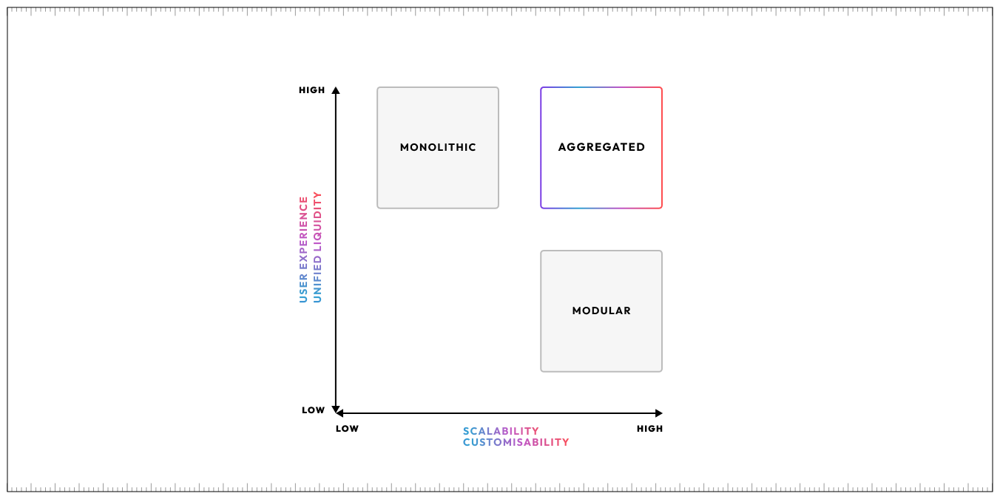
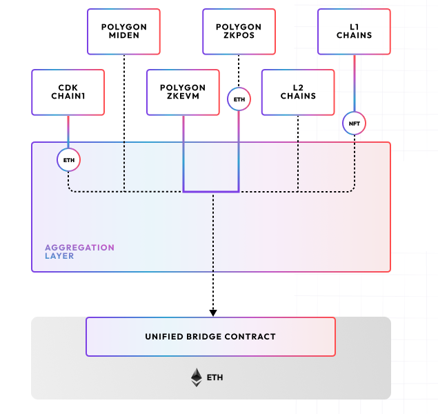
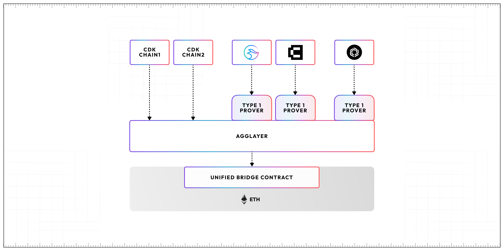

!!! info "Disclaimer"
    - Much of the content in this section is discussing technology in development and not ready for release.
    - Please check against the main documentation site for any live releases.
    - Feel free to experiment with any code in public repos.

## Welcome to AggLayer documentation

The culmination of Polygon Lab's innovation and design, AggLayer is an evolving ecosystem of zk-based (zero-knowledge) interacting chains. It addresses the current industry focus on interoperability and shared liquidity.

While most rollup environments follow a modular approach, where developers pick-and-choose components such as execution and data availability layers for example, the AggLayer vision is uniquely centered around zk-proof technology.

 
## AggLayer components

AggLayer connects CDK chains and provides a zero-knowledge prover for validity and security.

### Chain development kit (CDK)

- CDK chains connect to AggLayer.
- CDK chains are similar to other rollup stacks but enforce unique zk-based cryptographic proofs for transaction validation to ensure robust security and efficiency.
- Non-CDK chains will also eventually connect to AggLayer.

### AggLayer

- Running now on the unified bridge technology, AggLayer takes a many-to-many approach to CDK chain interactions which focuses on validity, interoperability, and security.
- It aggregates and batches proofs from multiple CDK chains into a single proof, significantly lowering the verification cost across chains as the ecosystem grows.

- AggLayer ensures seamless and correct ordering of cross-chain transaction execution and securely-shared liquidity across all zk-based chains.

### Provers

- Provers generate cryptographic proofs for zk-based chains that verify the validity of transactions.
- Ethereum smart contracts then validate those proofs.
- The cost of proof validation on Ethereum remains fixed regardless of the number of transactions.
- AggLayer offers a modular approach to provers. Options include the Polygon zkEVM prover technology and the SP1/Plonky 3 prover currently in development.

## What to expect

These documents introduce you to the current unified bridge technology that inspires and underpins AggLayer. 

We also document some of AggLayer's key technology in development now; such as the Go and Rust libraries, the bridge and call API, and Plonky prover technology. 

We also document a little about what the future has in store.
