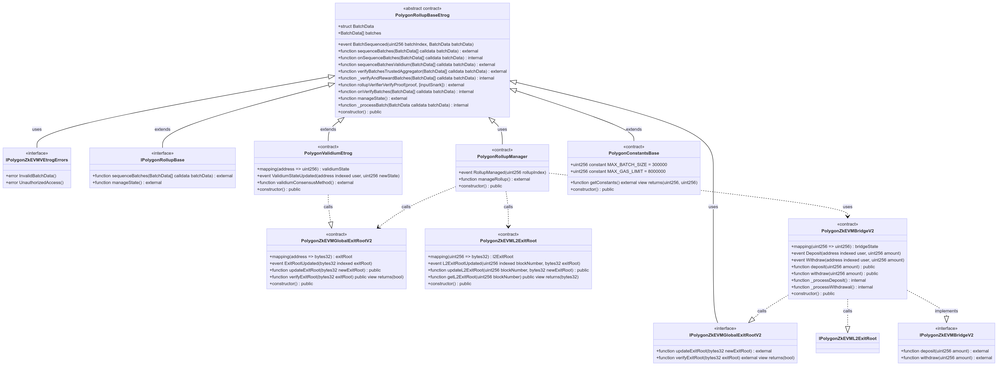
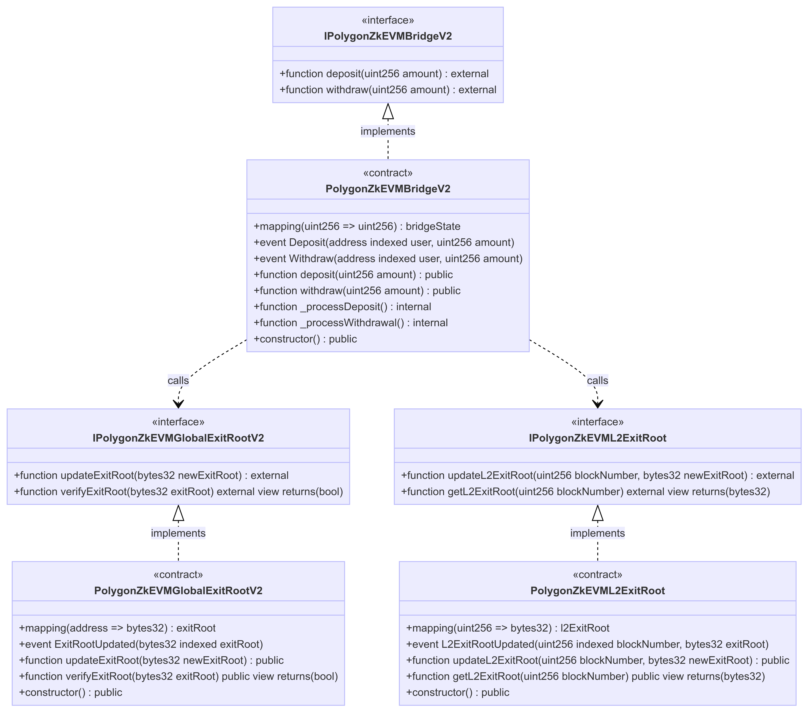
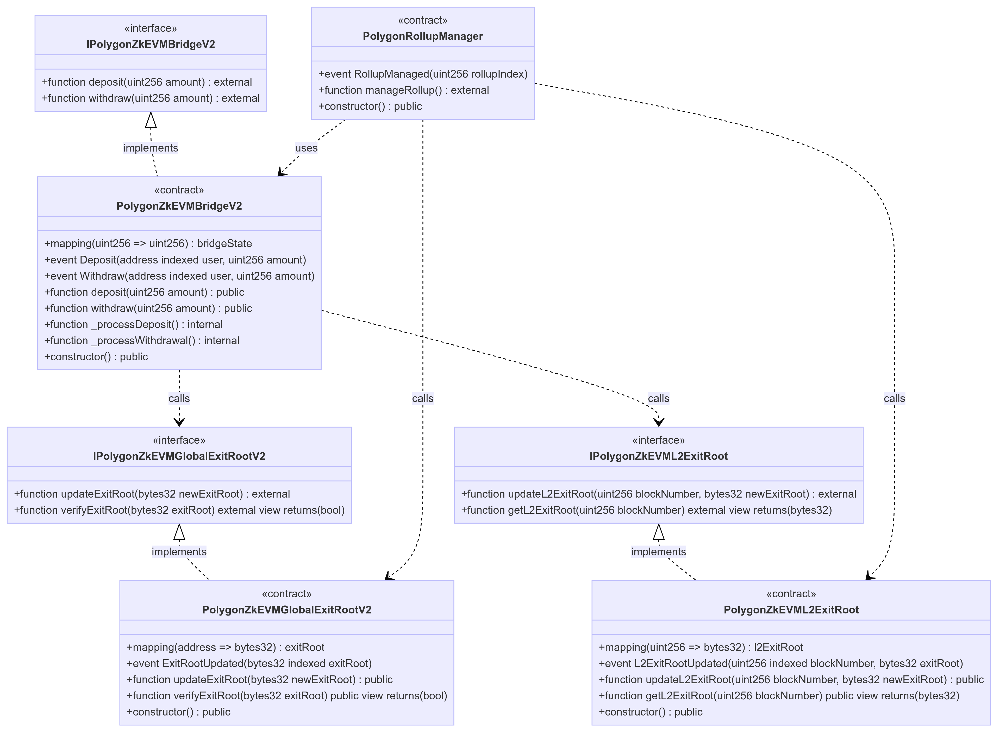

AggLayer's beginnings lie in the Polygon zkEVM unified bridge technology which was originally implemented for Polygon zkEVM. 

The unified bridge supports Ethereum scalability and interoperability by using advanced cryptographic techniques and Solidity smart contracts on L1 and L2. It facilitates secure cross-chain interactions and asset transfers, ensuring transaction throughput and integrity.

An Ethereum scalability solution, the unified bridge facilitates seamless L1-L2 interaction and relies on robust and secure zero-knowledge proofs.

!!! important "AggLayer smart contracts"
    - The [AggLayer smart contract repo](https://github.com/AggLayer/ulxly-contracts) differs in minor ways only to the [unified bridge smart contract rep](https://github.com/0xPolygonHermez/zkevm-contracts).

## Unified bridge architecture

The following class diagram depicts where the unified bridge functionality sits within the wider smart contract environment.

## Bridging mechanism

The bridging mechanism enables asset and data transfer between Ethereum (L1) and Polygon zkEVM (L2) via smart contracts. Detailed in the [zkEVM bridging documentation](../../zkEVM/architecture/high-level/smart-contracts/bridging.md), core components include the bridge and exit root Solidity smart contracts.

## Exit roots

Exit roots, cryptographic commitments representing system states, ensure integrity of the system as a whole. Refer to the [exit root documentation](../../zkEVM/architecture/high-level/smart-contracts/exit-roots.md) to understand the role of exit roots in state synchronization and fraud proofing.

## Main contracts

Critical to the zkEVM bridge, the consensus contracts govern core operations such as sequencing and verification. Learn more in the [main contract documentation](../../zkEVM/architecture/high-level/smart-contracts/main-contracts.md) where you can find more information on the consensus contracts and rollup manager, as well as unified bridge and exit root contracts.

### Sequencing

Sequencing maintains transaction order and integrity, encompassing transaction ordering and batch processing. Dive into the details via [smart contract sequencing documentation](../../zkEVM/architecture/high-level/smart-contracts/sequencing.md).

### Verification

Security is ensured through zk-proofs, verifying transaction correctness. Understand proof generation and validation in the [smart contract verification documentation](https://docs.polygon.technology/zkEVM/architecture/high-level/smart-contracts/verification/).

!!! tip "More information"
    Explore the unified bridge components and releases in some of the historical [zkEVM unified bridge documentation](../../zkEVM/architecture/protocol/unified-LxLy/lxly-bridge.md).

