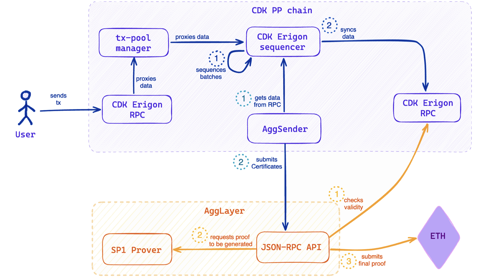
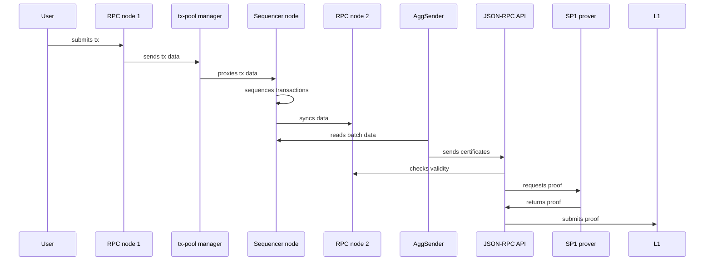

The figure below depicts a simplified, high level view of the CDK PP chain architecture, as well as the flow of transactions through the system.

## Transaction flow

Here is a step by step flow of transactions starting from when users submit transactions up to when the transactions are settled in L1. 

1. A user connects to the chain via a CDK Erigon RPC node and submits a transaction.
2. CDK Erigon RPC node sends the transaction data to the transaction-pool manager.
3. The transaction-pool manager proxies all transaction data to the CDK Erigon sequencer.
4. CDK Erigon sequencer executes transactions, puts the transactions in blocks
5. CDK Erigon sequencer syncs all transaction data with any CDK Erigon RPC node.
6. AggSender gets batch data from the CDK Erigon sequencer, uses the data to generate certificates, and submits the certificates to the JSON-RPC API.
7. The AggLayer RPC checks validity of the certificate by asserting that the balances of the bridge interactions are consistent with the liquidity of the chain
8. After validating the certificates, the JSON-RPC API sends a request to generate a proof, together with the necessary data (including the certificates), to the SP1 prover. 
9. Once the proof is received from the SP1 prover, the JSON-RPC API sends it to L1.  

## Sequential diagram

The flow of data is depicted in the squential diagram below. 

1. User submits a tx to the CDK Erigon RPC node.
2. The CDK Erigon RPC node sends tx data to the tx-pool man.
3. The tx-pool man proxies tx data to the CDK Erigon sequencer.
4. CDK Erigon sequencer executes transactions.
5. CDK Erigon sequencer syncs tx data with another CDK Erigon RPC node.
6. AggSender gets batch data from the CDK Erigon sequencer.
7. AggSender submits certificates to the JSON-RPC API.
8. JSON-RPC API checks validity of the certificates.
9. JSON-RPC API requests a proof from SP1 prover.
10. SP1 prover sends back a proof.
11. JSON-RPC API sends proof to L1.

