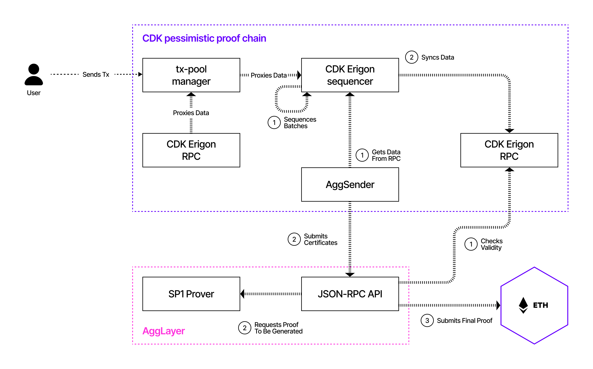

The figure below depicts a simplified, high-level view of the CDK chain architecture using pessimistic proofs and the flow of transactions through the system.

---

### Transaction Flow

Below is a step-by-step flow of transactions from user submission to settlement on Layer 1 (L1):

1. A user connects to the chain via a **CDK Erigon RPC node** and submits a transaction.
2. The **CDK Erigon RPC node** sends the transaction data to the **transaction-pool manager**.
3. The **transaction-pool manager** proxies all transaction data to the **CDK Erigon sequencer**.
4. The **CDK Erigon sequencer** executes transactions, organizes them into blocks, and batches the blocks for further processing.
5. Any **CDK Erigon RPC node** syncs transaction data from the **CDK Erigon sequencer**.
6. The **AggSender** retrieves batch data from the **CDK Erigon sequencer**, uses this data to generate certificates, and submits the certificates to the **Agglayer RPC**.
7. The **Agglayer RPC** validates the certificates against the transaction data stored in the **CDK Erigon RPC node**.
8. Upon validating the certificates, the **Agglayer RPC** sends a request to the **SP1 prover** to generate a proof, including the necessary data (e.g., certificates).
9. Once the proof is received from the **SP1 prover**, the **Agglayer RPC** submits it to L1 for final settlement.

---