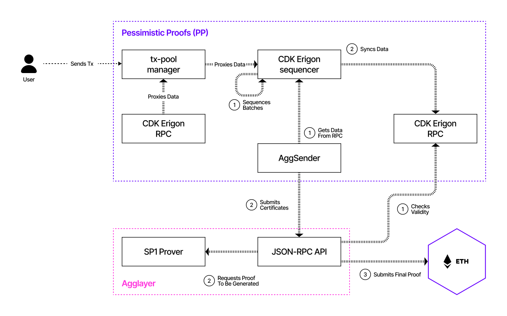
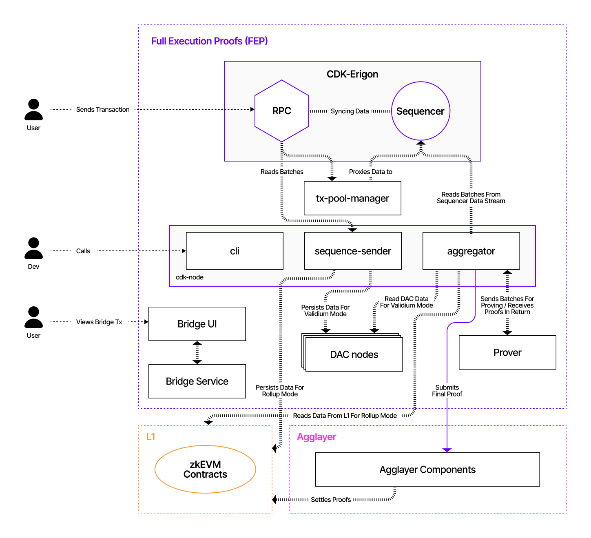
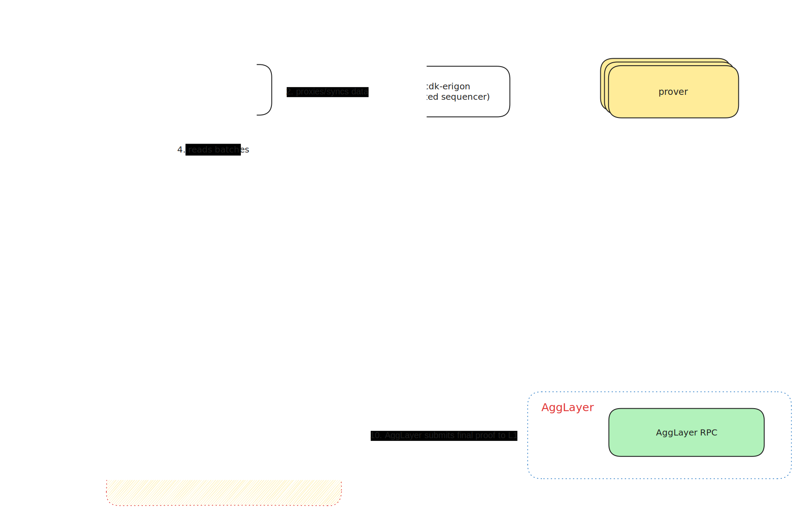
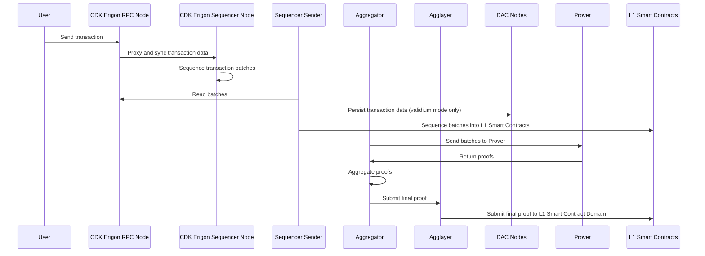

This section describes the core components and flow of the `cdk-erigon` configuration across its three main deployment modes: **sovereign**, **validium**, and **zkRollup**. These configurations vary primarily in data availability and prover setup, while sharing the same core Erigon-based client and bridge infrastructure.

## `cdk-erigon-sovereign`

| **Component** | **Description / Link** |
| --- | --- |
| **Execution + Consensus Layer** | [CDK-Erigon](https://github.com/0xPolygonHermez/cdk-erigon) — Combined Ethereum client for execution and consensus |
| **AggKit - Oracle** | [AggOracle](https://github.com/agglayer/aggkit) — Updates global Ethereum Root (GER) |
| **AggKit - Sender** | Sends certificates to Agglayer |
| **Bridge API** | [zkEVM Bridge Service](https://github.com/0xPolygonHermez/zkevm-bridge-service) — Enables messaging between chains |
| **Ethereum Bridge Contracts** | [zkEVM Contracts](https://github.com/0xPolygonHermez/zkevm-contracts) — Settlement layer contracts on Ethereum |
| **Agglayer Network** | [Agglayer](https://github.com/agglayer/agglayer) — Aggregation layer for certificates and proofs |
|  | Agglayer Node — Participates in Agglayer |
|  | Agglayer Prover — Generates validity proofs |

## `cdk-erigon-zkrollup`

| **Component** | **Description / Link** |
| --- | --- |
| **Execution + Consensus Layer** | [CDK-Erigon](https://github.com/0xPolygonHermez/cdk-erigon) |
| **Internal CDK Infrastructure** | Sequence Sender and Aggregator |
| **Bridge API** | [zkEVM Bridge Service](https://github.com/0xPolygonHermez/zkevm-bridge-service) |
| **Ethereum Bridge Contracts** | [zkEVM Contracts](https://github.com/0xPolygonHermez/zkevm-contracts) |
| **Data Availability Layer** | On-chain data submitted directly to Ethereum (no off-chain DAC) |
| **Agglayer Network** | [Agglayer](https://github.com/agglayer/agglayer), Agglayer Node |
| **Prover Network** | [Hermez Prover](https://github.com/0xPolygonHermez/zkevm-prover) — zk-SNARK based proof generator |

## `cdk-erigon-validium`
> 💡 **Note:** This mode shares the same architecture as `zkrollup`, but uses an alternative data availability (DA) layer.

| **Component** | **Description / Link** |
| --- | --- |
| **Execution + Consensus Layer** | [CDK-Erigon](https://github.com/0xPolygonHermez/cdk-erigon) |
| **Internal CDK Infrastructure** | Sequence Sender and Aggregator — build and send transaction batches |
| **Bridge API** | [zkEVM Bridge Service](https://github.com/0xPolygonHermez/zkevm-bridge-service) |
| **Ethereum Bridge Contracts** | [zkEVM Contracts](https://github.com/0xPolygonHermez/zkevm-contracts) |
| **Data Availability Layer** | [Custom DAC](https://github.com/0xPolygon/cdk-data-availability) — Off-chain data availability committee |
| **Agglayer Network** | [Agglayer](https://github.com/agglayer/agglayer), Agglayer Node |
| **Prover Network** | [Hermez Prover](https://github.com/0xPolygonHermez/zkevm-prover) — zk-SNARK based proof generator |

### User Data Flow

The following diagram sequentially depicts the user data flow for the CDK FEP config in validium mode using a mock prover and an Agglayer connection.

### Sequential Interactions

1. The user sends a transaction to the **CDK Erigon RPC node**.
2. The **CDK Erigon RPC node** proxies the data to the **CDK Erigon sequencer node** and syncs the batch data between the sequencer and the RPC nodes.
3. The sequencer sequences the transaction batches.
4. The **sequencer sender** reads batches from the RPC node.
5. In validium mode only, the sequencer sender persists transaction data into the **DAC nodes**.
6. The sequencer sender sequences the batches into the **L1 smart contracts**.
7. The **aggregator** reads batches from the sequencer data stream.
8. The aggregator sends batches to the **provers**.
9. The aggregator submits the final proof to the **Agglayer**.
10. The Agglayer submits the final proof to the **L1 smart contract domain**.

### Mermaid Sequence Diagram

