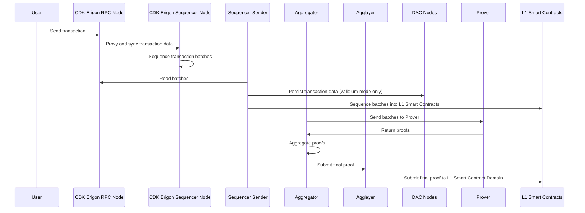

## 💻 Sovereign Mode (Live)

| Layer         | Component           | Description                              | Repository |
|---------------|----------------------|------------------------------------------|------------|
| CDK Stack    | CDK-Erigon           | Combined EL + CL client                  | [cdk-erigon](https://github.com/0xPolygonHermez/cdk-erigon) |
| Aggkit       | AggOracle            | GER update component                     | [aggkit](https://github.com/agglayer/aggkit) |
|              | AggSender            | Sends certificates to Agglayer           | — |
|              | Bridge API           | Cross-chain messaging                    | [bridge-service](https://github.com/0xPolygonHermez/zkevm-bridge-service) |
| DA           | Agglayer             | Native Agglayer connectivity             | [agglayer](https://github.com/agglayer/agglayer) |
| Contracts    | Ethereum Bridge      | Final settlement                         | [zkevm-contracts](https://github.com/0xPolygonHermez/zkevm-contracts) |

## 🧪 Validium Mode

| Layer         | Component           | Description                              | Repository |
|---------------|----------------------|------------------------------------------|------------|
| CDK Stack    | CDK-Erigon           | EL + CL client                           | [cdk-erigon](https://github.com/0xPolygonHermez/cdk-erigon) |
| CDK          | Aggregator           | Handles sequencing                       | — |
|              | Sequence Sender      | Submits blocks to DA                     | — |
|              | Bridge API           | Messaging layer                          | [bridge-service](https://github.com/0xPolygonHermez/zkevm-bridge-service) |
| DA           | Custom DAC           | Off-chain DA                             | [cdk-data-availability](https://github.com/0xPolygon/cdk-data-availability) |
|              | Agglayer             | Messaging/bridge layer                   | [agglayer](https://github.com/agglayer/agglayer) |
| Prover       | Hermez Prover        | zk-SNARK based prover                    | [zkevm-prover](https://github.com/0xPolygonHermez/zkevm-prover) |
| Contracts    | Ethereum Bridge      | Final settlement                         | [zkevm-contracts](https://github.com/0xPolygonHermez/zkevm-contracts) |

## 🔒 zkRollup Mode

| Layer         | Component           | Description                              | Repository |
|---------------|----------------------|------------------------------------------|------------|
| CDK Stack    | CDK-Erigon           | EL + CL client                           | [cdk-erigon](https://github.com/0xPolygonHermez/cdk-erigon) |
| CDK          | Aggregator           | Handles sequencing                       | — |
|              | Sequence Sender      | Submits blocks to L1                     | — |
|              | Bridge API           | Messaging layer                          | [bridge-service](https://github.com/0xPolygonHermez/zkevm-bridge-service) |
| DA           | Ethereum DA          | On-chain data storage                    | — (uses Ethereum L1) |
|              | Agglayer             | Messaging/bridge layer                   | [agglayer](https://github.com/agglayer/agglayer) |
| Prover       | Hermez Prover        | zk-SNARK based prover                    | [zkevm-prover](https://github.com/0xPolygonHermez/zkevm-prover) |
| Contracts    | Ethereum Bridge      | Final settlement                         | [zkevm-contracts](https://github.com/0xPolygonHermez/zkevm-contracts) |

### User Data Flow

The following diagram sequentially depicts the user data flow for the CDK FEP config in validium mode using a mock prover and an Agglayer connection.

---

### Sequential Interactions

1. The user sends a transaction to the **CDK Erigon RPC node**.
2. The **CDK Erigon RPC node** proxies the data to the **CDK Erigon sequencer node** and syncs the batch data between the sequencer and the RPC nodes.
3. The sequencer sequences the transaction batches.
4. The **sequencer sender** reads batches from the RPC node.
5. In validium mode only, the sequencer sender persists transaction data into the **DAC nodes**.
6. The sequencer sender sequences the batches into the **L1 smart contracts**.
7. The **aggregator** reads batches from the sequencer data stream.
8. The aggregator sends batches to the **provers**.
9. The aggregator submits the final proof to the **Agglayer**.
10. The Agglayer submits the final proof to the **L1 smart contract domain**.

---

### Mermaid Sequence Diagram

