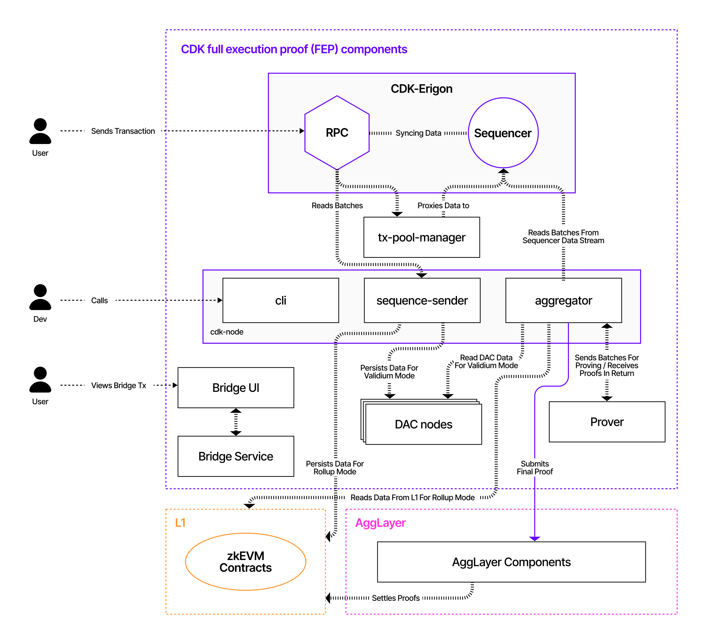

The diagram below depicts a simplified architectural layout of the CDK FEP config and indicates at a high level how components communicate.



---

### Component Interactions

- The **CLI tool** is the starting point. Developers, or chain administrators in particular, use the CLI tool to build and configure chains in various modes of operation, such as validiums and rollups.
- Once a chain is configured with the CLI, users can submit transactions through the **CDK Erigon RPC node**. These transactions are relayed to the `tx-pool manager` before the sequencer selects and executes them.
- The **sequencer** sequences transaction batches and synchronizes data with the **RPC node**.
- The **sequencer sender** reads batch data from the RPC node.
- The **aggregator** reads batch data from the sequencer data stream.
- The sequencer sender persists data into the **L1 smart contract domain** for rollup mode and into **DAC nodes** for validium mode operations.
- The aggregator sends batches to the **prover** and receives proofs in return. Together with the prover, it aggregates the proofs into batches before submitting the final proofs to the **Agglayer** or L1, depending on the chosen settlement layer.
- Users interact with the **bridge service** via the **bridge UI** or **API**.
- The Agglayer verifies proofs and interacts with the **L1 smart contracts**.

---

### User Data Flow

The following diagram sequentially depicts the user data flow for the CDK FEP config in validium mode using a mock prover and an Agglayer connection.


---

### Sequential Interactions

1. The user sends a transaction to the **CDK Erigon RPC node**.
2. The **CDK Erigon RPC node** proxies the data to the **CDK Erigon sequencer node** and syncs the batch data between the sequencer and the RPC nodes.
3. The sequencer sequences the transaction batches.
4. The **sequencer sender** reads batches from the RPC node.
5. In validium mode only, the sequencer sender persists transaction data into the **DAC nodes**.
6. The sequencer sender sequences the batches into the **L1 smart contracts**.
7. The **aggregator** reads batches from the sequencer data stream.
8. The aggregator sends batches to the **provers**.
9. The aggregator submits the final proof to the **Agglayer**.
10. The Agglayer submits the final proof to the **L1 smart contract domain**.

---

### Mermaid Sequence Diagram

```mermaid
sequenceDiagram
    participant User
    participant ErigonRPC as CDK Erigon RPC Node
    participant Sequencer as CDK Erigon Sequencer Node
    participant SeqSender as Sequencer Sender
    participant Aggregator
    participant Agglayer
    participant DACNodes as DAC Nodes
    participant Prover
    participant L1 as L1 Smart Contracts

    User->>ErigonRPC: Send transaction
    ErigonRPC->>Sequencer: Proxy and sync transaction data
    Sequencer->>Sequencer: Sequence transaction batches
    SeqSender->>ErigonRPC: Read batches
    SeqSender->>DACNodes: Persist transaction data (validium mode only)
    SeqSender->>L1: Sequence batches into L1 Smart Contracts
    Aggregator->>Prover: Send batches to Prover
    Prover->>Aggregator: Return proofs
    Aggregator->>Aggregator: Aggregate proofs
    Aggregator->>Agglayer: Submit final proof
    Agglayer->>L1: Submit final proof to L1 Smart Contract Domain