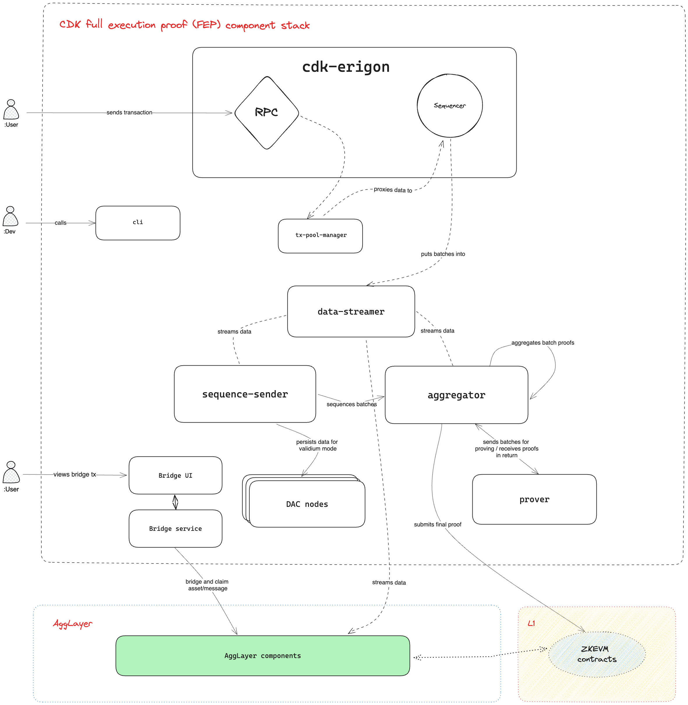
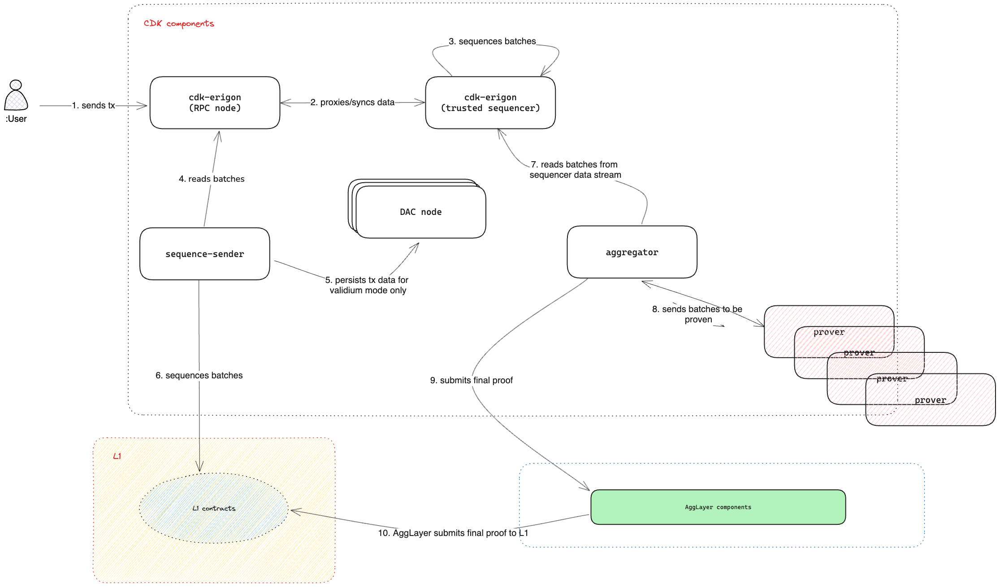
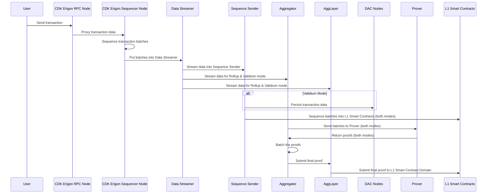

## CDK full execution proof (FEP)

The following diagram depicts the CDK FEP stack component layout and details some of the high level communication between components.

### Component interactions

- Engineers use a CLI to manage the backend components, installing and initializing various modes of operation, such as validium versus rollup for example.
- External applications send transactions to the CDK Erigon RPC node which forwards the transaction data to the sequencer via the transaction pool manager.
- The transaction pool manager proxies manages the transactions coming in from the RPC node and streams the data onto the sequence sender.
- The sequencer sequences transactions batches and puts them into the data streamer.
- The data streamer streams data to the sequencer sender and the aggregator.
- The sequencer sender sequences batches into the L1 smart contract domain and persists data into DAC nodes for validium mode operations.
- The aggregator sends batches to the prover and receives proofs in return. It then aggregates the proofs into batches before submitting them to the AggLayer or L1, depending on the chosen settlement layer.
- Users interact with the bridge service via the bridge UI.
- The AggLayer also utilizes the bridge service and interacts with the L1 smart contracts.

### User data flow

The following diagram is a sequential depiction of the user data flow for the CDK FEP stack in validium mode using a mock prover and having an AggLayer connection.

#### Sequential interactions

1. User sends a transaction to the CDK Erigon RPC node.
2. The Erigon RPC node proxies the data to the CDK Erigon sequencer node.
3. The sequencer sequences the transaction batches.
4. The sequencer puts the batches into the data streamer component.
5. The data streamer component streams the data into the sequence sender. It streams data into the aggregator and AggLayer for rollup and validium mode stacks. 
6. In validium mode, the sequencer sender persists transaction data into the DAC nodes.
7. In both modes, the sequencer sender sequences the batches into the L1 smart contracts.
8. In both modes, the aggregator sends the batches to the prover and the prover returns the proofs.
9. The aggregator batches the proofs.
10. The aggregator submits the final proof to the AggLayer.
11. The AggLayer submits the final proof to the L1 smart contract domain.

!!! tip
    Detailed AggLayer flows will be published soon.
