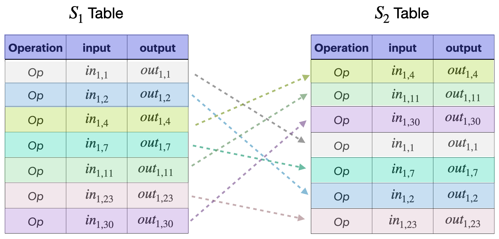

<!--
---
comments: true
---
-->

Since each STARK module is like a small state machine where its state transition can be uniquely captured in the form of a table, called the `execution trace`, the STARK modules are henceforth also referred to as _STARK tables_. See the repo for further details of each table [here](https://github.com/0xPolygonZero/plonky2/tree/main/evm/spec/tables).

For each STARK table, ordinary STARK proof and verification are used to check if all state transitions occurring in the module satisfies stipulated constraints.

However, there are input and output values shared among the tables. These values need to be checked for possible alterations while being shared among tables. For this purpose, _cross-table lookups_ (CTLs) are used in verifying that the shared values are not tampered with.

## How CTLs work

The CTL protocol is based on the [logUP argment](https://eprint.iacr.org/2022/1530.pdf), which works similar to how range-checks work. Range-checks are discussed in a subsequent document to this one.

### Example (CTL)

Consider the following scenario as an example. Suppose STARK $S_2$ requires an operation -- say $Op$ -- that is carried out by another STARK $S_1$.

Then $S_1$ writes input and output values of $Op$ in its own table, and provides these two values as inputs to STARK $S_2$.

Now, STARK $S_2$ also writes the input and output values in its rows, and the table's constraints check if $Op$ is carried out correctly.

However, one still needs to ensure that the input and output values in $S_1$ are the same as those shared with $S_2$.

In other words, and in cases where the $S_1$ and $S_2$ tables have many rows individually, one needs to ensure that all the rows of the $S_1$ table involving $Op$ appear amongst the rows of the $S_2$ table.

Note that, for the sake of efficiency, the $S_1$ and $S_2$ tables are first reduced to the input and output columns.

And thus, this check is tantamount to ensuring that the rows of the $S_1$ table involving $Op$ are but permutations of the rows of $S_2$ that carry out $Op$.

## How the CTL proof works

As outlined in the above example, verifying that shared values among STARK tables are not tampered with amounts to proving that rows of reduced STARK tables are permutations of each other.

The proof therefore is achieved in three steps;
   
   - Filtering rows of interest in both STARK tables.
   
   - Computing column-wise 'running sums'.

   - Checking correct construction and equality of 'running sums'.

### Table filtering

Define filters $f^1$ and $f^2$ for STARK tables $S_1$ and $S_2$ , respectively, such that

$$
\begin{equation}
 f^i (row_j) = \begin{cases}
   1, & \text{if $row_j$ carries out $Op$}.\\
   0, & \text{otherwise}.
   \end{cases}
\end{equation}
$$

for $i \in \{ 0, 1 \}$ and $0 < j < n_i$, where $n_i$ is $S_i$'s number of rows. So, each filter $f^i$ evaluates to either $0$ or $1$.

Next create subtables $S_1'$ and $S_2'$ of STARK tables $S_1$ and $S_2$ , respectively, such that $f^i(row_j) = 1$ for all $row_j$ of $S_i'$.

!!!note
    
    Columns $\{ c^{i,j} \}$ of the filtered subtables $S_i'$ only contains values that must be identical (these are shared input and output values.)

    Let $\alpha$ and $\beta$ be random challenges which in an interactive setting the verifier sends to the prover.

    Filters are limited to (at most) degree 2 combinations of columns.

### Computing running sums

For each $i \in \{0,1\}$, let $\{ c^{i,j} \}$ denote the columns of $S_i'$.

Define a _running sum_ $Z_i^{S_i}$ for $S_i'$ as follows,

$$
Z_{n-1}^{S_i} = \frac{1}{\sum_{j=0}^{m-1}\alpha^j \cdot c_{n-1}^{i,j} + \beta}
$$

and

$$
Z_l^{S_i} = Z_{l+1}^{S_i} - f_l^i \cdot \frac{1}{\sum_{j=0}^{m-1}\alpha^j \cdot c_l^{i,j} + \beta}
$$

for $0 < l < n-1$.

Note that $Z_l^{S_i}$ is computed backwards. i.e., It starts with $Z_{n-1}^{S_i}$ and goes down to $Z_0^{S_i}$ as the final sum.

### Checking running sums

After computing running sums, check equality of the final sums $Z_0^{S_1} =?\ Z_0^{S_2}$ and whether the running sums were correctly constructed.

The above three steps turn the CTL argument into a [LogUp lookup argument](https://eprint.iacr.org/2022/1530.pdf), where

- the STARK table $S_1'$ is the looking table
- the STARK table $S_2'$ is the looked table

which checks for equality between $S_1'$ and $S_2'$.

## CTL protocol summary

The cross-table protocol can be summarized as follows. 

For any STARK table $S$, the prover:
  
-  Constructs the `looking sums`, which are the running sums $\{Z_j^l\}$ for each table looking into $S$.
- Constructs the `looked sum`, which is the running sum $Z^S$ for $S$.
- Sends all the final values $\{Z_{j,0}^l\}$ and $Z_0^S$ to the verifier.
- Sends a commitment to the `looking sums` $\{Z_{j}^l\}$ and the `looked sum` $Z^S$ to the verifier.

On the other side, and for the same STARK table $S$, the verifier:
  
- Computes the sum $Z = \sum_j Z_{j}^l$.
- Checks equality, $Z =?\ Z_0^S$.
- Checks whether each of the running sums $Z_{j}^l$ and $Z^S$ were correctly constructed. 