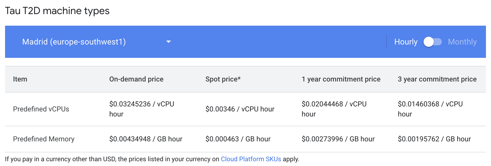

## Testing the prover

Find a parser and test runner for testing compatible and common Ethereum full node tests against the Polygon type 1 prover [here](https://github.com/0xPolygonZero/evm-tests).

The prover passes all relevant and official [Ethereum tests](https://github.com/ethereum/tests/).

## Proving costs

Instead of presenting gas costs, we focus on the cost of proving EVM transactions with the Polygon type 1 prover.

Since the prover is more like a 'CPU' for the EVM, it makes sense to look at proving costs per VM instance used, as opposed to TPS or other benchmarks.

Consider the table below for prices of GCP's specific instances, taken from [here](https://cloud.google.com/compute/all-pricing), and webpage accessed on the 29th January, 2024. 

Take the example of a t2d-standard-60 GCP instance, where each vCPU has 4GB memory, based on GCP's Spot prices:

- 0.00346 USD / vCPU hour
- 0.000463 USD / GB hour

We obtain the following hourly cost, $(60 \times 0.00346) + (240 \times 0.000463) = 0.31872$ USD per hour. The total cost per block is given by: $\texttt{(Proving time per hr)} \times 0.31872$ USD.

The table below displays proving costs per transaction per hour.

| Block number                                    | Transactions | Gas        | Proof time (minutes) | Total cost (USD) | Cost per tx (USD)|
| ----------------------------------------------- | ------------ | ---------- | -------------------- | ---------- | ----------- |
| [17106222](https://etherscan.io/block/17106222) | 105          | 10,781,405 | 44.17                | $0.235     | $0.0022     |
| [17095624](https://etherscan.io/block/17095624) | 163          | 12,684,901 | 78.12                | $0.415     | $0.0025     |
| [17735424](https://etherscan.io/block/17735424) | 182          | 16,580,448 | 100.52               | $0.534     | $0.0029     |
