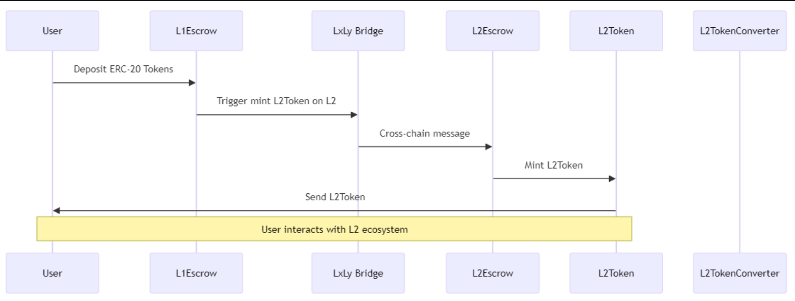

The LxLy bridge is the native bridging infrastructure for all CDK chains. The way it works is each individual CDK chain deploys an instance of the LxLy bridge that connects to an L1 (Ethereum by default) by deploying contracts that carry out deposit and withdrawal of assets, along with escrow management. These contracts are managed by node operators corresponding to the respective CDK chains.

This changes as the AggLayer v1 goes online, and introduces an upgrade to the existing LxLy architecture in the form of a _unified instance_ of the LxLy bridge that multiple chains can connect to.

## What's "unified" bridge?

Polygon AggLayer envisions a scalability solution that leverages shared state and unified liquidity across multiple ZK-powered chains within the Polygon ecosystem, all powered by the CDK infrastructure.

!!! tip "What's AggLayer?"

    Want to learn more about what AggLayer is and what it looks to achieve? Check out [the AggLayer documentation in the Learn space](../../learn/agglayer.md).

All of this cool infrastructure needs a unified channel for easy transmission of assets and messages between the multiple chains connected via the AggLayer. And this is where the **unified bridge** comes into play. It allows all chains to take advantage of the AggLayer's unified liquidity, lower transaction costs, and more.

!!! tip "Lxly vs unified bridging TL;DR"

    - **LxLy bridge:** A ZK bridge that supports asset and message transfers between a zkEVM system and the L1, typically Ethereum.
    - **Unified bridge:** A specific instance of an LxLy bridge that allows several chains to connect to it. This instance is specific to the AggLayer v1.  

The new unified model of the LxLy bridge introduced as a part of the AggLayer v1 infrastructure has one significant difference from the existing LxLy bridge: any asset bridged onto a CDK chain using the unified bridge is held by the the **Unified Escrow** (also referred to as the **Master Escrow**) contract instead of a dedicated bridge contract.

!!! info

    The Master Escrow contract is managed and governed by the Polygon zkEVM team.

Due to the shared nature of the bridge, chain operators will not have admin access to the funds locked in the master escrow contract, including the funds that belong to their own network. 

The ability to manage bridge reserves is crucial to implement restaking for yield generation and other similar use cases. How does the unified bridge address this?

## Introducing "Stake the Bridge"

**Stake the Bridge**, or **STB**, is a feature that lets CDK chain operators maintain control over the assets that are deposited to their respective networks.

### Design and implementation

On L1, CDK chains enable STB for an asset by deploying STB contracts on L1 to create an alternative [`L1Escrow`](https://github.com/pyk/zkevm-stb/blob/main/src/L1Escrow.sol) account that holds the asset, and allows the CDK chain operator to manage this token reserve.

On L2 (the CDK chain), there are three components needed to make this work:

- [`L2Token`](https://github.com/pyk/zkevm-stb/blob/main/src/L2Token.sol), which is a natively deployed ERC20 contract.
- [`L2Escrow`](https://github.com/pyk/zkevm-stb/blob/main/src/L2Escrow.sol), a contract that manages the L2Token's supply.
- **[`L2TokenConverter`](https://github.com/pyk/zkevm-stb/blob/main/src/L2TokenConverter.sol), the contract that enables converting bridge-wrapped tokens to natively-minted tokens on L2.

!!! info

    Each token needs to have its own set of STB contracts that perform the functions described above.

Let's briefly go over the specific actions and characteristics of each STB contract on L1 and L2.

#### `L1Escrow`

- Defines investment strategies.
- Sending token issuance messages to `L2Escrow`.
- Fulfilling redemption messages from `L2Escrow`.

#### `L2Escrow`

- Receives minting instructions from `L1Escrow` via the unified bridge upon token deposit, and prompts `L2Token` contract to mint assets to a given address on L2.
- Burns the native asset on L2 and sends minting instructions to `L1Escrow` to release assets on L1.

#### `L2Token`

- Natively mints L2 tokens and sends them to a designated address.
- Interfaces with the `L2TokenConverter` contract.

#### `L2TokenConverter`

- Supports 1:1 conversion between the STB minted native tokens, and the bridged tokens minted by depositing tokens to LxLy bridge directly on L1.
- Doesn't have a default cap on the token volume that can be converted, can be added by chain operators as necessary.
- An asset can have multiple token converters that can have different properties.

## Roles and responsibilities

There are three roles, each of which performs specific actions to manage the STB system:

- Admin: Can upgrade and pause the system.
- Escrow manager: Can withdraw token backing from the respective escrow contract to invest using the `managerWithdraw()` function.
- Risk manager: Can invoke `setIssuanceCap()` multiple times to increase or reduce the issuance cap.

## STB transaction flow vs. existing LxLy flow

With the STB contracts set up on L1 and L2 for a particular CDK chain, the bridging UX for a user doesn't differ from what it would be if they were carrying it out using the existing LxLy bridge. Let's consider an example using the following tokens:

- USDC - L1
- USDC.e - L2
- LxLy USDC

The diagram above illustrates the following flow:

1. A user initiates a **USDC** deposit from L1 to L2.
2. Instead of being deposited directly to the unified bridge, the **USDC** is deposited into the STB `L1Escrow` contract.  
3. The STB `L1Escrow` locks the USDC and passes a message to the unified messenger containing the user’s address and amount of USDC being bridged.  
4. The `Messenger` contract validates the message and then sends it to the STB `L2Escrow`.    
5. The STB `L2Escrow` receives the message and mints USDC.e from the `L2Token` contract. 
6. The USDC.e is sent to the user's address on L2. 

### Native token conversion

With the introduction of STB, there are now two ways to deposit tokens to an L2 CDK chain, and two distinct resultant tokens:

- The STB flow involves locking tokens in the L1Escrow contract, which is followed by the minting of USDC.e on L2.
- On the other hand, if the tokens are deposited directly into the LxLy bridge contract, it results in the minting of LxLy USDC on L2.

The `L2TokenConverter` facilitates conversion between **USDC.e** and **LxLy USDC**. The way it works is by locking (Deposit function) either of the tokens in the converter contract, and then sending (Withdraw function) the equivalent amount of the other token to the user's wallet.

## Using the STB contracts

The STB contracts grant chain operators control over the token backing in the escrow contracts for all the chains that connect to the Polygon ecosystem via the AggLayer.

!!! note

    Polygon Labs **does not** manage or facilitate the investing of the funds locked in the escrow contracts. The management of funds to implement any investment strategies and risk profiles is completely at the discretion of the chain operators and owners.

Bridging tokens to L2 CDK chains using the STB contracts is ideal for the following use cases:

- Coins that need to implement staking and yield generation mechanisms.
- Coins that need to implement custom L2 functionality.
- Coins that possess native issuance capabilities.

Want to start testing with STB? The contracts are still being audited, but are ready to use on testnets, and can be found here: https://github.com/pyk/zkevm-stb. 