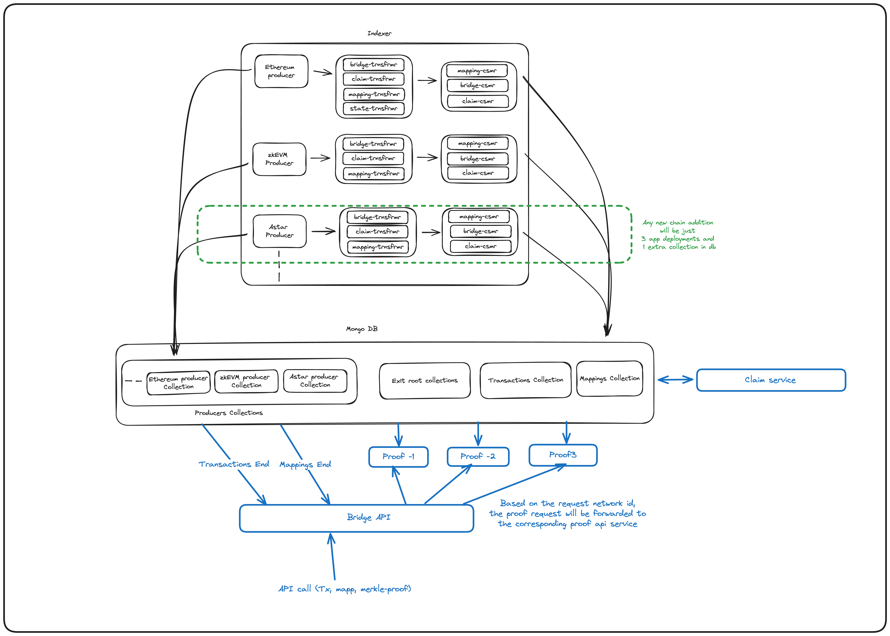

## Introduction

The Unified Bridge API powers the [Polygon portal](https://portal.polygon.technology/) which consists in a set of endpoints that track the status of bridge transactions over all Polygon chains in real time and exposes the data to the user.

The API is built using the [chain indexer framework](../../tools/chain-indexer-framework/overview.md). 

The Unified Bridge API indexes data from Polygon PoS, Polygon zkEVM, Ethereum mainnet and testnets. The service also indexes CDK chains.

## Architecture



[Chain indexer framework](../../tools/chain-indexer-framework/overview.md) is the backend technology that runs the Unified Bridge API. The framework consists of three main components:

### Producer

To index data, the producer reads raw blockchain data from a specific chain and writes it to an [Apache Kafka](https://kafka.apache.org/documentation/) queue.  

The block data indexed by the service can be used for multiple use cases; not just for bridge related scenarios. 

Reorgs are handled at the producer level but only if the reorg height is less than 256 blocks. Anything above that requires the team to manually trigger a resync.

### Transformer

The transformer subscribes to specific topics on the Kafka queue and transforms the data into a different format. 

For the bridge service use case, the transformer filters bridge and claim events coming in from the producer, transforms the information into a more readable format, and pushes it to corresponding Kafka topics.

### Consumer

This component consumes the transformed data from the queue and writes it into a database which is accessible to users via API endpoints.

### Deploying the components

The infrastructure for the three components has to be deployed for each chain. This means that every new CDK chain must have a new producer, transformer, and consumer. Once these are deployed, the API endpoints can start exposing data for the chain. 

## Endpoints

The endpoints are common for all CDK chains. 

### Network ids

Transaction data belonging to a specific chain is identified using either the `destinationNetwork` and `sourceNetwork` parameters which are included in every endpoint response. 

- ETH = 0
- zkEVM = 1
- CDK chains = >1 (including testnets) 

### Transactions API

This API manages the details of a bridge transactions initiated from, or incoming to, a user’s `walletAddress`. Details include the real time status, the token bridged, the amount, the source and destination chain, etc. For example:

- Testnet: [https://api-gateway.polygon.technology/api/v3/transactions/testnet?userAddress=](https://api-gateway.polygon.technology/api/v3/transactions/testnet?userAddress=)`walletAddress`
- Mainnet: [https://api-gateway.polygon.technology/api/v3/transactions/mainnet?userAddress=](https://api-gateway.polygon.technology/api/v3/transactions/mainnet?userAddress=)`walletAddress`
    
!!! tip
    - Additional filtering can be performed on the transactions API by including the `sourceNetworkIds` and `destinationNetworkIds` query parameters.
    
### Merkle Proof API

This API manages the payload needed to process claims on the destination chain. For example:

- Testnet: [https://api-gateway.polygon.technology/api/v3/merkle-proof/testnet?networkId=](https://api-gateway.polygon.technology/api/v3/merkle-proof/testnet?networkId=sourceNetworkId&depositCount=depositCount)`[sourceNetworkId](https://bridge-api-mainnet-dev.polygon.technology/merkle-proof?networkId=1&depositCount=1)`[&depositCount=](https://api-gateway.polygon.technology/api/v3/merkle-proof/testnet?networkId=sourceNetworkId&depositCount=depositCount)`[depositCount](https://bridge-api-mainnet-dev.polygon.technology/merkle-proof?networkId=1&depositCount=1)`
- Mainnet: [https://api-gateway.polygon.technology/api/v3/merkle-proof/mainnet?networkId](https://api-gateway.polygon.technology/api/v3/merkle-proof/mainnet?networkId)[=`sourceNetworkId`&depositCount=`depositCount`](https://bridge-api-mainnet-dev.polygon.technology/merkle-proof?networkId=1&depositCount=1)
    
!!! tip
    - Use the Transactions API to get `sourceNetworkId` and `depositCount` data for a given bridge transaction. 
    
## Onboarding a new CDK

New CDK implementation providers must supply the following mandatory parameters:

- Public RPC
- Chain ID
- Chain name
- Chain logo
- Dedicated RPC: This is _really important_ as the indexer requires it to index all data coming from the CDK chain.
- Block explorer URL
- Bridging contracts address

!!! important
    - The above are mandatory expectations from any CDK implementation provider. 
    - At the time of writing, the Polygon Labs team coordinates additional steps for full implementation.

## Deeper dive into the bridging workflow

To understand why the API requires the mandatory onboarding parameters, let's examine the workflow of the Unified Bridge API and some of the components it interacts with.

### `lxly.js` client library 

The [LxLy SDK](https://www.npmjs.com/package/@maticnetwork/lxlyjs) is a JavaScript library that contains all prebuilt functions required for interacting with the bridge contracts.

Initialize the library with the bridge contract address, RPC URL, and network id to access type conversion, formatting, error handling, and other processes to make it easy for a developer to invoke bridge, claim, and many other functions required for bridging. 

The SDK can be used for any compatible chain with no additional changes. 

#### Common use cases

- L1 to L2 (Ethereum to CDK L2 chain).
- L2 to L2 (zkEVM to CDK L2 chain).
- L2 to L1 (CDK L2 chain to Ethereum).

### Unified Bridge API

The backend service as [explained previously](#unified-bridge-api). 

The repository to spin up this service is not yet open source and is currently managed by the Polygon Labs team. The code is expected to be open source soon, at which time all participants will manage their own deployments.

### Gas station 

In order to estimate the gas price before submitting the transactions, we use the [Polygon gas station](../../tools/gas/polygon-gas-station.md), a lightweight service which gets gas price estimates for a specific chain.

The gas station is currently maintained by the Polygon Labs team, but can be hosted by anyone as the [code is open source](https://github.com/maticnetwork/maticgasstation).

### Token list

This is a [json-formatted list](https://github.com/maticnetwork/polygon-token-list) containing metadata for all supported tokens. 

It automatically updates with new token details whenever one is bridged for the first time. However, logos or other metadata types need to be added or updated via a PR. 

### Balance API

This service relies on a [balance scanner contract](https://github.com/MyCryptoHQ/eth-scan) deployed on each chain. 

The contract fetches the balance from multiple ERC20 tokens in one single batch call and returns them. Token balance is processed with a price-feed service which attaches the USD value of the tokens before sending to the UI. 

### Merkle Proof Generation API

This is used to process claims on L1 and L2. 

The service can be accessed via the Unified Bridge API endpoint. It relies on the indexed bridge events and Merkle tree data to generate the Merkle proof required to process claims on L1/L2. 

### The auto-claim service

This service polls the Unified Bridge API endpoints to fetch unprocessed claims on a specific chain, and then submits the `claimAsset` transaction for all unprocessed claims. The service takes care of all retry mechanisms and error handling.

Claims are automatically processed on a destination chain so that users don’t have to perform extra steps, or add additional transaction gas fees, to receive their tokens on the destination chain. 

### How to run the auto-claim script

Clone the [auto-claim service repo](https://github.com/0xPolygon/auto-claim-service) and follow the README instructions making sure to include all required parameters in the `.env` file before running `npm install`, `npm build`, and `npm run`.

```sh
# COMMON
PRIVATE_KEY=0x   # The private key of the EOA which will be submitting the claim transaction 
NETWORK=testnet # testnet/mainnet
TRANSACTIONS_URL= https://api-gateway.polygon.technology/api/v3/transactions/testnet # The transaction list endpoint of the bridge API service
TRANSACTIONS_API_KEY=64cbf956-198a-47e0-b4a1-2b3432d8f70d
PROOF_URL= https://api-gateway.polygon.technology/api/v3/merkle-proof/testnet # The merkle proof endpoint of the bridge API service
RPC_URL=https://zkyoto.explorer.startale.com # The rpc of your chain
PROOF_API_KEY=64cbf956-198a-47e0-b4a1-2b3432d8f70d
BRIDGE_CONTRACT=0x528e26b25a34a4A5d0dbDa1d57D318153d2ED582 # contract address of your bridge contract 
GAS_STATION_URL=https://gasstation-staging.polygon.technology/astar/zkyoto # Follow Readme to spin up your own gas estimation service
SOURCE_NETWORKS=[0,1] # The list of soruce network ID's of the chains you want to monitor and process claim transactions from
DESTINATION_NETWORK=2 # The network ID if your chain on the L1 lxly bridge contract
SLACK_URL= # Not Mandatory

# LOGGER_ENV - Not Mandatory
SENTRY_DSN=
SENTRY_ENVIRONMENT=
DATADOG_API_KEY=
DATADOG_APP_KEY=
```
