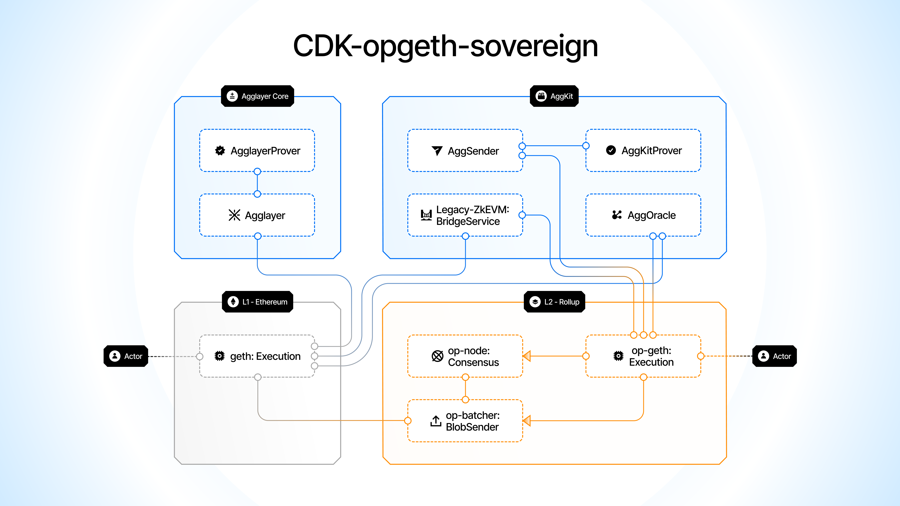

This page outlines the full system architecture for CDK-opgeth across supported and upcoming modes.

### ✅ `cdk-opgeth-sovereign`

| Component                  | Description / Link                                                                                                      |
|---------------------------|---------------------------------------------------------------------------------------------------------------------------|
| Execution Layer           | [OP Geth Client](https://github.com/ethereum-optimism/op-geth) — Ethereum client modified for Optimism                   |
| Consensus Layer           | [OP Node](https://github.com/ethereum-optimism/optimism) — Handles block production and synchronization                   |
| AggKit - Oracle           | [AggOracle](https://github.com/agglayer/aggkit) — Updates global Ethereum Root (GER) onchain                              |
| AggKit - Sender           | Sends certificates from the chain to Agglayer                                                                             |
| Bridge API                | [zkevm-bridge-service](https://github.com/0xPolygonHermez/zkevm-bridge-service) — Enables messaging between chains        |
| Data Availability Layer   | [OP Batcher](https://github.com/ethereum-optimism/optimism) — Sends transaction data to Ethereum Mainnet (Layer 1)       |
| Agglayer Network          | [Agglayer](https://github.com/agglayer/agglayer), Agglayer Node, Agglayer Prover                                          |
| Smart Contracts (L1 + L2) | [Optimism Contracts](https://github.com/ethereum-optimism/optimism/releases/tag/op-deployer%2Fv0.0.11)                    |
| Ethereum Bridge Contracts | [Polygon zkEVM Contracts](https://github.com/0xPolygonHermez/zkevm-contracts) — Manages final settlement on Ethereum     |

---

### 🔒 `cdk-opgeth-zkrollup` *(Not live yet)*

| Component                  | Description / Link                                                                                                      |
|---------------------------|---------------------------------------------------------------------------------------------------------------------------|
| Execution Layer           | [OP Geth Client](https://github.com/ethereum-optimism/op-geth)                                                            |
| Consensus Layer           | [OP Node](https://github.com/ethereum-optimism/optimism)                                                                  |
| Proposer Service          | [OP Proposer](https://github.com/ethereum-optimism/optimism)                                                              |
| AggKit - Oracle           | [AggOracle](https://github.com/agglayer/aggkit)                                                                           |
| AggKit - Sender           | Sends certificates to Agglayer                                                                                            |
| Bridge API                | [zkevm-bridge-service](https://github.com/0xPolygonHermez/zkevm-bridge-service)                                           |
| Data Availability Layer   | Ethereum Mainnet (on-chain data only)                                                                                     |
| Agglayer Network          | [Agglayer](https://github.com/agglayer/agglayer), Agglayer Node, Agglayer Prover                                          |
| Smart Contracts (L1 + L2) | [Optimism Contracts](https://github.com/ethereum-optimism/optimism/releases/tag/op-deployer%2Fv0.0.11)                    |
| Ethereum Bridge Contracts | [Polygon zkEVM Contracts](https://github.com/0xPolygonHermez/zkevm-contracts)                                             |
| Prover Network            | [SP1 Prover](https://github.com/succinctlabs/sp1) — zkVM-based prover                                                     |

---

### ⚙️ `cdk-opgeth-validium` *(Not live yet)*
> 💡 **Note:** This mode shares the same architecture as `zkrollup`, but uses an alternative data availability (DA) layer.

| Component                  | Description / Link                                                                                                      |
|---------------------------|---------------------------------------------------------------------------------------------------------------------------|
| Execution Layer           | [OP Geth Client](https://github.com/ethereum-optimism/op-geth)                                                            |
| Consensus Layer           | [OP Node](https://github.com/ethereum-optimism/optimism)                                                                  |
| Proposer Service          | [OP Proposer](https://github.com/ethereum-optimism/optimism) — Proposes blocks and batches                               |
| AggKit - Oracle           | [AggOracle](https://github.com/agglayer/aggkit)                                                                           |
| AggKit - Sender           | Sends certificates to Agglayer                                                                                            |
| Bridge API                | [zkevm-bridge-service](https://github.com/0xPolygonHermez/zkevm-bridge-service)                                           |
| Data Availability Layer   | [Alt-DA Mode (TBD)](https://docs.optimism.io/stack/beta-features/alt-da-mode) — Off-chain or alternative DA provider      |
| Agglayer Network          | [Agglayer](https://github.com/agglayer/agglayer), Agglayer Node, Agglayer Prover                                          |
| Smart Contracts (L1 + L2) | [Optimism Contracts](https://github.com/ethereum-optimism/optimism/releases/tag/op-deployer%2Fv0.0.11)                    |
| Ethereum Bridge Contracts | [Polygon zkEVM Contracts](https://github.com/0xPolygonHermez/zkevm-contracts)                                             |
| Prover Network            | [SP1 Prover](https://github.com/succinctlabs/sp1) — zkVM-based prover                                                     |

---