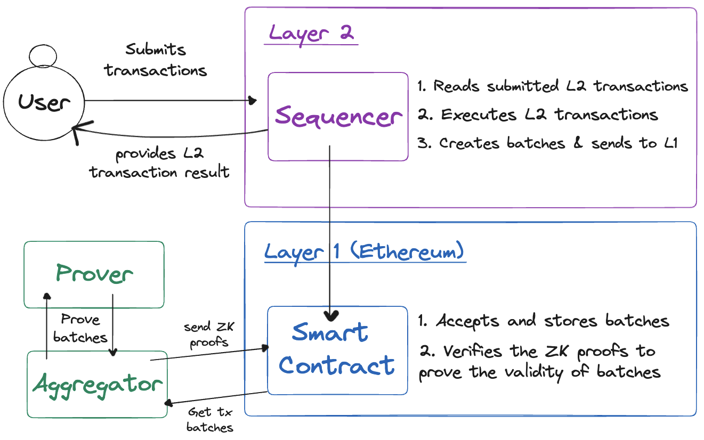

# Architecture

While each chain built with the CDK is unique, they all share a common high-level architecture. Before diving into the specifics of how [transactions](./transaction-lifecycle.md) are processed, it is helpful to first understand the role of each component in the system.

Below is the high-level architecture of a chain built with the CDK, showing how transactions sent by users are processed and finalized on the L1:

## Users

Chains built with the CDK are EVM-compatible by default. Although the [type of ZK-EVM](../architecture/type-1-prover/intro-t1-prover.md/#type-definitions) you choose to implement is customizable, CDK chains are designed to be compatible with existing Ethereum tools and libraries.

This means both users and developers can use the same wallets (such as MetaMask) and libraries (such as Ethers.js) to interact with CDK-built chains as they do with Ethereum.

The process for submitting transactions is the same as on Ethereum, using the same [JSON-RPC](https://ethereum.org/en/developers/docs/apis/json-rpc/) interface. Transactions are submitted directly to the L2 and go into a pending transaction pool.

## Sequencer

The sequencer is responsible for two vital tasks in the system:

1. Executing transactions submitted by L2 users.
2. Sending batches of transactions to the L1 smart contract.

The sequencer reads transactions from the pending transaction pool and executes them on the L2, effectively updating the state of the L2 and providing this information back to the user. Once this process is complete _(typically in a matter of seconds)_, users are free to continue interacting with the L2 as if the transaction was finalized.

In the background, the sequencer periodically creates batches of transactions and sends multiple batches of transactions to the L1 smart contract in a single transaction.

## L1 smart contracts

Multiple smart contracts, deployed on the L1 (Ethereum), work together to finalize transactions received from the L2 on the L1. Typically there is a main *rollup* smart contract that is responsible for:

1. Receiving and storing batches of transactions from the L2 (depending on the design of the L2, it may not use Ethereum for [data availability](../glossary/index.md#data-availability).

2. Receiving and verifying ZK-proofs from the aggregator to prove the validity of the transactions.

## Aggregator and prover

The aggregator is responsible for periodically reading batches of L2 transactions that have not been verified yet, and generating ZK-proofs for them to prove their validity.

To do this, the aggregator sends the batches of transactions to a prover. The prover generates ZK proofs and sends them back to the aggregator, which then posts the proof back to the L1 smart contract.

## Further reading

- [zkEVM architecture overview](../../zkEVM/architecture/index.md)