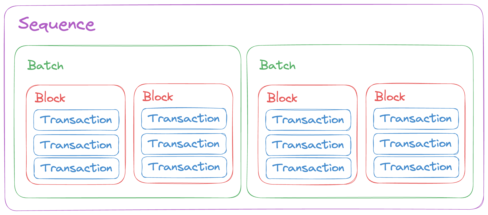
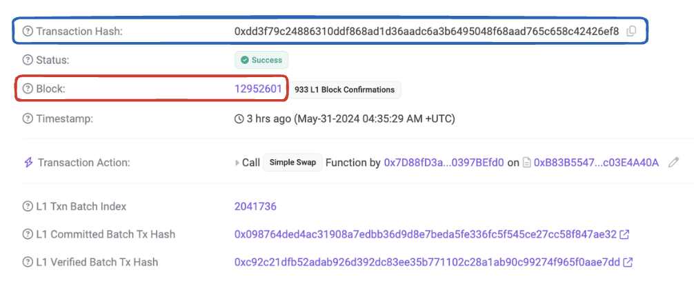
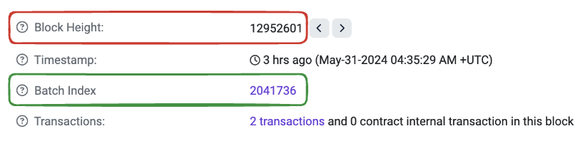
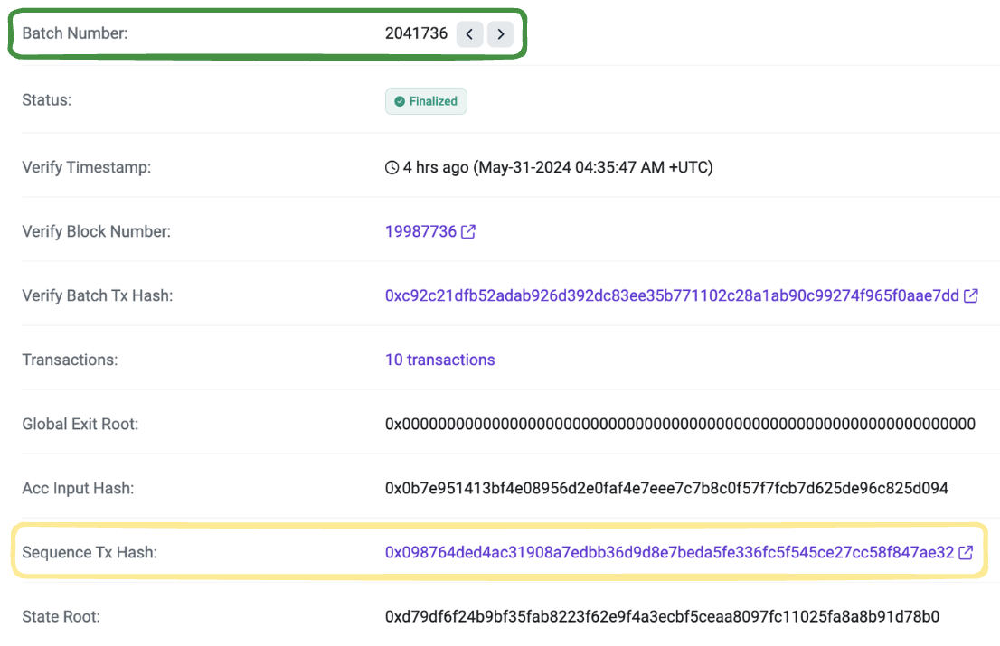
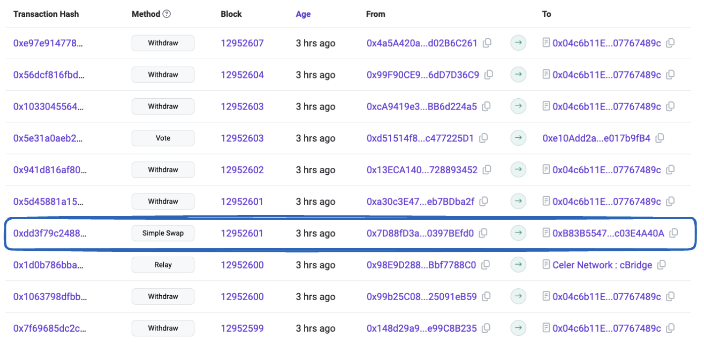
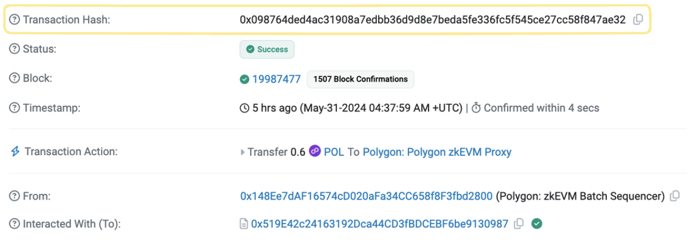
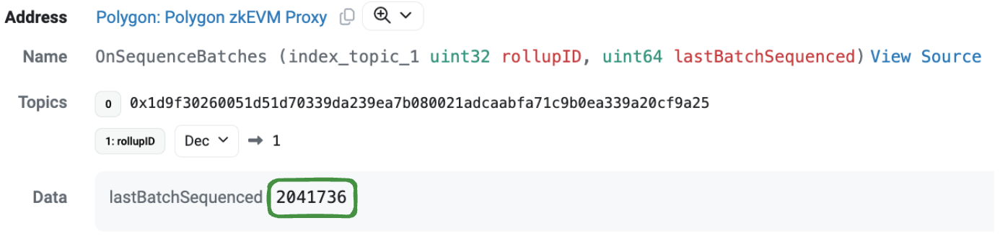

# Batches, blocks, and transactions

The following definitions are key to understanding how transactions are handled on L2s built with the CDK:

- Transaction: A signed instruction to perform an action on the blockchain.
- Block: A group of transactions and a hash of the previous block in the chain.
- Batch: A group of many transactions from multiple blocks.

Transactions are included in blocks, and these blocks fill batches, which are then sequenced. See the figure below to best understand how these elements relate to each other. 

## Transaction

A transaction is a cryptographically signed instruction from an account to update the state of the blockchain. 

Let's take a look at a real transaction in the Polygon zkEVM (which is in a way a CDK rollup), and inspect how the transaction is recorded in the [explorer](https://zkevm.polygonscan.com/) as part of a block, then a batch, and ultimately in a sequence.

Consider the Polygon zkEVM transaction with the transaction hash, [`0xdd ... 6ef8`](https://zkevm.polygonscan.com/tx/0xdd3f79c24886310ddf868ad1d36aadc6a3b6495048f68aad765c658c42426ef8), which performs a `Simple Swap` function call, and is included in block number [`12952601`](https://zkevm.polygonscan.com/block/12952601) on the L2.

## Block

Each block must include the hash of the previous block, along with multiple transactions, to establish a link to the block before it. 

Continuing with the above transaction, identified by the hash `0xdd ... 6ef8` and contained in block [`12952601`](https://zkevm.polygonscan.com/block/12952601), we observe that this block contains [2 transactions in total](https://zkevm.polygonscan.com/txs?block=12952601).

Also, as depicted in the figure below, block `12952601` is in turn contained in batch `2041736`.

## Batch

Batches contain multiple transactions from multiple blocks.

The two transactions from our example block `12952601` are included in batch [`2041736`](https://zkevm.polygonscan.com/batch/2041736), which contains [10 transactions](https://zkevm.polygonscan.com/txs?batch=2041736) in total.

This means batch `2041736` includes the two transactions from block `12952601` as well as eight transactions from other blocks.

As observed in the figure below, the presence of the `Sequence Tx Hash` field associated indicates that the batch has been sent to Ethereum along with other batches in a single transaction.

Further inspection of the transactions in the batch, as depicted in the figure below, reveals that:

- Our transaction example, with hash `0xdd ... 6ef8`, is included in this batch.
- The batch contains several transactions from different blocks.

Since Polygon zkEVM is a [rollup](./layer2s.md) (that is, it uses Ethereum for [data availability](../glossary/index.md#data-availability)), it sends an array of batches to Ethereum, by providing the array as an argument to the `sequenceBatches()` function of a smart contract on Ethereum.

We can inspect the `Sequence Tx Hash` transaction to ascertain if batch `2041736`, containing our original transaction example, was indeed part of the argument to the `sequenceBatches()` function. 

In this case, batch `2041736` happens to be the last batch to be sequenced, as depicted in the figure below.

## Further reading

- [Blocks in the zkEVM Etrog upgrade](../../zkEVM/architecture/protocol/etrog-upgrade.md/?h=blocks#etrog-blocks).
