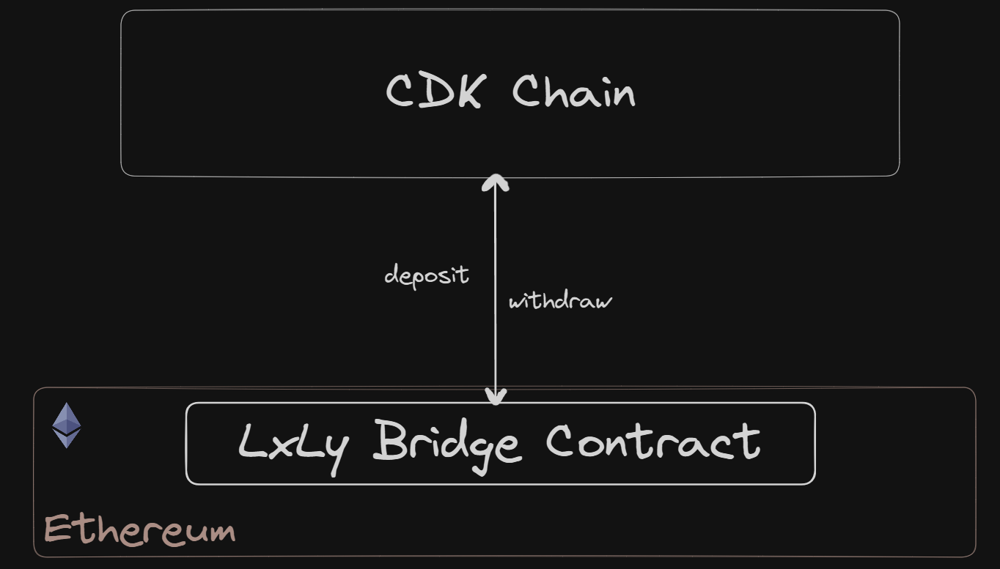
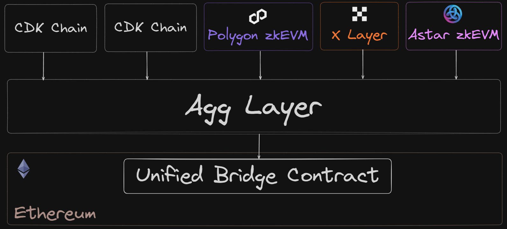

# Bridging

[Bridges](https://ethereum.org/en/developers/docs/bridges/) are a fundamental component of L2s that allow users to deposit and withdraw assets to and from your chain.

CDK-built chains come with a built-in bridge service and customizable UI out of the box, with the option to have a standalone [LxLy bridge](#lxly-bridge) or alternatively opt-in to the AggLayer and use the [unified bridge](#unified-bridge) to enable cross-chain L2-to-L2 interoperability.

## LxLy bridge

The LxLy bridge contracts carry out deposit and withdrawal of assets between L2 and L1.

Chains looking to run their own bridge infrastructure can choose to deploy a new instance of the [LxLy bridge](../../zkEVM/architecture/unified-LxLy/index.md) that allows users to move assets (both native and [ERC20](https://ethereum.org/en/developers/docs/standards/tokens/erc-20/) tokens) from L1 to the L2 and vice versa.

Deploying an individual instance of the LxLy means interoperability with other L2 chains via the [AggLayer](../../agglayer/overview.md) is not possible. To enable cross-chain interoperability (i.e. L2-to-L2 cross-chain transactions), chains can opt-in to the AggLayer and use the [unified bridge](../../agglayer/unified-bridge.md).

This option is suited to chains that may want to customize how the bridge is managed and operated, or maintain control of the bridge's funds; as the [upgradeability](./admin-upgradeability.md) of the bridge contracts are managed by the chain operator.

## Unified bridge

A single, shared instance of the LxLy bridge, called the [unified bridge](../../agglayer/unified-bridge.md) is available to use for all CDK chains that opt-in to the AggLayer. 

It is a shared smart contract deployed on Ethereum, responsible for enabling interoperability between chains in the form of cross-chain transactions and L2-to-L2 transfers.

Chains that integrate with the unified bridge can benefit from the network effect of the AggLayer, as their chain can therefore access the users and liquidity of other chains that are also part of the AggLayer.

This option is suited to chains that want a standard bridging experience and do not require customization of the bridge's operation. The shared bridge is also not directly managed by the chain operator, instead, it shares the governance outlined in the [admin upgradeability](./admin-upgradeability.md) section.

## Further reading

- [Aggregated blockchains: A new thesis](https://polygon.technology/blog/aggregated-blockchains-a-new-thesis).
- [LxLy bridge](../../zkEVM/architecture/unified-LxLy/index.md).
- [Unified bridge overview](../../agglayer/unified-bridge.md).
