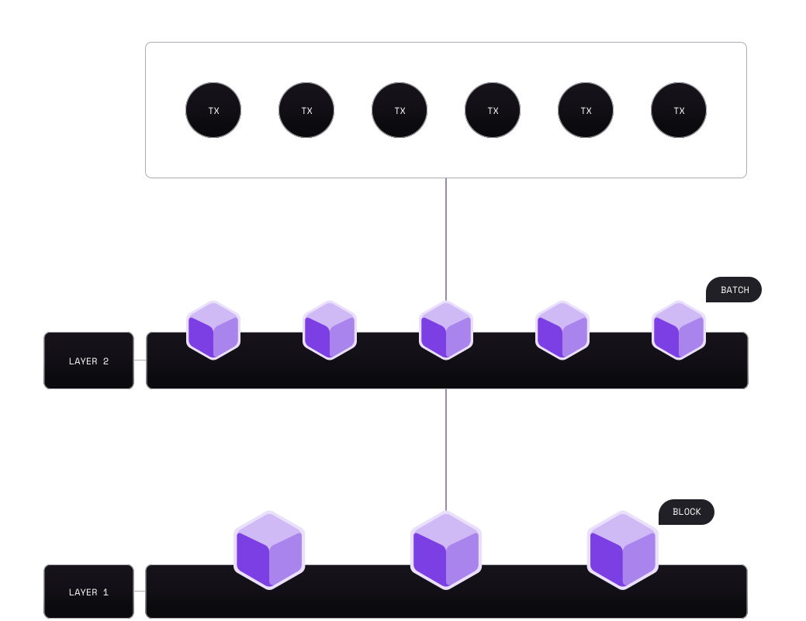

# What is a layer 2 blockchain?

Layer 2 (L2) blockchains are scaling solutions, typically built on top of Ethereum (L1) that are designed to increase transaction throughput without sacrificing decentralization or security.

While L2s are their own chains, they are considered "extensions" of Ethereum. Users can submit transactions directly to L2 chains, which handle them more efficiently (in terms of cost and speed) than Ethereum.

Under the hood, L2s create "batches" of transactions, and periodically submit many batches to Ethereum as a single transaction; potentially including information on thousands of transactions that occurred on the L2 in a single transaction on Ethereum.

Typically, L2s deploy smart contracts to Ethereum that handle the verification of these batches, ensuring that the transactions are valid. Since this verification process occurs on Ethereum, it is often said that L2s inherit the security of Ethereum.

## Types of layer 2s

L2s come in different shapes and sizes in terms of their relationship with Ethereum: Each design decision comes with trade-offs in terms of security, scalability, or decentralization.

For example, some L2s, such as the [Polygon zkEVM](../../zkEVM/index.md) send all transaction data to Ethereum, whereas other L2s only send information about the state differences, or choose not to send transaction data to Ethereum; instead relying on different data availability mechanisms.

Since storing information on Ethereum is expensive, (see [gas and fees](https://ethereum.org/en/developers/docs/gas/)), building an L2 chain means making tradeoffs between security, decentralization, and scalability. The CDK provides developers with the tools to make these trade-offs and build a chain that meets their specific needs depending on their use case.

## Further reading

- [Ethereum documentation: Layer 2s](https://ethereum.org/en/layer-2/).
- [Ethereum documentation: Scaling](https://ethereum.org/en/developers/docs/scaling/).