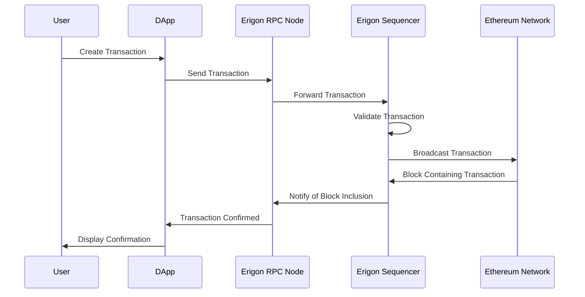

Sure! Let's discuss the Erigon sequencer/RPC node and include some explanatory diagrams and sequence diagrams.

### Erigon Sequencer/RPC Node

Erigon, previously known as Turbo-Geth, is a high-performance Ethereum client designed to handle the growing demands of the Ethereum blockchain. It focuses on optimizing performance, disk space, and synchronization speed. Erigon is notable for its modular architecture, which makes it highly efficient and customizable for various blockchain tasks. 

#### Key Features of Erigon

1. **Modular Architecture**: Erigon's modular design allows different components to be developed, optimized, and updated independently. This separation of concerns helps in improving the performance and reliability of each module.

2. **Performance Optimization**: Erigon employs advanced techniques for data handling, such as memory-mapped files and optimized data structures, to ensure high-speed processing of blockchain data.

3. **Reduced Disk Usage**: By implementing a more efficient database schema, Erigon significantly reduces disk usage compared to other Ethereum clients.

4. **Fast Synchronization**: Erigon's fast sync method allows nodes to catch up with the blockchain more quickly by downloading only the most recent state of the blockchain, rather than the entire history.

#### Erigon as a Sequencer

In the context of Ethereum, a sequencer plays a critical role in ordering transactions and creating new blocks. Erigon's sequencer efficiently processes incoming transactions, organizes them into blocks, and propagates these blocks across the network. 

#### RPC Node

The Remote Procedure Call (RPC) interface in Erigon allows external applications to interact with the Ethereum blockchain. This interface is essential for decentralized applications (DApps), wallets, and other blockchain services. It provides methods for querying blockchain data, sending transactions, and managing accounts.

### Diagrams

#### High-Level Architecture of Erigon

Below is a high-level diagram illustrating the core components of Erigon.

1. **Networking**: Handles P2P communication with other nodes.
2. **Block Processing**: Manages the validation and execution of blocks.
3. **Database**: Stores blockchain data in a highly optimized format.
4. **RPC Interface**: Provides methods for external applications to interact with the node.

#### Sequence Diagram for Transaction Processing

The following sequence diagram shows how a transaction is processed by the Erigon node.

### Summary

Erigon's design and performance improvements make it a powerful Ethereum client, particularly suitable for handling high transaction throughput and large data volumes. Its modular architecture allows for efficient transaction processing and data storage, making it a preferred choice for developers and node operators looking for a robust and scalable solution.

With its advanced features, Erigon stands out as an optimal client for running both sequencer and RPC node roles in the Ethereum ecosystem. It efficiently processes transactions, maintains blockchain data, and provides a reliable interface for external applications to interact with the Ethereum blockchain.