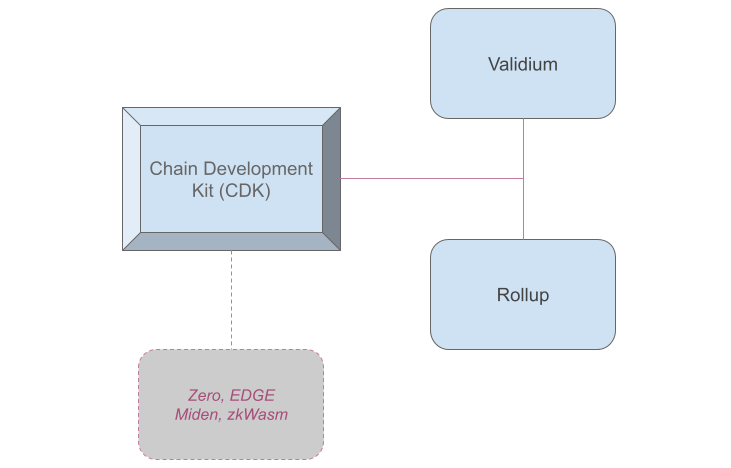

Polygon's Chain Development Kit (CDK) is a modular, open source software tool for blockchain developers which supports installation and configuration of a variety of chain architectures.

!!! important
    At the time of writing, CDK offers rollup and validium configurations.

CDK users choose a chain architecture specific to their needs and use cases.

 

!!! info
    For the latest updates, follow our official GitHub repositories.

    - [Rollup node](https://github.com/0xPolygonHermez/zkevm-node)
    - [Validium node](https://github.com/0xPolygon/cdk-validium-node)
    - [Data availability committee](https://github.com/0xPolygon/cdk-data-availability)
    - [zkEVM smart contracts](https://github.com/0xPolygonHermez/zkevm-contracts)
    - [Validium smart contracts](https://github.com/0xPolygon/cdk-validium-contracts)
