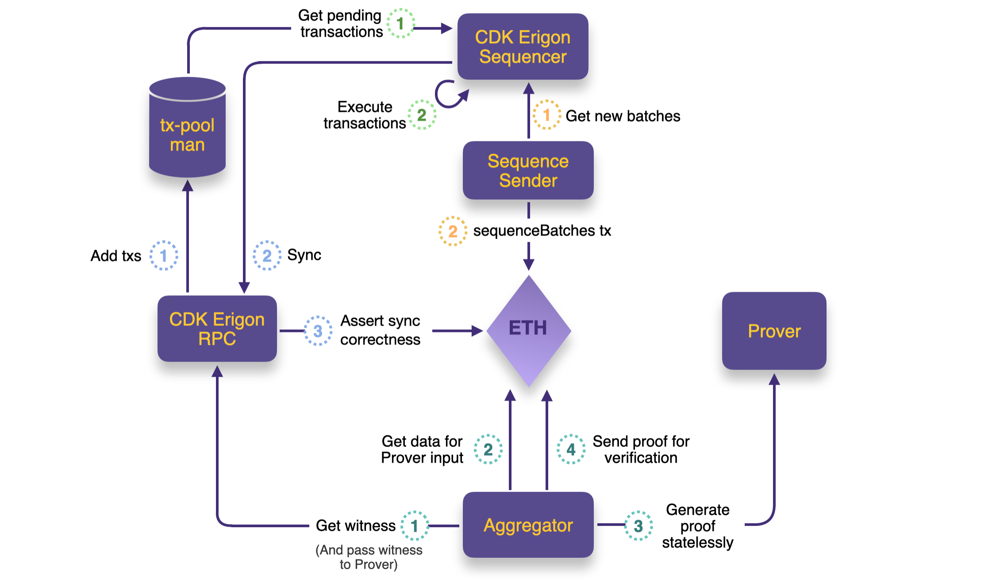
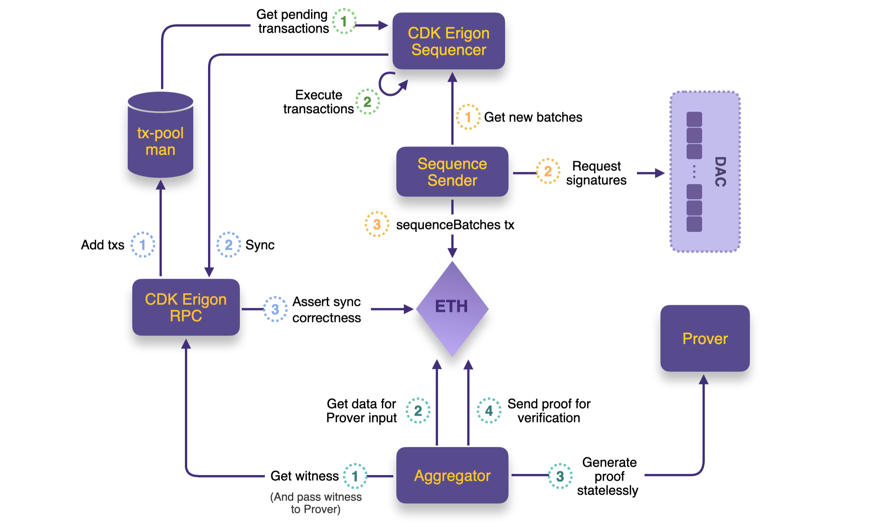
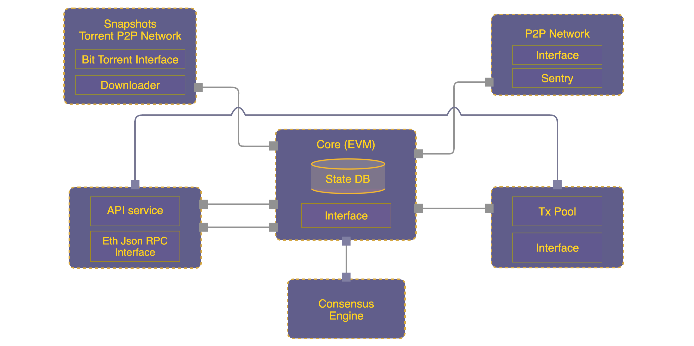
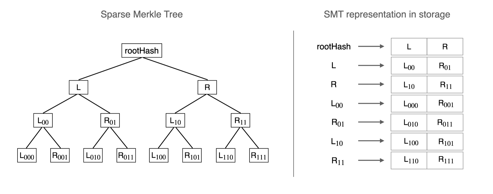
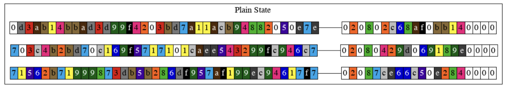
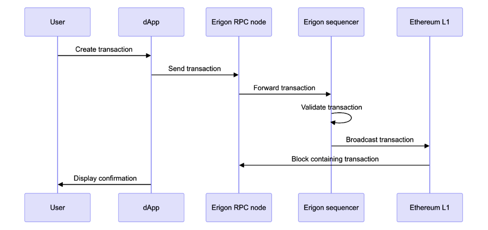
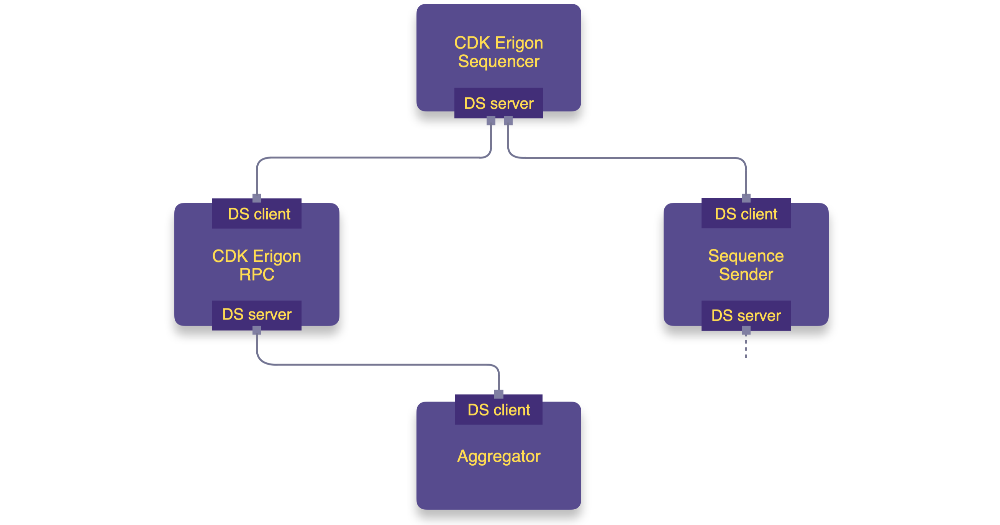

# CDK Erigon

CDK Erigon is the implementation of Erigon adapted to be a specialized framework for creating and managing chains that run the Polygon zkEVM protocol. Its code repository can be found at [0xPolygonHermez/cdk-erigon](https://github.com/0xPolygonHermez/cdk-erigon). 

Erigon, formerly known as Turbo-Geth, is a high-performance Ethereum client built to meet the increasing demands of the Ethereum blockchain. It focuses on optimizing performance, disk space, and synchronization speed. 

Since its inception, Erigon has demonstrated the ability to sync in *full archive node* mode without requiring advanced hardware or weeks of synchronization time.

The CDK Erigon framework utilizes Erigon's fast syncing mode, allowing any CDK Erigon RPC node to sync with the CDK Erigon sequencer node.

## Polygon zkEVM components

The legacy Polygon zkEVM, either as a rollup or validium, has the following components: 

- RPC node through which transactions are submitted.
- Pool DB for storing users' transactions.
- Sequencer node for executing transactions, creating blocks and batches, sending batches to L1 (or DAC), and sequencing them.
- Aggregator node for facilitating proving and verification.
- Synchronizer for keeping sync with L1.
- State DB for permanently storing state data (but not the Merkle trees).  

For the sake of simplicity, we leave out the bridge and consensus smart contracts.

## CDK Erigon components

CDK Erigon, an Erigon implementation running the Polygon zkEVM protocol, includes most of the above components with a few modifications to fully leverage Erigon's capabilities. 

CDK Erigon consists of the following components:

-  CDK Erigon RPC node through which transactions are submitted.
-  tx-pool-manager for storing users' transactions.
-  CDK Erigon sequencer node for executing transactions, and creating blocks and batches. 
-  SequenceSender for sequencing batches.
    -  In the case of a rollup, the SequenceSender sends batch data and the `sequenceBatches` transaction to L1.
    -  In the case of a validium, the SequenceSender sends batch data to the Data Availability Committee (DAC), requests for signatures from the DAC, and sends the `sequenceBatchesValidium` transaction to L1.
-  Aggregator node for facilitating proving and verification. 

## Transaction flow

Here is a high-level overview of how user transactions move through the system, from the moment they are submitted via an RPC node to when they are finalized. This process involves transitioning through three states: *trusted*, *virtual*, and *verified*.

The figure below depicts a simplified CDK Erigon architecture and the flow of transactions, specifically in the rollup mode.

### Trusted state

User's transactions are submitted via a CDK Erigon RPC node, and stored in the Pool DB. 

The CDK Erigon sequencer selects transactions from the Pool DB according to its own strategy. 

It executes the transactions, adds the successfully executed ones to blocks, and then groups the blocks into batches.

At this stage the transactions have reached the _trusted state_, and the RPC node syncs with the sequencer. 

### Virtual state

The SequenceSender fetches batches from the CDK Erigon sequencer.

The SequenceSender sends the batch data to either L1 or DAC for data availability, depending on whether the chain is in a rollup or validium mode.

- If the chain is a validium, SequenceSender also requests for the required number of DAC-member signatures.

As mentioned above, SequencerSender sends either a `sequenceBatches` or `sequenceBatchesValidium` transaction to L1.

At this stage the transactions have reached the _virtual state_.

### Verified state

The CDK Erigon RPC node checks if the batches received by syncing with the sequencer have been virtualized, and thus validate their correctness against the data on L1. 

The aggregator retrieves the *witness* from the CDK Erigon RPC and fetches data required for proving batches from L1.

The witness and batch data are sent to the Prover as a request for a proof.

The Prover sends back a verifiable proof, called _batchProof_.

The aggregator sends the _batchProof_ to the consensus smart contract on L1 for verification.  

Once verified, the transactions have now reached the _verified state_.

The figure below depicts a simplified CDK Erigon architecture and the flow of transactions, in the validium mode.

## Bridge

To maintain simplicity, the architectural diagram above omits the bridge and consensus smart contracts.

CDK Erigon deploys the LxLy bridge, a pair of identical smart contracts on L1 and L2.

It is called the 'LxLy bridge' to indicate that it manages not only exits between L1 and L2, but also between different L2s, for example.

The bridge enables asset deposits on one layer and withdrawals on the destination network.

When a deposit is made on L1, the bridge waits for verification of the corresponding Ethereum block before allowing the recipient on L2 to claim the asset.

For a deposit on L2, the bridge waits for the related batch to be verified before unlocking the asset on L1 for the recipient to withdraw.

## Standard Erigon

The standard [Erigon](https://github.com/ledgerwatch/erigon) design follows a modular architecture, consisting of a P2P network, transaction pool, consensus engine, Core with its State DB, API service, and JSON RPC interface.

Although a snapshots component is included in the design, it is not yet under development. 

While standard Erigon is similar to other nodes like Geth, it is distinguished by its *Core* and *State DB* component. 

Components such as the P2P network and consensus engine are largely the same as in Geth. 

The figure below depicts a simplified, high-level design of Erigon's architecture.

### Storing Merkle trees

State in Ethereum is represented in the form Merkle Patricia tries, and it consists of,

- A tree of accounts.
- A tree of storage slots.
- A tree of receipts.

Merkle trees provide a conceptual view of the state, but storing them in memory requires flattening the data. 

Typically, a Merkle tree is represented in storage as a mapping of each hash value to its child nodes. 

#### Example

Let’s look at an example of how a Merkle tree is represented in storage. 

Consider a binary Merkle tree, such as the sparse Merkle trees (SMTs) used in Polygon zkEVM. 

The figure below illustrates an SMT and its representation in storage.

### Flat DB storage

Merkle trees offer an convenient mechanism for proving and verifying the presence of specific data within a state.

However, retrieving a value from a specific leaf often requires traversing the full height of the Merkle tree, which is inefficient.

Since Merkle proofs contain only a few intermediate hash values, which are sufficient for verification, it is unnecessary to store all intermediate hashes.

Erigon, therefore, eliminates the merkelization of state data in storage and replaces it with a flat database structure. 

Data in Erigon State DB is stored as key-value pairs where, 

- The account address is the key pointing to the account data. For example,

$$
  \mathtt{0x0123 \dots E38F}\ \rightarrow\ \texttt{account data}
$$

- The account address is concatenated with the storage slot address to form the key, while the storage slot itself serves as the value. For example,

$$
  \mathtt{0x0123 \dots E38F} || \mathtt{0xFF1D \dots B12D} \ \rightarrow\ \texttt{storage slot data}
$$

These key-value pairs are stored in a table called _Plain state_. An illustration of three such pairs is shown below.

For compatibility with Ethereum, a second table called _Hash state_ is used to store hash digests of the values in the _Plain state_. 

While this results in storing the same amount of data twice, it still leads to a significant reduction in memory usage. It offers a 10:1 reduction ratio compared to the legacy Ethereum node. 

In other words, 300GB of data stored in a legacy Ethereum node is equivalent to 30GB in Erigon’s flat DB storage. 

Another advantage of flat DB storage is the ease and speed of value lookups, compared to traversing the full height of a Merkle tree to retrieve a leaf value.

### Separate commitment

Since flat DB storage no longer uses merkelization, how does Erigon enable proof and verification? 

Erigon separates commitment from data. In other words, while the *flat DB storage* is used for storing data, merkelization is employed for commitments. 

A commitment is a binary Merkle tree, similar to the SMT used in Polygon zkEVM, and is stored in a separate table within the database. 

Once the commitment tree is built, Erigon uses a cached version of the tree, called *Intermediate Hashes*, to track changes in state data. 

However, due to the absence of prior *Intermediate Hashes*, the initial execution of transactions requires building the commitment tree from scratch using data from the *flat DB storage*.

Subsequent iterations then use the *Intermediate Hashes* cache. 

Although it is currently a rare occurrence, *jumping ahead by many blocks* to rebuild the commitment tree can be much faster than rebuilding it iteratively. 

### RPC node

The remote procedure call (RPC) interface in Erigon allows external applications to interact with the underlying blockchain. 

The interface is essential for decentralized applications such as dApps, wallets, and other blockchain services. 

The RPC provides methods for querying blockchain data, sending transactions, and managing accounts. 

The following sequence diagram shows how a transaction is processed by the Erigon node.

### Distinguishing features

Erigon is characterized by the following features: Modular architecture, optimized performance, reduced disk usage, and fast synchronization.

- Erigon has a modular architecture, which makes it highly efficient and customizable for various common blockchain tasks. This allows different components to be developed, optimized, and updated independently. Such a separation of concerns helps in improving the performance and reliability of each module. 
- Erigon employs advanced techniques for data handling, such as memory-mapped files and optimized data structures, to ensure high-speed processing of blockchain data.
- By implementing a more efficient database schema, Erigon significantly reduces disk usage compared to other Ethereum clients.
- Erigon's fast sync method allows nodes to catch up with the blockchain more quickly by downloading only the most recent state of the blockchain, rather than the entire history.

## CDK Erigon vs. Polygon zkEVM

At a high level, CDK Erigon works similarly to Polygon zkEVM, but with a few differences.

Like Polygon zkEVM, CDK Erigon has sequencer and RPC nodes, except that these are Erigon nodes implemented to serve as the sequencer and RPC, respectively.

While the Polygon zkEVM sequencer creates batches and posts them to L1, the CDK Erigon sequencer does not perform these tasks. Instead, they are handled by the *SequenceSender*. 

In the validium mode, it is again the *SequenceSender*, not the *Sequencer*, that interacts with the Data Availability Committee (DAC).

### Data streamer

As seen in the [transaction flow](./index.md#transaction-flow) above, _State DB_ does not appear in the CDK Erigon architectural diagrams. This is because CDK Erigon currently shares the L2 state via the [data streamer](../../../zkEVM/architecture/data-streamer/data-streamer-design.md) (DS) library. 

Data streamer was developed to serve raw block data to external nodes that need to maintain an up-to-date L2 state. 

Any CDK Erigon node can function as both a DS stream server and client, except for the CDK Erigon sequencer, which only has a DS stream server. 

Both the SequenceSender and RPC nodes have a DS stream server and client, allowing them to request batches from the CDK Erigon sequencer and serve batches to other nodes. 

For instance, the Aggregator has a DS stream client, enabling it to request batch data from the CDK Erigon RPC. 

The figure below illustrates the data stream servers and clients in CDK Erigon.

### L1 syncing and recovery

Another key difference between CDK Erigon and Polygon zkEVM is how they sync with L1. It consists of two parts,

- Firstly, L1 syncing in normal operation mode.
- Secondly, L1 recovery or DAC recovery is used, depending on whether the network is implemented in rollup or validium mode. 

#### L1 syncing

Normal operation mode refers to both the CDK Erigon sequencer and RPC nodes reading all data related to sequences, verifications, and the information needed to build the *L1InfoTree* from L1 smart contracts.

Each CDK Erigon sequencer or RPC node has its own fully built-in _L1InfoTree_, which can be queried via the RPC, similar to the Polygon zkEVM node. 

Sequences and verifications are primarily needed for `GetBatchByNumber` and other API methods like `verifiedBatchNumber`. 

All sequences are important because the _L1InfoTree_ is used in block building, proving batches, and is essential for the proper functioning of the bridge.

#### L1 recovery

Although it uses the same mechanism as L1 syncing, L1 recovery is performed if data is lost in all instances of Erigon. 

Between any two CDK Erigon nodes, either can function as the sequencer while the other serves as the RPC, and these roles are interchangeable. Both nodes store roughly the same data, as each maintains a full _L1InfoTree_.

If both instances of CDK Erigon are lost, including all backups, it is still possible to retrieve batch data from L1 (or the DAC) and rebuild the state. 

This process is called _L1 recovery_, and it is clearly not part of normal operation mode.

## CDK Erigon vs. standard Erigon

Next is a quick look at how CDK Erigon is different from standard Erigon.

- The first difference between CDK Erigon and standard Erigon is the integration of Polygon zkEVM consensus protocols.

- CDK Erigon is an adaptation of standard Erigon, optimized specifically for L2 scaling solutions where high throughput and reduced transaction costs are of paramount importance.

- Erigon's modular design is ideal for the CDK implementation, as it aligns with the underlying modular architecture of Polygon zkEVM.

- CDK Erigon is designed to seamlessly integrate with the broader Polygon ecosystem, facilitating interoperability with Polygon's products, services, scaling solutions, and tools.

- The RPC interface in the CDK implementation is adapted to support the functionalities and optimizations of the zkEVM protocol, enabling more efficient communication and interaction with the network.
