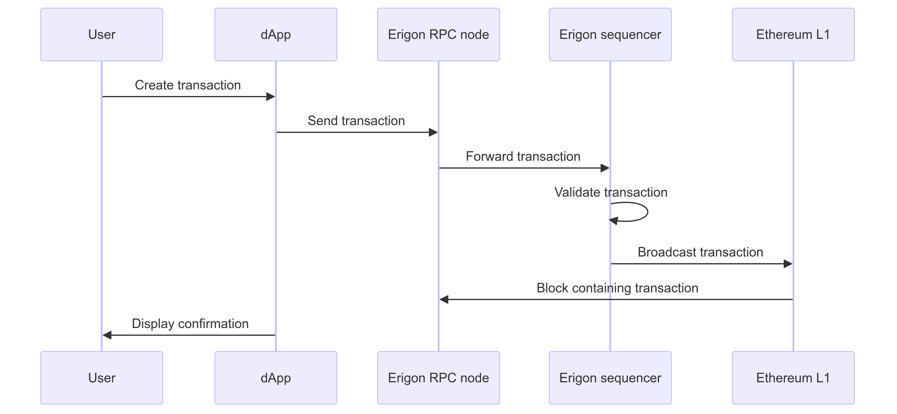

CDK Erigon is the implementation of Erigon adapted to be a specialized framework for creating and managing chains that run the Polygon zkEVM protocol. Its code repository can be found at [0xPolygonHermez/cdk-erigon](https://github.com/0xPolygonHermez/cdk-erigon).

## Erigon

[Erigon](https://github.com/ledgerwatch/erigon), formerly known as Turbo-Geth, is a high-performance Ethereum client built to meet the increasing demands of the Ethereum blockchain. It focuses on optimizing performance, disk space, and synchronization speed. 

Erigon is characterized by the following features: Modular architecture, optimized performance, reduced disk usage, and fast synchronization.

- Erigon has a modular architecture, which makes it highly efficient and customizable for various common blockchain tasks. This allows different components to be developed, optimized, and updated independently. Such a separation of concerns helps in improving the performance and reliability of each module.

- Erigon employs advanced techniques for data handling, such as memory-mapped files and optimized data structures, to ensure high-speed processing of blockchain data.

- By implementing a more efficient database schema, Erigon significantly reduces disk usage compared to other Ethereum clients.

- Erigon's fast sync method allows nodes to catch up with the blockchain more quickly by downloading only the most recent state of the blockchain, rather than the entire history.

## Erigon as a sequencer

L2 chains require sequencer nodes that play the critical role of ordering transactions and creating new blocks. 

Erigon can act as a sequencer to process incoming transactions, organize them into blocks, and propagate the blocks across the network. 

## RPC node

The remote procedure call (RPC) interface in Erigon allows external applications to interact with the underlying blockchain. This interface is essential for decentralized applications such as dApps, wallets, and other blockchain services. The RPC provides methods for querying blockchain data, sending transactions, and managing accounts.

The following sequence diagram shows how a transaction is processed by the Erigon node.

## CDK Erigon vs. Erigon

Next is a quick look at how CDK Erigon is different from standard Erigon.

- The first difference between CDK Erigon and standard Erigon is the integration of Polygon zkEVM consensus protocols.

- CDK Erigon is an adaptation of standard Erigon, optimized specifically for L2 scaling solutions where high throughput and reduced transaction costs are of paramount importance.

- While standard Erigon is modular by design, the CDK implementation further extends this architecture, enabling developers to easily customize and replace components. For instance, developers can customize the consensus mechanism, transaction pool, and state management.

- CDK Erigon is designed to seamlessly integrate with the broader Polygon ecosystem, facilitating interoperability with Polygon's products, services, scaling solutions, and tools.

- The RPC interface in the CDK implementation is adapted to support the functionalities and optimizations of the zkEVM protocol, enabling more efficient communication and interaction with the network.