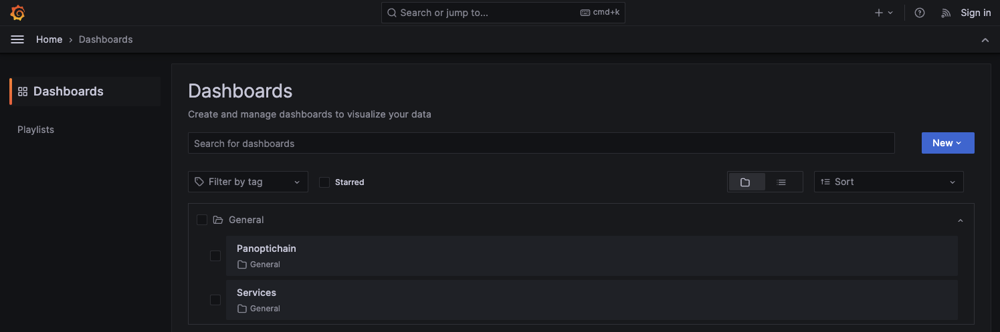

This guide walks you through the process of setting up and deploying a layer 2 CDK blockchain stack on your local machine.

The [Polygon CDK Kurtosis package](https://github.com/0xPolygon/kurtosis-cdk/) allows you to easily customize and instantiate all the components of a CDK chain. It uses the [Kurtosis](https://docs.kurtosis.com/) tool to orchestrate the setup of the chain components in Docker containers, with logic defined in [Starlark](https://github.com/bazelbuild/starlark) scripts (a Python dialect) which define the step-by-step process of setting up the chain.

!!! tip
      Check out the [Polygon Kurtosis docs](https://github.com/0xPolygon/kurtosis-cdk) for more documentation on this stack and how to use it, and if you need to raise an issue or have a question for the team.

## Prerequisites

### Hardware

- Linux-based OS (or [WSL](https://learn.microsoft.com/en-us/windows/wsl/about)).
- Minimum 8GB RAM/2-core CPU.
- AMD64 architecture.

### Software

- [Docker Engine](https://docs.docker.com/engine/) - version 4.27 or higher for MacOS.
- [Kurtosis CLI](https://docs.kurtosis.com/install/)

And, optionally, for submitting transactions and interacting with the environment once set up, we are using:

- [Foundry](https://book.getfoundry.sh/getting-started/installation)
- [yq](https://github.com/mikefarah/yq)
- [jq](https://stedolan.github.io/jq/)
- [polyon-cli](https://github.com/maticnetwork/polygon-cli)

## Set up the Kurtosis environment

### Clone the repository

```bash
git clone https://github.com/0xPolygon/kurtosis-cdk.git
cd kurtosis-cdk
```

### Understanding the deployment steps

There are two configuration files which help you understand what happens during a deployment.

#### 1. [`main.star`](https://github.com/0xPolygon/kurtosis-cdk/blob/main/main.star)

The `main.star` file contains the step-by-step instructions for the deployment process. It orchestrates the setup of all the components in sequential order and pulls in any necessary logic from other files.

It defines the following steps for the deployment process:

| Step number | Deployments                                    | Relevant Starlark code                                                                                                                          | Enabled by default |
|-------------|----------------------------------------------------|-------------------------------------------------------------------------------------------------------------------------------------------------|--------------------|
| 1           | Deploy a local layer 1 Ethereum chain              | [ethereum.star](https://github.com/0xPolygon/kurtosis-cdk/blob/main/ethereum.star)                                                              | True               |
| 2           | Deploy the CDK smart contracts on the L1           | [deploy_zkevm_contracts.star](https://github.com/0xPolygon/kurtosis-cdk/blob/main/deploy_zkevm_contracts.star)                                  | True               |
| 3           | Deploy the central environment, prover, and CDK erigon or zkEVM node databases | [databases.star](https://github.com/0xPolygon/kurtosis-cdk/blob/main/databases.star)                                                            | True               |
| 4           | Deploy the CDK central environment                 | [cdk_central_environment.star](https://github.com/0xPolygon/kurtosis-cdk/blob/main/cdk_central_environment.star)                                | True               |
| 5           | Deploy the CDK erigon package                      | [cdk_erigon.star](https://github.com/0xPolygon/kurtosis-cdk/blob/main/cdk_erigon.star) - included in step 4 deployment |      True              |
| 6           | Deploy the bridge infrastructure                   | [cdk_bridge_infrastructure.star](https://github.com/0xPolygon/kurtosis-cdk/blob/main/cdk_bridge_infra.star)                                     | True               |
| 7           | Deploy the AggLayer                                | [agglayer.star](https://github.com/0xPolygon/kurtosis-cdk/blob/main/agglayer.star)                                                              | True              |
| -           | Input parser tool to help deployment stages        | [input_parser.star](https://github.com/0xPolygon/kurtosis-cdk/blob/main/input_parser.star) - deployed immediately                                                      | n/a              |
| -           | zkEVM pool manager tool                 | [zkevm_pool_manager.star](https://github.com/0xPolygon/kurtosis-cdk/blob/main/zkevm_pool_manager.star) - deployed with CDK erigon node                                         | n/a             |


You can customize (or skip) any of the numbered steps by modifying the logic in the respective files.

#### 2. [`params.yml`](https://github.com/0xPolygon/kurtosis-cdk/blob/main/params.yml) 

The `params.yml` file defines the parameters of the chain and the deployment process. 

It includes configurations for simple parameters such as the chain ID and more complex configurations such as the gas token smart contract address.

You can modify each of these parameters to customize the chain to your specific needs.

## Run the chain locally

1. Run the [kurtosis clean](https://docs.kurtosis.com/clean) to remove any existing Kurtosis environments:

      ```bash
      kurtosis clean --all
      ```

2. In the `kurtosis-cdk` directory, use the [kurtosis run](https://docs.kurtosis.com/run) command to deploy the chain on your local machine by executing the `main.star` script provided with the `params.yml` configuration file:

      ```bash
      kurtosis run --enclave cdk-v1 --args-file params.yml --image-download always .
      ```

      - `enclave cdk-v1` specifies the name of the enclave, or isolated environment, to use for the deployment process.
      - `args-file params.yml` specifies the configuration file to use for the deployment process.
      - `image-download` specifies to always download the latest Docker images for the deployment process.

3. This command typically takes a while to complete and outputs the logs of each step in the deployment process for you to monitor the progress of the chain setup. Once the command is complete, you should see the following output:

      ```bash
      Starlark code successfully run. No output was returned.

      ===============================================
      ||          Created enclave: cdk-v1          ||
      ===============================================
      Name:            cdk-v1
      Status:          RUNNING

      ========================================= Files Artifacts =========================================

      ... List of files generated during the deployment process ...

      ========================================== User Services ==========================================

      ... List of services with "RUNNING" status - none should be "FAILED"! ...

      ```

3. Inspect the chain

      Run the following command to see the status of the enclave and the services running within it at any time.

      ```sh
      kurtosis enclave inspect cdk-v1
      ```

## Interacting with the chain

Now that your chain is running, you can explore and interact with each component.

Below are a few examples of how you can interact with the chain.

### Read/write operations

Let's do some read and write operations and test transactions on the L2 with Foundry.

1. Use `cast` to view information about the chain, such as the latest block number:

      ```bash
      cast block-number
      ```

2. View the balance of an address, such as the pre-funded admin account:

      ```bash
      cast balance --ether 0xE34aaF64b29273B7D567FCFc40544c014EEe9970
      ```

3. Send simple transactions to the chain, such as a transfer of some ETH:

      ```bash
      cast send --legacy --value 0.01ether 0x0000000000000000000000000000000000000000 --private-key "0x12d7de8621a77640c9241b2595ba78ce443d05e94090365ab3bb5e19df82c625"
      ```

      !!! info
            The `0xE34...9970` and `0x12d...c625` public-private key pair used in the above commands is the default admin account configured in `params.yml`.

### Load testing the chain

1. Export the RPC URL of your L2 to an environment variable called `ETH_RPC_URL` with the following command:

      ```bash
      export ETH_RPC_URL="$(kurtosis port print cdk-v1 cdk-erigon-node-001 http-rpc)"
      ```

2. Use the [`polycli loadtest`](https://github.com/maticnetwork/polygon-cli/blob/main/doc/polycli_loadtest.md) command to send multiple transactions at once to the chain to test its performance:

      ```bash
      polycli loadtest --rpc-url "$ETH_RPC_URL" --legacy --verbosity 700 --requests 500 --rate-limit 5 --mode t --private-key "0x12d7de8621a77640c9241b2595ba78ce443d05e94090365ab3bb5e19df82c625"
      ```

### Viewing transaction finality

A common way to check the status of the system is by ensuring that batches are sent and verified on the L1 chain.

Use `cast` to view the progression of batches from trusted, virtual, and verified states:

```bash
cast rpc zkevm_batchNumber          # Latest batch number on the L2
cast rpc zkevm_virtualBatchNumber   # Latest batch received on the L1
cast rpc zkevm_verifiedBatchNumber  # Latest batch verified or "proven" on the L1
```

### Opening the bridge UI

To open the bridge interface and bridge tokens across the L1 and L2, run the following command:

```bash
open $(kurtosis port print cdk-v1 zkevm-bridge-proxy-001 web-ui)
```

## Additional services

There are a number of additional services you can add to the stack, including observability applications and other useful tools.

See the current list of additional services in the [CDK kurtosis additional services documentation](https://github.com/0xPolygon/kurtosis-cdk/blob/main/docs/additional-services.md).

To add an additional service, simply add the name of the service to the `params.yml` array. For example:

```yml
args:
  additional_services:
    - blockscout
    - prometheus_grafana
```

To use the additional service, simply add the service to a kurtosis call. For example, to open the Grafana dashboard once set up in `params.yml`, run the following command:

```bash
open $(kurtosis port print cdk-v1 grafana-001 dashboards)
```



### Stopping the chain

If you want to stop the chain and remove all the containers, run the following command:

```bash
kurtosis clean --all
```

## Going to production

While it is possible to run a CDK chain on your own, we strongly recommend getting in touch with the [Polygon team directly](https://share-eu1.hsforms.com/1aI6l7_bFTn-vWl0NIFVzDQc8xid), or one of our [implementation providers](https://ecosystem.polygon.technology/spn/cdk/) for production deployments.

## Advanced use cases

For a list of advanced use cases and documentation explaining how to set them up, please see the list in the [Kurtosis CDK stack repo](https://github.com/0xPolygon/kurtosis-cdk?tab=readme-ov-file#advanced-use-cases).

## Further reading

- For more information on CDK architecture, components, and how to customize your chain, refer to the [CDK architecture documentation](https://docs.polygon.technology/cdk/architecture/cdk-zkevm/).
- For detailed how to's, including how to create a native token, check out our [how to guides](../how-to/use-native-token.md).
- For detailed conceptual information on zero-knowledge stacks, check out our [concepts documentation](../concepts/layer2s.md).
