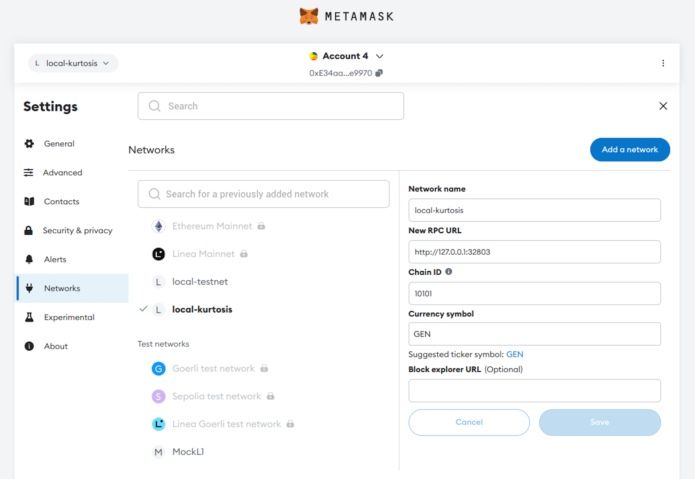
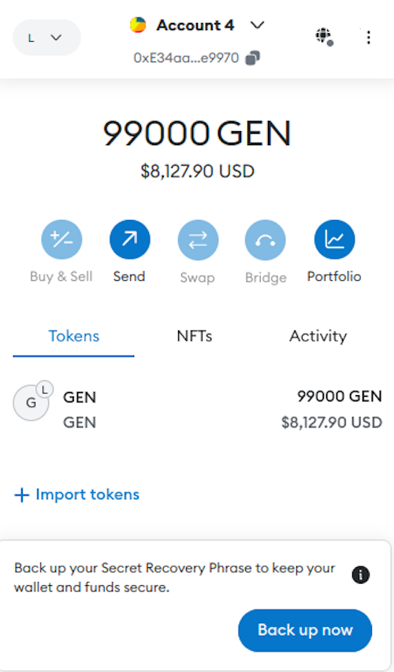
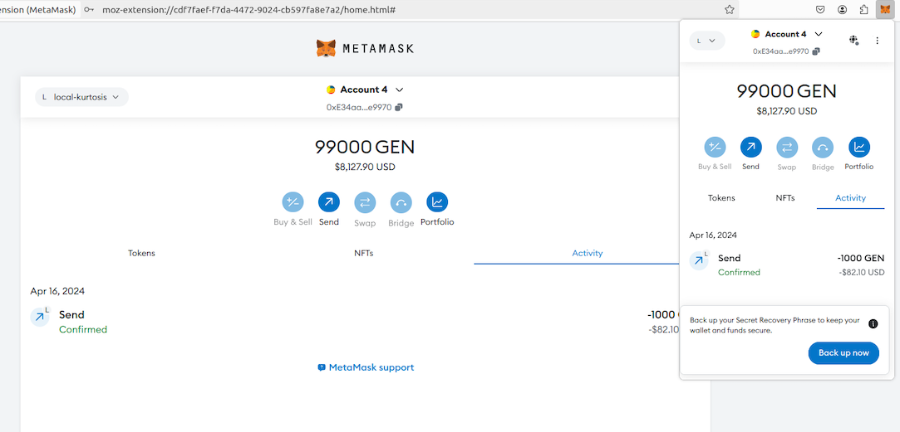

A quick and easy method for testing a running CDK stack, whether in validium or rollup mode, is by sending a zero-value transaction and examining the result.

## Get the URL

First inspect the logs to find the `zkevm-node-rpc` details. For example, in the Kurtosis stack you should see something like:

```sh
zkevm-node-rpc-001    http-rpc: 8123/tcp -> http://127.0.0.1:32803
```

## Send transaction with cast

In a terminal window, run the following command where the mnemonic is used just for testing and the address can be any valid account address. 

```sh
cast send --legacy --mnemonic 'code code code code code code code code code code code quality' --value 0 --gas-price 0 --rpc-url http://127.0.0.1:8123 0x0bb7AA0b4FdC2D2862c088424260e99ed6299148
```

You should see something like this as output:

```sh
blockHash               0x5d6d45f46e54c5d0890dd8a4ede989dc8042d7d3aeada375ea11d2e77c91a298
blockNumber             1
contractAddress        
cumulativeGasUsed       21000
effectiveGasPrice       0
from                    0x85dA99c8a7C2C95964c8EfD687E95E632Fc533D6
gasUsed                 21000
logs                    []
logsBloom               0x00000000000000000000000000000000000000000000000000000000000000000000000000000000000000000000000000000000000000000000000000000000000000000000000000000000000000000000000000000000000000000000000000000000000000000000000000000000000000000000000000000000000000000000000000000000000000000000000000000000000000000000000000000000000000000000000000000000000000000000000000000000000000000000000000000000000000000000000000000000000000000000000000000000000000000000000000000000000000000000000000000000000000000000000000000000
root                    0x97b15537641583db08f1e3db15cb1e89212ed8d147670a11f93f368d5960e72f
status                  1
transactionHash         0xd5443cff8dcc1147ead09d978d3abe9179615aa3eecbe4819c6768390bc467a3
transactionIndex        0
type                    0
to                      0x66ec…89fd
```

Status `1` signifies a successful transaction.

## Send transaction with MetaMask

1. Add the network details manually to MetaMask and accept the defaults and auto-populating fields.

    

2. In local/test setup you will find a pre-funded account with private key: `0x12d7de8621a77640c9241b2595ba78ce443d05e94090365ab3bb5e19df82c625`. Import the account into MetaMask.

    <center>
    { width=45% }
    </center>

3. Send a transaction to another MetaMask account.

    

</br>