This document shows you how to set up and test a native token in a CDK stack.

## Summary

!!! quote "From the [Unified bridge documentation](https://github.com/0xPolygonHermez/zkevm-techdocs/blob/a6d46da98ad32ace544e5dbc31d34831f9cc1bdd/knowledge-layer/architecture/PDFs/ulxly.pdf)"
    When a token is utilized to cover gas expenses within a layer, we refer to it as the gas token for that specific layer.

    Even when employing a gas token within a layer, it remains feasible to transfer L1 ETH to that layer. In such instances, the ETH is recorded within an ERC20 contract known as W-ETH, functioning as another instance of an ERC20 token.

The diagram below illustrates the interchange of assets between layers, focusing on LY as a layer of interest.

It depicts several scenarios, such as bridging an ERC20 token from mainnet to another ERC20 token in LY, bridging L1 ETH to the LY gas token, or bridging a wrapped ERC20 token living on LX to LY ETH.

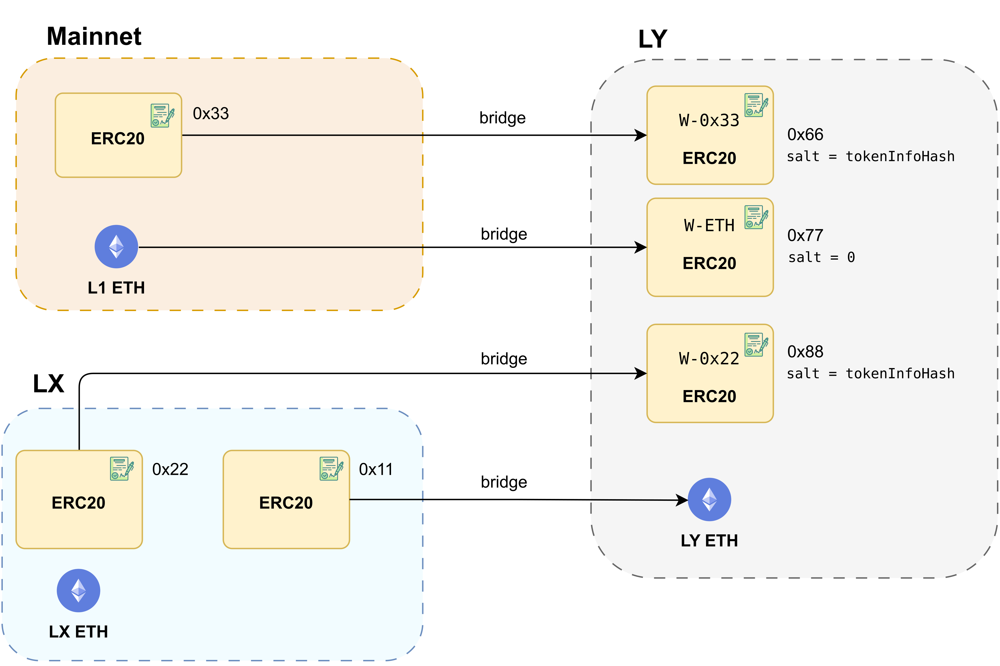

## Set up and prerequisites

1. Edit the [params.yml](https://github.com/0xPolygon/kurtosis-cdk/blob/main/params.yml) file to set `zkevm_use_gas_token_contract` to `true`. This forces a couple of changes at setup time:

    1. During contract deployment, an ERC20 token is deployed on L1.
    2. The [rollup creation parameters](https://github.com/0xPolygon/kurtosis-cdk/blob/main/templates/contract-deploy/create_rollup_parameters.json) file is modified to set the `gasTokenAddress` to the address of the L1 ERC20.

2. You can now run the stack:

    ```sh
    kurtosis run --enclave cdk-v1 --args-file params.yml --image-download always .
    ```


    It takes a few minutes to compile and deploy the full set of contracts.

    The screenshot below shows the full set of deployed services and highlights the bridge UI, L1 RPC, and L2 RPC services which we will focus on throughout this document.

    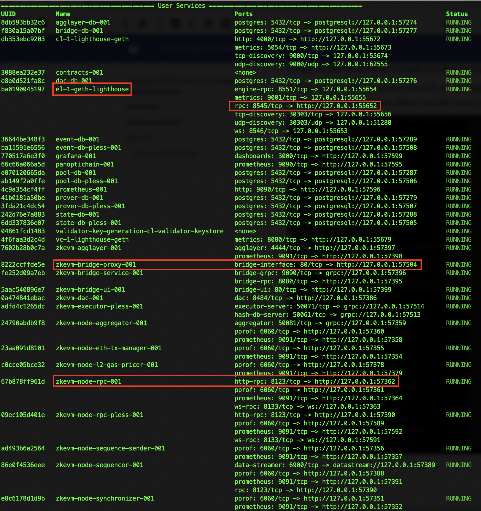

### Mint gas token on L1

!!! tip
    For this section you will need to have [Foundry](https://book.getfoundry.sh/getting-started/installation), [jq](https://jqlang.github.io/jq/), and [yq](https://github.com/mikefarah/yq/#install) installed.

1. Extract the `gasTokenAddress` from the generated files:

    ```sh
    kurtosis service exec cdk-v1 contracts-001 "cat /opt/zkevm/create_rollup_parameters.json"
    ```

2. Run the following command to mint some L1 tokens.

    ```sh
    export gta=$(kurtosis service exec cdk-v1 contracts-001 "cat /opt/zkevm/create_rollup_parameters.json" | tail -n +2 | jq -r .gasTokenAddress)
    export l1_rpc_url=$(kurtosis port print cdk-v1 el-1-geth-lighthouse rpc)
    cast send \
    --mnemonic "code code code code code code code code code code code quality" \
    --rpc-url "$l1_rpc_url" \
    "$gta" \
    "mint(address,uint256)" \
    0x85dA99c8a7C2C95964c8EfD687E95E632Fc533D6 \
    1000000000000000000000000000
    ```

3. Check the balance to make sure it worked.

    ```sh
    cast call --rpc-url "$l1_rpc_url" "$gta" "balanceOf(address)(uint256)" 0x85dA99c8a7C2C95964c8EfD687E95E632Fc533D6
    ```

### Open the bridge UI

Run the following command to get the bridge UI URL and then open the URL in your browser.

```sh
kurtosis port print cdk-v1 zkevm-bridge-proxy-001 web-ui
```

### Add L1 and L2 RPCs to your wallet

As the URLs use HTTP, instead of HTTPS, you need to [manually add them to MetaMask](https://support.metamask.io/hc/en-us/articles/360043227612-How-to-add-a-custom-network-RPC).

1. Retrieve the L1 RPC config by running the following command:

    ```sh
    echo \{\"network_name\": \"kurtosis_cdk_l1\", \"new_rpc_url\": \"$l1_rpc_url\", \"chain_id\": $(yq .args.l1_chain_id params.yml), \"currency_symbol\": \"ETH\"\} | jq
    ```

2. Do the same for L2:

    ```sh
    echo \{\"network_name\": \"kurtosis_cdk_rollup\", \"new_rpc_url\": \"$(kurtosis port print cdk-v1 zkevm-node-rpc-001 http-rpc)\", \"chain_id\": $(yq .args.zkevm_rollup_chain_id params.yml), \"currency_symbol\": \"CDK\"\} | jq
    ```

### Import an account

If you used the [pre-allocated mnemonic](https://github.com/0xPolygon/kurtosis-cdk/blob/be17ee3ec3b67d086a0155f3deab5ad009034c8b/params.yml#L147), you need to [import an account](https://support.metamask.io/hc/en-us/articles/360015489331-How-to-import-an-account#h_01G01W07NV7Q94M7P1EBD5BYM4) using a private key.

The first derived private key from the `code...quality` mnemonic is
`42b6e34dc21598a807dc19d7784c71b2a7a01f6480dc6f58258f78e539f1a1fa`.

## Bridging tokens

### Add token

1. On the bridge UI, click the token dropdown menu:

    

2. Get the ERC20 gas token address from earlier and paste it in with:

    ```sh
    echo "$gta"
    ```

    In my case, the gas token address is `0xBDF337Ae0209B33285034c476f35733BFC890707`.

    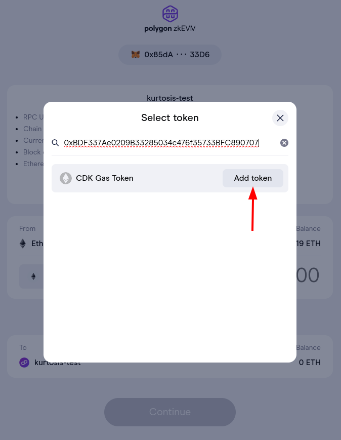

3. Confirm the details and click the **Add CDK Gas Token** button.

    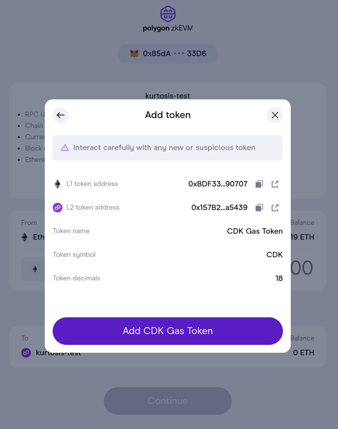

### Bridge tokens

1. Select the token for bridging.

    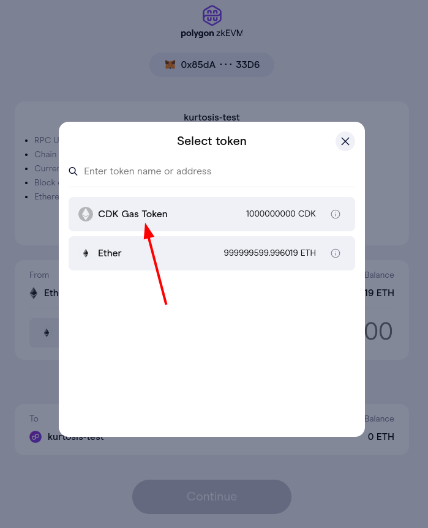

2. Add a value to bridge and click **Continue**.

    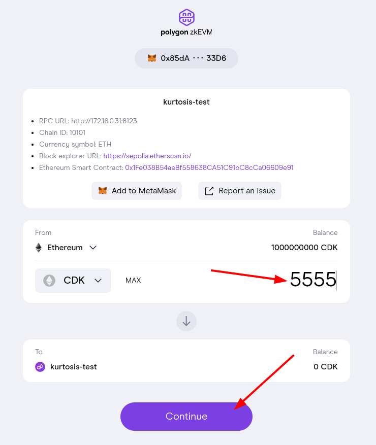

3. Your bridge deposit should be pending.

    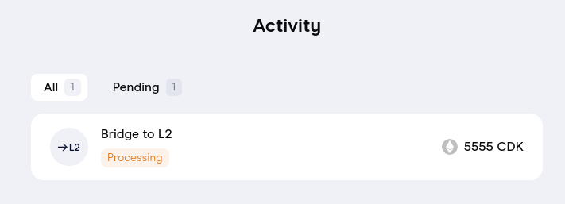

4. After some time, the transaction should complete.

    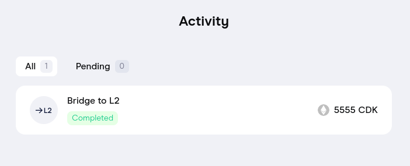

    !!! tip
        If that doesn't happen, it's possible the auto-claiming service on L2 is not funded. Send it some Ether on L2 by running a command like this:

            ```sh
            cast send --legacy \
            --value 10ether \
            --private-key 0x12d7de8621a77640c9241b2595ba78ce443d05e94090365ab3bb5e19df82c625 \
            --rpc-url "$(kurtosis port print cdk-v1 zkevm-node-rpc-001 http-rpc)" \
            "$(yq -r .args.zkevm_l2_claimtxmanager_address params.yml)"
            ```

5. Switch to your L2 network on Metamask to see the bridged value on L2.

    

### Transfer token

1. To complete the test, lets transfer some of the value on L2 to another address.

    

2.  Check the balance in MetaMask after importing the private key `0903a9a721167e2abaa0a33553cbeb209dc9300d28e4e4d6d2fac2452f93e357`.

    

### Withdraw the token

1. After initiating a withdraw transaction, wait for the transaction data to be proven on L1.

    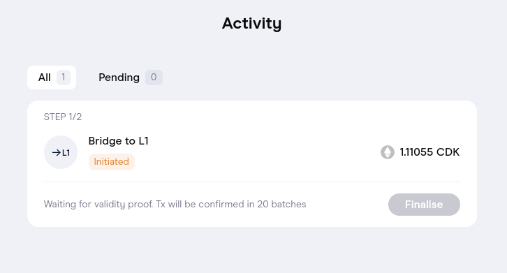

    !!! warning
        - As of 2024-03-27, there might be a small bug in the bridge UI which causes the transaction not to be claimable on L1 with the UI.
        - Essentially the bridge UI is selecting the wrong destination network so the proof will not validate.
        - That being said, it's possible to claim directly using the smart contracts.

2. Click **Finalize**.

    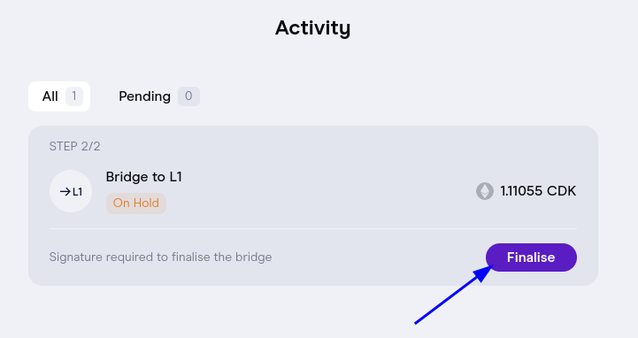

## Using cast to withdraw assets from the bridge

The following work-in-progress cast script processes a bridge claim.

Feel free to go through line-by-line and tweak where necessary.

```sh
#!/bin/bash
set -e

# Setup some vars for use later on
# The private key used to send transactions
private_key="0903a9a721167e2abaa0a33553cbeb209dc9300d28e4e4d6d2fac2452f93e357"
# The destination network (zero corresponds to L1/Ethereum)
destination_net="0"
# The address of the recipient
destination_addr="0x85dA99c8a7C2C95964c8EfD687E95E632Fc533D6"
# The bridge address
bridge_addr="$(kurtosis service exec cdk-v1 contracts-001 "cat /opt/zkevm/combined.json" | tail -n +2 | jq -r .polygonZkEVMBridgeAddress)"

# Grab the endpoints for l1 and the bridge service
l1_rpc_url=$(kurtosis port print cdk-v1 el-1-geth-lighthouse rpc)
bridge_api_url="$(kurtosis port print cdk-v1 zkevm-bridge-service-001 rpc)"

# The signature for claiming is long - just putting it into a var
claim_sig="claimAsset(bytes32[32],bytes32[32],uint256,bytes32,bytes32,uint32,address,uint32,address,uint256,bytes)"

# Get the list of deposits for the destination address
echo "Getting the list of deposits..."
curl -s "$bridge_api_url/bridges/$destination_addr?limit=100&offset=0" | jq > bridge-deposits.json
cat bridge-deposits.json

# Filter the list of deposits down to the claimable txs that hasn't already been claimed and are destined for L1
echo "Filtering the list of deposits..."
jq '[.deposits[] | select(.ready_for_claim == true and .claim_tx_hash == "" and .dest_net == '$destination_net')]' bridge-deposits.json > claimable-txs.json
cat claimable-txs.json

# Process all the claimable txs
jq -c '.[]' claimable-txs.json | while IFS= read -r tx; do
  echo "Processing claimable tx..."
  echo "$tx"

  # Use the bridge service to get the merkle proof of our deposit
  echo "Getting the merkle proof of our deposit..."
  curr_deposit_cnt="$(echo "$tx" | jq -r '.deposit_cnt')"
  curr_network_id="$(echo "$tx" | jq -r '.network_id')"
  curl -s "$bridge_api_url/merkle-proof?deposit_cnt=$curr_deposit_cnt&net_id=$curr_network_id" | jq '.' > proof.json
  cat proof.json

  # Get our variables organized
  in_merkle_proof="$(jq -r -c '.proof.merkle_proof' proof.json | tr -d '"')"
  in_rollup_merkle_proof="$(jq -r -c '.proof.rollup_merkle_proof' proof.json | tr -d '"')"
  in_global_index="$(echo "$tx" | jq -r '.global_index')"
  in_main_exit_root="$(jq -r '.proof.main_exit_root' proof.json)"
  in_rollup_exit_root="$(jq -r '.proof.rollup_exit_root' proof.json)"
  in_orig_net="$(echo "$tx" | jq -r '.orig_net')"
  in_orig_addr="$(echo "$tx" | jq -r '.orig_addr')"
  in_dest_net="$(echo "$tx" | jq -r '.dest_net')"
  in_dest_addr="$(echo "$tx" | jq -r '.dest_addr')"
  in_amount="$(echo "$tx" | jq -r '.amount')"
  in_metadata="$(echo "$tx" | jq -r '.metadata')"

  # Generate the call data, this is useful just to examine what the call will look like
  echo "Generating the call data for the bridge claim tx..."
  cast calldata "$claim_sig" "$in_merkle_proof" "$in_rollup_merkle_proof" "$in_global_index" "$in_main_exit_root" "$in_rollup_exit_root" "$in_orig_net" "$in_orig_addr" "$in_dest_net" "$in_dest_addr" "$in_amount" "$in_metadata"

  # Perform an eth_call to make sure the tx will work
  echo "Performing an eth call to make sure the bridge claim tx will work..."
  cast call --rpc-url "$l1_rpc_url" "$bridge_addr" "$claim_sig" "$in_merkle_proof" "$in_rollup_merkle_proof" "$in_global_index" "$in_main_exit_root" "$in_rollup_exit_root" "$in_orig_net" "$in_orig_addr" "$in_dest_net" "$in_dest_addr" "$in_amount" "$in_metadata"

  # Publish the actual transaction!
  echo "Publishing the bridge claim tx..."
  cast send --rpc-url "$l1_rpc_url" --private-key "$private_key" "$bridge_addr" "$claim_sig" "$in_merkle_proof" "$in_rollup_merkle_proof" "$in_global_index" "$in_main_exit_root" "$in_rollup_exit_root" "$in_orig_net" "$in_orig_addr" "$in_dest_net" "$in_dest_addr" "$in_amount" "$in_metadata"
done
```

Run the script with:

```sh
sh scripts/bridge-manual-claim.sh
```

You should see something like this:

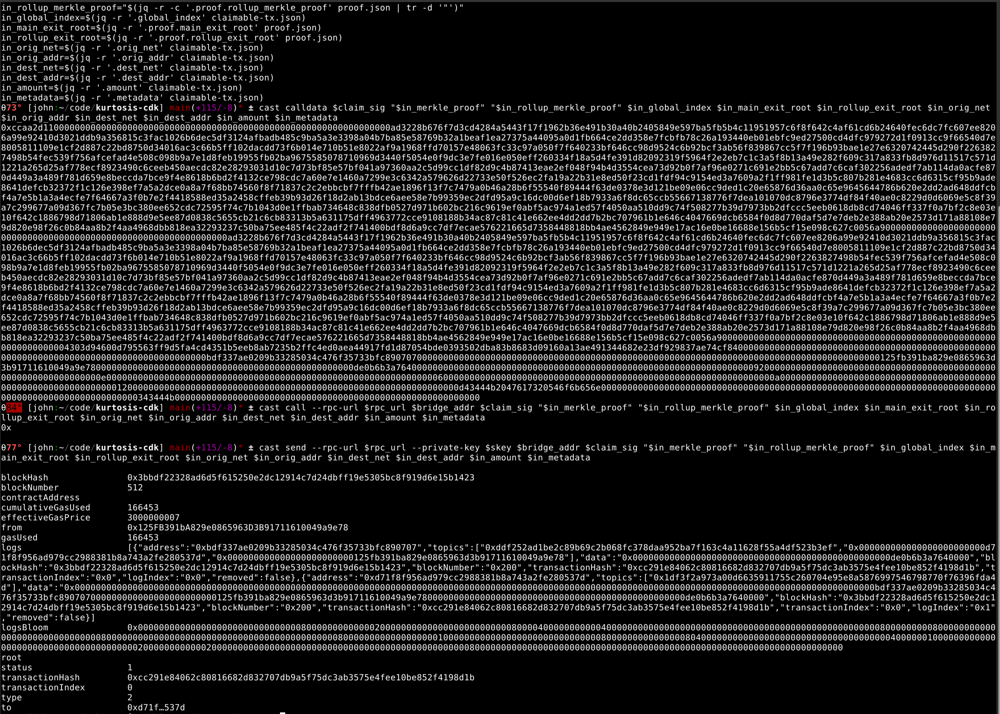

Confirm the claim went through using MetaMask and the bridge UI.

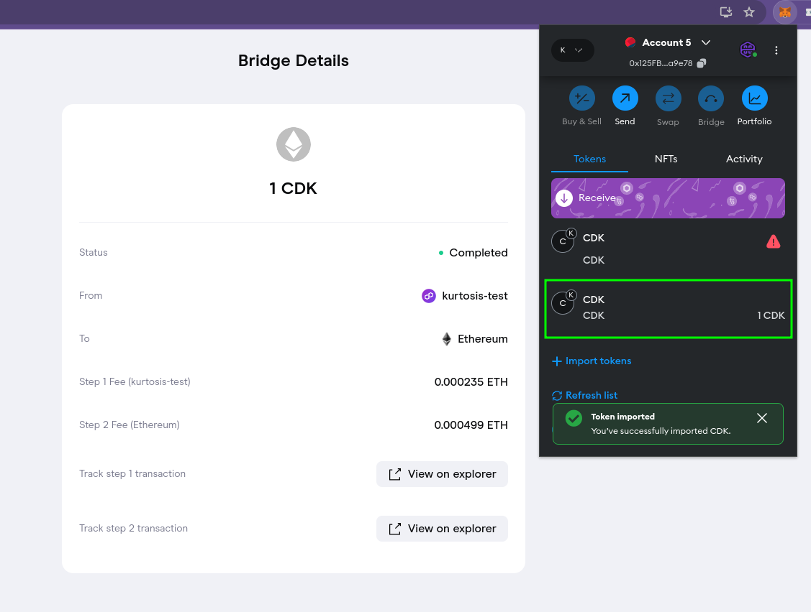

!!! info
    Even though the bridge UI didn't allow me to claim, it does correctly show that a claim was executed.
