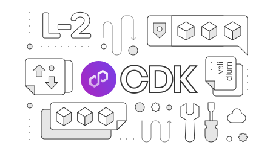

---
hide:
- toc
---

   

   

      <h1 class="hero-heading">Polygon CDK</h1>
      
Polygon Chain Development Kit (CDK) is a modular, open source software toolkit for blockchain developers to launch new L2 chains on Ethereum.

   

    

   

      <a href="./get-started/quickstart-rollup">
         

            
CDK rollups

         

         
Get started with the CDK zkRollup stack.

      </a>
   

   

      <a href="./get-started/quickstart-validium">
         

            
CDK validiums

         

         
Get started with the CDK validium stack.

      </a>
   

   

      <a href="./spec/validium-vs-rollup">
         

            
Rollup versus validium

         

         
Discover the key differences between the rollup and validium infrastructure options.

      </a>
   

