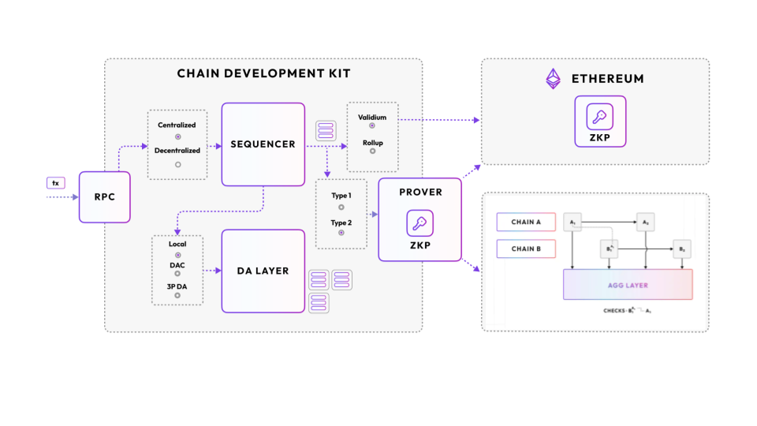
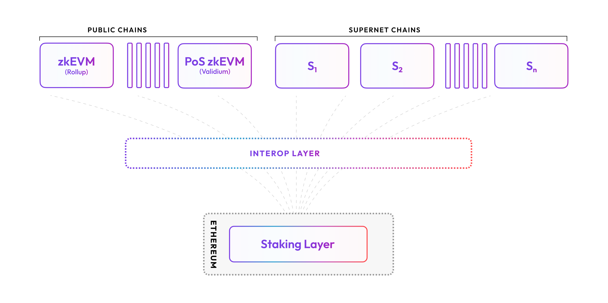

Polygon Chain Development Kit (CDK) is a modular, open source software toolkit for blockchain developers which supports the installation and configuration of a variety of chain architectures. Polygon CDK empowers developers to launch new L2 chains running Polygon zkEVM technology on Ethereum or, in the future, transition existing Layer 1 (L1) chains into ZK-EVM L2s. 

!!! warning "ZK-EVM versus zkEVM"
    - Whenever we refer to **ZK-EVM** chains, this is meant in a general sense and includes any zero-knowledge rollup chain.
    - Whenever we are specifically referring to the Polygon zkEVM product, we use **zkEVM**.

## CDK options

With Polygon CDK, developers can select a chain architecture specific to their needs from a set of supported, open source components. Alternatively, developers can select custom components for specific requirements. The diagram below shows the two supported configuration options, zkEVM rollup or validium. zkEVM rollups post transaction data from Polygon CDK directly onto Ethereum whereas validiums only post the transaction hash.

A chain tailored for a specific application might leverage the zkEVM execution environment, adopt the validium mode, and implement a centralized sequencer. 

!!! note "Example use case"
     A CDK zkEVM rollup L2 chain dedicated to running a game has lower security requirements than a high-value DeFi application. This could also use a validium mode for off-chain data availability to further reduce transaction costs.

!!! info "Coming soon"
     Upon the completion of the aggregation layer every chain will have the option to be interoperable with other Polygon network chains. For now the aggregation layer in the CDK kit allows for independent chains (1 to 1) to settle independently.

## Sovereign and modular chain design

Polygon CDK gives developers a toolkit for sovereign and modular chain design, without sacrificing future interoperability with other L2 chains. Chains built with Polygon CDK can access an ecosystem of (forthcoming) unified liquidity, optimized performance, and seamless asset transfers, all while prioritizing user experience and data security.

## CDK features

Here is what developers can expect when they build with Polygon CDK.

1. **Modularity and sovereignty**: Polygon CDK offers a modular environment for ZK-powered L2 chain design. Developers can customize chains according to their needs.
2. **Scalability**: Polygon CDK-developed L2 chains enhance transaction speed and can be multiplied to achieve an elastically scalable ecosystem.
3. **Independent data availability**: With a dedicated data availability layer and a data availability committee, Polygon CDK-developed chains provide robust off-chain data access and reliability. This structure, independent of Ethereum, ensures substantial data resilience and integrity.
4. **Interoperability (forthcoming)**: Through an in-development interop layer, CDK-developed chains can be seamlessly interoperable, meaning atomic L2 <> L2 transactions. Chains deployed with Polygon CDK will have the opportunity to opt-in to the interop layer and tap unified liquidity.
5. **Near-instant finality**: Chains deployed using Polygon CDK rely on cryptographic security, ensuring transaction integrity without the need of full nodes. This approach guarantees near-instant finality and robust security.
6. **Extensive Web3 support**: Polygon CDK chains leverage a comprehensive ecosystem with premium service providers offering essential tools for application integration, development, and deployment.

!!! important "Why are there zkEVM docs in the CDK section?"
     Several of the docs point to zkEVM specific deployment documentation because the rollup flavor of CDK uses zkEVM deployment defaults.

The following diagram illustrates how Polygon CDK-developed chains may opt into a web of interoperable L2 chains: 

