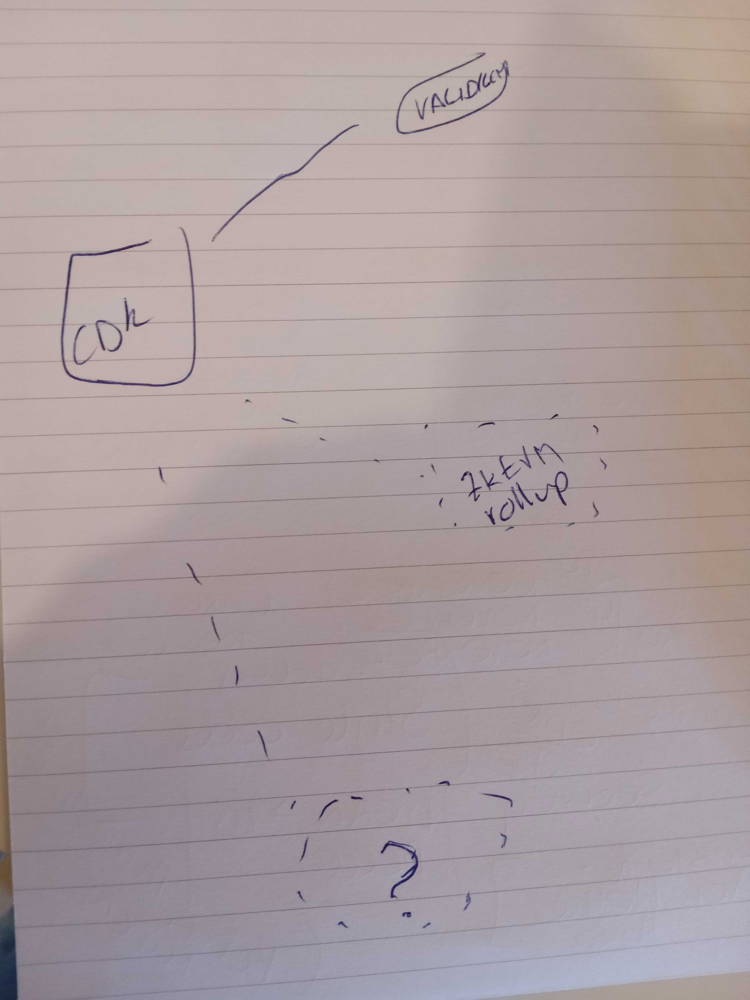

Polygon's Chain Development Kit (CDK) is a software tool for blockchain developers which allows easy install and configuration of a variety of chain architectures.

!!! warning
    - At the time of writing, the CDK only supports validium nodes.
    - zkEVM rollups and more are in development.

