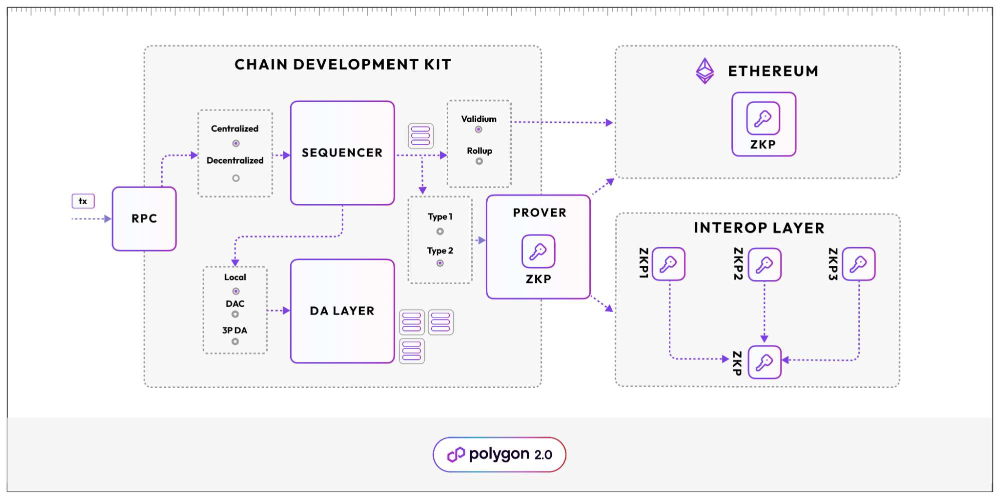

Polygon’s Chain Development Kit (CDK) is a modular, open source software toolkit for blockchain developers which supports installation and configuration of a variety of chain architectures.  

This section documents the two most popular deployments currently supported by CDK:

- Validium
- Rollup

Users select a chain architecture specific to their needs from a set of supported, open source options. Alternatively, users can select custom components for specific requirements.

!!! important "Why are there zkEVM docs in the CDK section?"
     Several of the docs point to zkEVM specific deployment documentation because the rollup flavor of CDK uses zkEVM deployment defaults.

The diagram below shows the two supported configuration options for data availability (DA), rollup or validium. Rollups post transaction data from the CDK directly onto Ethereum whereas validiums only post the transaction hash.

Check out the [data availability docs](concepts/dac.md) for more information.

!!! important
    The documentation describes standard deployments. You can edit the configuration files to implement your own custom set ups.

!!! info
    For the latest updates, follow our official GitHub repositories.

    - [Rollup node](https://github.com/0xPolygonHermez/zkevm-node).
    - [Validium node](https://github.com/0xPolygon/cdk-validium-node).
    - [Data availability committee](https://github.com/0xPolygon/cdk-data-availability).
    - [zkEVM smart contracts](https://github.com/0xPolygonHermez/zkevm-contracts).
    - [Validium smart contracts](https://github.com/0xPolygon/cdk-validium-contracts).
