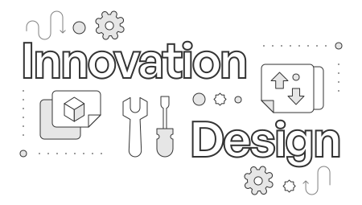

---
hide:
- navigation
- toc
---

      

   

      <h1 class="hero-heading">Innovation & design</h1>
      
The Polygon Knowledge Layer consists of technical documentation that developers need for building with Polygon protocols, products, and services.
 
      
We also publish resources necessary for learning about and contributing to Polygon technologies.

      
This section gives you a peek into the future: a community-driven  vision centered on cutting-edge Web3 development.
      

   

   

      <a href="../agglayer/overview">
         

            
AggLayer documentation

         

         
AggLayer solves blockchain fragmentation by enabling sovereign chains to securely share liquidity, users, and state.

      </a>
   

    

      <a href="./polygon-protocols">
         

            
The future of Polygon network

         

         
Upcoming updates and iterations across Polygon network

      </a>
   

   

      <a href="../cdk/architecture/type-1-prover/intro-t1-prover">
         

            
Polygon Type 1 Prover

         

         
Driven by innovation, the Polygon type 1 prover is fully Ethereum equivalent.

      </a>
   

   

      <a href="./security/overview">
         

            
Polygon security

         

         
Polygon security, bug bounties, and more.

      </a>      
   

   

      <a href="./plonky">
         

            
Plonky 2 & 3

         

         
State-of-the-art cryptography libraries for developers.

      </a>
   

   

      <a href="https://polygon.technology/blog/reorgs-demystified-insights-from-monitoring-with-a-sensor-network">
         

            
Understanding chain reorgs in PoS

         

         
Find out more about reorgs in PoS; why they happen and how they work.

      </a>
   

