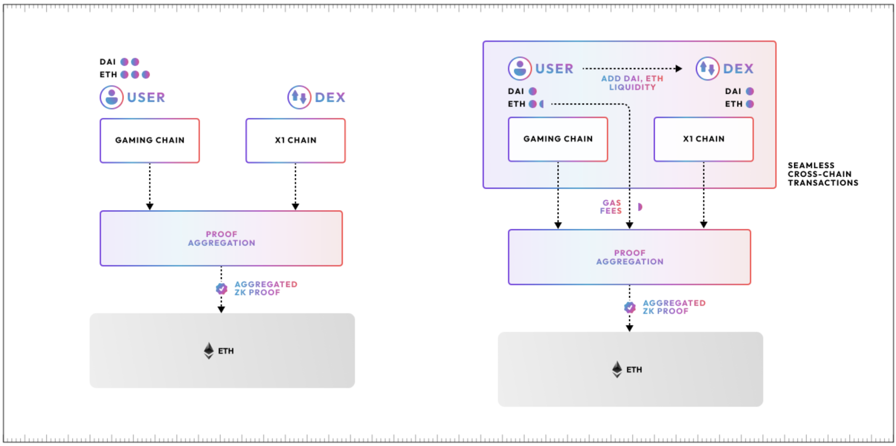

# Polygon aggregation layer

!!! info

    This post is a direct reproduction of [**the original blog post**](https://hackmd.io/@QOKsDTFRSd-1oYqrNQ3fIA/Hkx9X3jah) made by Brendan Farmer, Co-founder @ Polygon

Polygon 2.0 envisions a protocol layer that seamlessly connects any ZK-enabled Layer-2 (L2) or Layer-1 (L1) chain. This layer of interoperability is referred to as the **aggregation layer**, or **AggLayer**.

In this post, we'll be looking at:

* what AggLayer is and the problems it addresses
* a brief overview of how the AggLayer is implemented
* the advantages of using an aggregated solution

## Overview

At this point, interoperability protocols rely heavily on bridging to connect what are essentially isolated networks. This translates to fragmented liquidity, and makes for a less than ideal user experience.

Polygon 2.0's AggLayer proposes a solution to that problem by acting as the service layer that aggregates ZK proofs generated by different chains, and co-ordinates cross-chain transactions. We're working with the assumption that ***atomic cross-chain transaction execution is necessary for cross-chain asset exchange***.

!!! tip

    To read up more on atomic cross-chain transactions, check out [this article on shared validity sequencing](https://www.umbraresearch.xyz/writings/shared-validity-sequencing).

In this context, "atomic" means a user can send a set of transactions to multiple chains, and they can be certain that either all of the transactions will be executed succesfully, or none of them will be included on any of the chains.

The most basic example of this is a cross-chain transfer. Let’s say that Alice wants to send 1 ETH to Bob, but Alice is on Rollup A, and Bob is on Rollup B. Assuming a shared native bridge for both rollups, Alice can burn her ETH on Rollup A and mint ETH on Rollup B which is transferred to Bob. But it’s critical to guarantee that she can’t mint ETH without burning it or vice-versa - either she could lose her ETH or under-collateralize the bridge.

This is why we need atomic transactions to ensure low-latency interactions between the chains so the UX *feels* like using a single chain with the Polygon ecosystem. Any L1 or L2 connecting to the Polygon AggLayer, these chains still maintain complete sovereignty, but the ecosystem delivers **high composability** and **uniform cryptographic security** with Ethereum as the global settlement layer.

## AggLayer design sketch

The Polygon network topology consists of many L2 chains and a single AggLayer, which can be centralized or decentralized. L2 chains submit proofs and state updates to the AggLayer, and the proofs are aggregated and submitted to Ethereum. This design sketch will have three components:
- Proof aggregation
- Optimistic batch confirmation
- Atomic cross-chain interaction

Let's go over each component in detail.

### Proof aggregation

The `submitBatch` data interface used to transmit proofs between chains and the AggLayer, which is of the form:

|          Field           |      Type       | Description                                                               |
| :----------------------: | :-------------: | ------------------------------------------------------------------------- |
|         Chain ID         |       Int       | Identifier for chain submitting a batch and proof                         |
|      New State Root      |      u256       | Commitment to the updated chain state                                     |
|       Batch Proof        | Plonky2/3 Proof | Proof guaranteeing validity of batch of tx                                |
|     Consensus Proof      | Plonky2/3 Proof | Proof of consensus for decentralized sequencers/signature for centralized |
|      Message Queue       |  Vec<Message>   | LxLy message queue resulting from batch                                   |
|         Calldata         |  Vec<Calldata>  | Calldata that must be posted to Ethereum                                  |
| Cross-Chain Dependencies |     Vec<*>      | Cross-chain state root dependencies and bundles that the batch builds on. |

Multiple chains post proofs to the AggLayer that are then aggregated before being published to Ethereum. This way, the Polygon ecosystem can post an unlimited number of chain updates for the cost of a single chain’s update, amortizing the cost of proof verification across many more transactions, and allowing for more frequent finalization.

Users interact with individual Polygon chains $C_i$. These can be thought of as copies of the Polygon zkEVM chain. They submit transactions to each $C_i$, and then for each $C_i$, the sequencer (centralized or decentralized) orders and executes them, and then generates a $\pi_i$ proof showing that the updated state $S_i'$ of each $C_i$ is valid and is consistent with a list of messages for each chain $M_i$.

From here, rather than submitting $\pi_i$ to Ethereum, chains submit $\pi_i$, $S'_i$, and $M_i$ to the AggLayer, which can run as a centralized or decentralized service.

The AggLayer takes in $\pi_i$ and the associated $S'_i$ and the message list $M_i$. It arranges the $\pi_i$ in a binary tree ordered by index, where each $\pi_i$ is assigned to a leaf node.

For each $\pi_i$, the AggLayer generates a commitment to all messages $M_i$ associated with that proof. At each parent node, the AggLayer generates a recursive proof $\pi'_i$ that verifies that both child proofs are valid, and a commitment to the union of messages associated with both child nodes. 

By the root node, the AggLayer will produce an aggregated proof $\pi'$ that guarantees that all proofs for all chains in the Polygon ecosystem are valid and that the messages $M_i$ associated with all chains are consistent with the proof. Optionally, the aggregated proof can also guarantee that a list of updated state roots $S_i$ is valid.

After producing the aggregated proof $\pi'$, the AggLayer posts that proof to Ethereum, along with a commitment to the message lists $M_i$.

There's one subtle detail - we know that for all rollup chains, we'll have all data necessary to retrieve the proof of inclusion for a particular message in some list $M_i$. But we don't know this for all validium nodes, so we need to ensure that a withholding attack (with cooperation from the AggLayer) on a validium can't affect a user's ability to process an exit or message from a rollup. This can be achieved by segmenting rollup and validium message lists and optionally posting a commitment to the message list for all validium nodes to Ethereum.

### Optimistic confirmation

The problem with the aggregation layer, as described, is that it suffers from high latency. For a user to trust a message from another chain, they must have a proof that the message is the output of a valid batch, and a guarantee that the batch that produced the message has either already been, or will be finalized on Ethereum.
    
Currently, proving time for a batch is a few minutes, and batches are posted to Ethereum every 30-60 minutes, which prohibits fast cross-chain messaging and interopability.
    
In order to reduce latency to levels that make cross-chain interactions feel like using a single chain, we need to safely confirm batches before:    
1. A proof is generated (validity).
2. A batch is posted to Ethereum (finality).

The `SubmitBatchWithoutProof` data interface is used to post tx batches to the Agglayer without a validity proof, and is of the form:

|           Field            |      Type      | Description                                                                 |
| :------------------------: | :------------: | :-------------------------------------------------------------------------- |
|          Chain ID          |      Int       | Identifier for chain submitting a batch and proof                           |
|       New State Root       |      u256      | Commitment to the updated chain state                                       |
|     Consensus Witness      | Vec<Signature> | Witness required to verify consensus for a chain                            |
|       Message Queue        |  Vec<Message>  | LxLy message queue resulting from batch                                     |
|          Calldata          | Vec<Calldata>  | Calldata that must be posted to Ethereum                                    |
| *Cross-Chain Dependencies* |     Vec<*>     | *Cross-chain state root dependencies and bundles that the batch builds on.* |

#### Finality
    
We can derive the finality property from the aggregation layer: as soon as a batch is pre-confirmed by the aggregation layer, it is considered weakly finalized, meaning that it's only possible to revert a pre-confirmed batch and post a conflicting batch to Ethereum if both the aggregator layer and the chain collude. 

While it's possible that a chain could collude with the aggregation layer to fork, it's possible to slash both the aggregation layer and the chain for equivocation. Moreover, this attack already exists ith a single L2, as the sequencer RPC can confirm transactions for users before the transactions are posted to L1 and then publish a conflicting batch.
    
#### Validity
    
We can allow batches to be optimistically confirmed without proofs if we ensure that chains can safely receive messages. We do so as follows.
    
1. Chain A submits a batch and message queue without a validity proof to the AggLayer.
2. A user on Chain B submits a transaction that reads a message from Chain A before the validity proof is generated.
3. Chain B can confirm with the AggLayer the current pre-confirmed state of Chain A.
4. Chain B submits a batch and includes a claimed Batch Root and Message Queue for Chain A.
5. The validity proof for Chain B commits to the claimed Message Queue for Chain A.
6. The recursive proof generated by the AggLayer checks that the Message Queue for Chain A is consistent with the *claimed* Message Queue for Chain A by Chain B.
7. Either:
    - Chain A submits a validity proof that is consistent with the pre-confirmed batch, in which case the recursive proof can be generated.
    - Chain A fails to submit a validity proof. Chain B must roll back the transaction that depends on Chain A. Chain A is slashed. 

Fundamentally, this approach provides safety because it guarantees that a batch from Chain B that relies on a pre-confirmed batch from Chain A cannot be submitted to Ethereum if Chain A equivocates or has pre-confirmed an invalid batch. 
    
This is critical, because otherwise Chain B could read a message from Chain A, mint some number of tokens, and then Chain A could equivocate and mint the same number of tokens on Chain C, undercollateralizing the bridge. Using this approach, we can obtain both low latency and safety.

### Atomic Cross-Chain Interaction
    
The final part of the unified liquidity vision is to enable cross-chain atomic interactions. Cross-chain interactions as we've described them are only asynchronous - Chain A must submit a batch and message queue, then Chain B must submit a transaction in a new batch that reads from Chain A's message queue, and so on.
    
We want to instead provide truly seamless interaction and give users the experience of using a multi-chain ecosystem that feels like using a single chain. We can achieve this with atomicity. Users can submit a bundle of transactions to many chains in the Polygon ecosystem, with the guarantee that all transactions will be successfully executed, or none will be included.
    
#### AggLayer data interfaces 
    
**`SubmitBundle`**

|    Field     |               Type                | Description                                              |
| :----------: | :-------------------------------: | :------------------------------------------------------- |
| Bundle Root  |               u256                | Unique identifier or commitment for a transaction bundle |
| Transactions | Vec&lt;(ChainID, Transaction)&gt; | Chain, Transaction pairs                                 |

**`ConfirmBundle`**

|    Field    | Type  | Description                                              |
| :---------: | :---: | :------------------------------------------------------- |
| Bundle Root | u256  | Unique identifier or commitment for a transaction bundle |
    
#### Chain Interface
    
**`SubmitBundleTransaction`**

|    Field    |    Type     | Description                                              |
| :---------: | :---------: | :------------------------------------------------------- |
| Bundle Root |    u256     | Unique identifier or commitment for a transaction bundle |
| Transaction | Transaction | EVM Transaction                                          |
    
**`ConfirmBundleTransaction`**

|    Field    |     Type      | Description                                              |
| :---------: | :-----------: | :------------------------------------------------------- |
| Bundle Root |     u256      | Unique identifier or commitment for a transaction bundle |
| Transaction | TransactionID | Transaction Identifier                                   |

The atomic mode for cross-chain interaction largely follows the Shared Validity Sequencing approach, with the caveat that no shared sequencer is required for all chains. 
    
1. Users submit atomic bundles of transactions to the aggregator layer. For each bundle, an Aggregator Worker is spun up. The worker is a process running on a single node, charged with ensuring execution of all transactions in the bundle before the bundle can be included in a batch. 
2. Transactions from the bundle are forwarded to their respective chains by the worker.
3. Chains take a lock on the state affected by each transaction and sequence the bundle in a new block, returning the resulting message queue to the worker. If another transaction is received that touches state affected by the bundle, it's queued for execution until after the bundle is either confirmed or rejected.
4. If each transaction in the bundle executed correctly and the resulting message queues are consistent (ie tokens minted matches tokens burned), then the bundle is included by the aggregation layer.
5. Each chain generates a validity proof for the block containing the bundle. When all validity proofs are received by the AggLayer, chains can release the lock on affected state and execute queued transactions.
    
#### Failure Modes
    
**Liveness**: A malicious user can collude with a malicious chain and submit a bundle that's known to fail on a specific chain. The colluding chain will claim successful execution, the remaining chains will generate proofs, but the colluding chain will never submit a proof, causing the bundle to time out. 
    
This is an attack, but it's not unique to the atomic case. It also exists in the optimistic interop case, where Chain A might have a pre-confirmed batch that Chain B relies on for messages, but this batch is invalid or Chain A never submits a proof. Ultimately, the solution is to blacklist the colluding or unreliable chain from participating in atomic bundles or optimistic pre-confirmations.
    
**Griefing**: A malicious user and colluding chain can submit a bundle that touches a large amount of state on another chain, and then run the same liveness attack, preventing fast confirmations for many transactions on that chain.
    
Similar to the liveness attack, this will cause degradation of UX, but it's not a directly profitable attack, and it comes with a significant penalty for the misbehaving chain. Possible mitigation approaches include only allowing slashable chains to participate in atomic interop and optimistic confirmations.

## Aggregation vs. Modularity

Aggregation presents a solution to the monolothic vs. modular chain design dilemma. It takes the performance gains and efficient resource usage of modular architecture and combines it with the unified experience of a monolothic system.

The AggLayer will allow a single ZK proof to verify state across all chains in the ecosystem and use Ethereum as the settlement layer. Once any chain publishes a ZK proof of its latest state to the AggLayer, all other chains can trust the value (state) of that chain.
