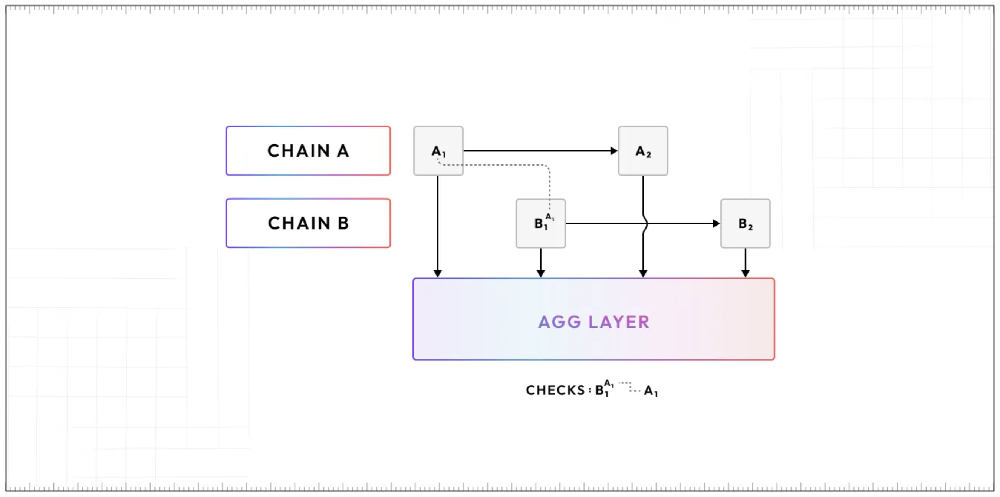
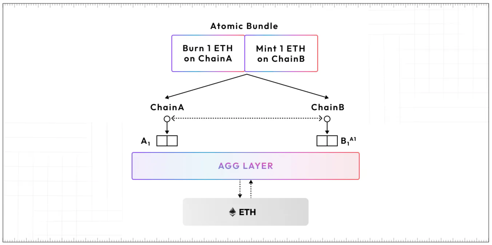
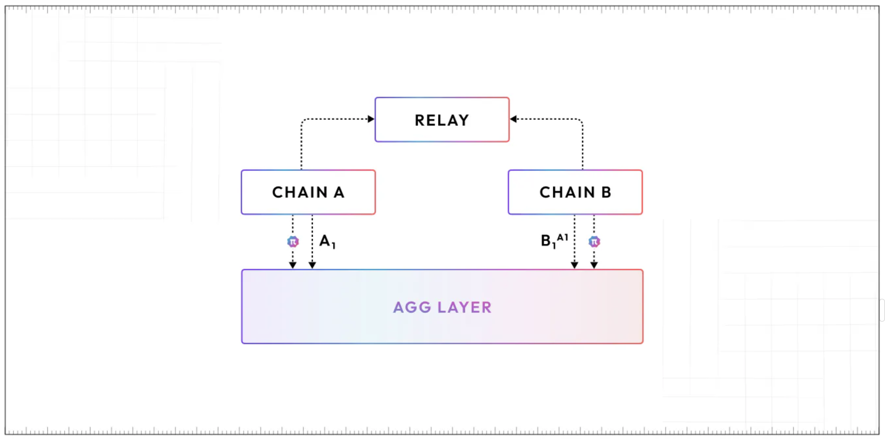

# Aggregation layer

Solving the scalability problem in blockchains means scaling access to shared state and liquidity across multiple chains. To do so requires a new approach to blockchain architecture, namely, aggregated blockchains. Polygon Labs researchers and engineers have designed a solution -- the **aggregation layer**, or **AggLayer** -- which will seamlessly connect any ZK-enabled L2 or L1 chain for near-instant cross-chain transactions, and shared state and liquidity across chains.

In this document, we look at:

* What AggLayer is and the problems it addresses.
* A brief overview of how the AggLayer is implemented.
* The advantages of using an aggregated solution.

****

## Fragmented liquidity

Although developers today have the freedom to build on chains that suit their needs, or design their own chains, the current setup lacks cross-chain interoperability.

As seen in the above diagram, each chain connects directly to Ethereum via a bridge contract, and so any transfer of assets from Chain A to Chain B must go via Ethereum. 

Reliance on bridging in order to connect what are essentially isolated networks, is a common interoperability solution. But it translates to fragmented liquidity, and a less than ideal user experience.

## Atomic guarantees

Let's take a deeper look at cross-chain transfers.

First of all, we understand execution of atomic cross-chain transactions to mean that, with every set of transactions a user submits to multiple chains, the user has the guarantee that either all transactions are executed successfully or none of them is included in any chain.[^1]

Consider the following example as a typical cross-chain transfer:

Suppose Alice, who is on rollup A, wants to send 1 ETH to Bob who is on rollup B. Assuming a shared native bridge for both rollups; 

- Alice burns her 1 ETH on rollup A and mints 1 ETH on rollup B.
- The 1 ETH minted by Alice gets transferred to Bob.

Two things are required for Chain B to safely credit those tokens to Bob.

1. The batch containing Alice’s transaction must be finalized on Ethereum L1.
2. Chain B must be able to verify that the resulting state of Chain A is valid after Alice’s transaction.

This means trustless cross-chain transactions can’t have low-latency. (1) currently requires 12 minutes, while (2) requires waiting for the duration of the challenge period in ORs and a few minutes for proof generation on ZKRs.

The security of atomic transactions is based on this critical guarantee that users do not lose their funds and cannot double spend their tokens. Therefore, atomic guarantees are key to enable low-latency interactions between chains and realizing a unified Polygon ecosystem that feels like using a single chain. 

Good UX is incompatible with 20-minute latency. The Aggregation Layer is designed to solve this problem.

## AggLayer design

The solution to the current fragmentation is an ecosystem of interconnected, ZK-powered L2s. The infrastructure that connects them, the AggLayer, is a decentralized aggregation protocol operated by staked nodes that ensure safety for low-latency, cross-chain transactions and a unified bridge. 

!!! note
    In this context, “safety” implies that it is impossible for a rollup’s state to be finalized/settled on Ethereum if that chain state relies on an invalid or non-finalized state from another chain, or if it includes a transaction from an atomic bundle that has not executed successfully on all other chains.

These chains submit proofs and state updates to the AggLayer, where the proofs are aggregated, and then settled on Ethereum. With atomic cross-chain guarantees, chains can safely interoperate at super-low latencies without having to wait for state finalization on Ethereum.

The overall design of AggLayer is outlined in three parts:

- [Proof aggregation](#proof-aggregation).
- [Batch confirmation and finalization](#batch-confirmation-and-finalization).
- [Cross-chain interoperability mechanism](#interoperability-scenarios).

Let's go over each part in detail.

### Proof aggregation

<!-- Multiple chains post proofs to the AggLayer that are then aggregated before being published to Ethereum. This way, the Polygon ecosystem can post an unlimited number of chain updates for the cost of a single chain’s update, amortizing the cost of proof verification across many more transactions, and allowing for more frequent finalization. -->

Here's what happens in the AggLayer when users interact with individual chains $C_i$.

<!-- These can be thought of as copies of the Polygon zkEVM chain.  -->
  
  1. Users submit transactions to each chain $C_i$. As usual, the sequencer of each $C_i$ (whether centralized or decentralized) orders and executes the transactions. Then generates a proof $\pi_i$ attesting to the fact that the updated state $S_i'$ of each $C_i$ is valid and is consistent with a list of messages for each chain $M_i$.

  2. Rather than submitting proofs $\{ \pi_i \}$ to Ethereum, chains submit $\{\pi_i, S_i', M_i\}$ to the AggLayer, which can run as a centralized or decentralized service.

  3. The AggLayer takes as inputs the proofs $\{\pi_i\}$ and the associated states $\{S'_i\}$ and the message list $\{M_i\}$. It arranges the proofs $\{\pi_i\}$ in a binary tree ordered by index, where each $\pi_i$ is assigned to a leaf node.

  4. For each proof $\pi_i$, the AggLayer generates a commitment to all messages $\{M_j\}$ associated with that proof. 
  
  5. At each parent node, the AggLayer generates a recursive proof $\pi'_i$ that verifies that both child proofs are valid, and a commitment to the union of messages associated with both child nodes.

  6. For the root node, the AggLayer produces an aggregated proof $\pi_{\text{final}}'$ which guarantees that all proofs for all chains in the Polygon ecosystem are valid, and that the messages $\{M_i\}$ associated with all chains are consistent with the proof $\pi_{\text{final}}'$.
  
  7. Optionally, the aggregated proof can also guarantee that a list of updated state roots $S_i$ is valid.

After producing the aggregated proof $\pi_{\text{final}}'$, the AggLayer posts that proof to Ethereum, along with a commitment to the message lists $\{M_i\}$.

The above procedure is depicted in the simplified diagram below.

****

#### Validium-case caveat

There's a subtle detail about validiums that needs to be noted.

For all rollup chains, we have all data necessary to retrieve the proof of inclusion for a particular message in some list $\{M_i\}$.

But this is not so with validium chains. For instance, there could be a 'data withholding' attack.

So we need to ensure that 'data withholding' attacks do no affect validium users' ability to process an exit or message from a rollup.

The solution that enables validium users to circumvent 'data withholding' attacks is, segmentation of rollup and validium message lists, as well as optionally posting the commitment to the message list for all validium nodes to Ethereum.  

### Batch confirmation and finalization

AggLayer functions in three phases. Suppose that Chain A is a ZK-powered chain running in the Polygon ecosystem.

1. **Pre-Confirmation:** Chain A submits a header for a new block/batch $A_1$ to the AggLayer along with a light client proof. The header includes commitments to all other blocks and bundles that $A_1$ depends on ($B_i$, $C_i$, etc). When the new batch is accepted without a validity proof, it’s considered “pre-confirmed” by the AggLayer.
2. **Confirmation:** Chain A, or any full node of A, generates a proof for $A_1$ and submits it to the AggLayer. Once the proof is verified by the AggLayer, $A_1$ is confirmed if all batches that it depends on are also confirmed.
3. **Finalization:** After $A_1$ is confirmed, its proof is aggregated alongside batches from other rollups into a single proof that is posted to Ethereum. The aggregated proof enforces that dependent chain states and bundles are consistent.

Chains can navigate the tradeoff space between latency and liveness guarantees for themselves. A chain might choose to interoperate with another chain after the pre-confirmation step for super low-latency cross-chain transactions, but fundamentally, this model is compatible with chains waiting for confirmation, or even for finalization. The safety guarantee for cross-chain transactions is enforced at the third step. 

Let’s dig further into how this design enables safe cross-chain interaction under different interoperability scenarios.

### Interoperability scenarios

#### Asynchronous case

In this case, chains decide to temporarily assume that transactions and state transitions from other chains are going to be settled on Ethereum before validity proofs are submitted to the AggLayer. For example, in the case of the atomic cross-chain transfer between Alice (on chain A) and Bob (on chain B):

1. Alice needs to lock or burn tokens in block $A_1$ in order to mint and transfer them to Bob on chain B. Chain A submits a batch and message queue without a validity proof.

2. When the message from Chain A is read, Chain B refers to the **pre-confirmed** state of Chain A, temporarily assuming $A_1$ is valid and will eventually be finalized on Ethereum and commits to the state root $A_1$, turning it into a dependency to generate $B_1$ (as ${B_1}^{A_1}$).

3. $B_1$ is then submitted to AggLayer, including a claimed batch root and the message queue for chain Chain A.

4. The AggLayer generates a recursive proof and checks for consistency between claimed message queues, building a dependency graph for each batch of transactions it receives as part of the **confirmation** process.

5. At this point, if the proof submitted by Chain A is consistent with the pre-confirmed batch, the recursive proof can be successfully generated. If it is not, or if Chain A fails to submit a proof altogether, Chain B rolls back the transaction that depends on $A_1$.

!!! info

    Relying on Chain A's pre-confirmed state from AggLayer to generate $B_1$ brings down the total processing time from 20 or so minutes, to a few seconds.

For instance, if $A_1$ depends on $B_1$, which in turn depends on $C_1$, $C_1$ can be confirmed as soon as its respective proof ${\pi_{C_1}}$ is submitted to AggLayer. But this is not the case for $A_1$ as ${\pi_{A_1}}$ is not enough to confirm its validity. The same can only be confirmed with both ${\pi_{B_1}}$ and ${\pi_{C_1}}$.

The critical aspect of this design is that the proof aggregation circuit enforces consistency across dependencies. If ${B_1}^{A_1'}$ is inconsistent with the block $A_1$ that Chain A submits, or a proof is missing for ${A_1'}$, then B1 cannot be included in the aggregated batch finalized on Ethereum. If Chain A equivocates, or submits an invalid batch ${A_1'}$, then any batch that depends on it's state root also cannot be finalized on Ethereum. 

This is critical, because otherwise Chain B could read a message from Chain A, mint some number of tokens, and then Chain A could equivocate and mint the same number of tokens on Chain C, undercollateralizing the bridge. Using this approach, we can achieve both low latency and safety.

In the event where let's say the AggLayer equivocates, chain have a cryptographic guarantee that invalid or inconsistent proofs cannot be aggregated in the proof aggregation circuit.
    
#### Atomic case

The final part of the unified liquidity vision is to enable cross-chain atomic interactions. With AggLayer, we want to provide truly seamless interaction and give users the experience of using a multi-chain ecosystem that feels like using a single chain. We can achieve that with atomicity. Users can submit a bundle of transactions to many chains in the Polygon ecosystem, with the guarantee that all transactions will be successfully executed, or none will be included.

Let's consider a scenario where a user submits an atomic bundle of transactions to multiple chains. The bundle is ordered, so let's say the execution starts on Chain A, and the result is passed to Chain B. Likewise, the execution result from Chain B is passed to Chain C, and so on.

The atomic mode for cross-chain interaction largely follows the Shared Validity Sequencing approach, with the caveat that no shared sequencer is required for all chains. 
    
1. Users submit atomic bundles of transactions to the aggregator layer. For each bundle, an Aggregator Worker is spun up. The worker is a process running on a single node, charged with ensuring execution of all transactions in the bundle before the bundle can be included in a batch. 
2. Transactions from the bundle are forwarded to their respective chains by the worker.
3. Chains take a lock on the state affected by each transaction and sequence the bundle in a new block, returning the resulting message queue to the worker. If another transaction is received that touches state affected by the bundle, it's queued for execution until after the bundle is either confirmed or rejected.
4. If each transaction in the bundle executed correctly and the resulting message queues are consistent (ie tokens minted matches tokens burned), then the bundle is included by the aggregation layer.
5. Each chain generates a validity proof for the block containing the bundle. When all validity proofs are received by the AggLayer, chains can release the lock on affected state and execute queued transactions.

It would be ideal to provide the ability to include atomic transactions without:
- Requiring the operator of Chain B to run a full node for all other chains included in a bundle; or
- Accepting the risk that the bundle might be partially included on Ethereum (harming participating chains).

The mechanism that is used to guard against equivocation, or an invalid state in the asynchronous case can also be used here to mitigate the above. Chain B commits to the bundles and the execution results it receives from other chains. The AggLayer and the proof aggregation circuit then check for bundle consistency across chains. So for instance, a bundle on Chain B can only be finalized/settled on Ethereum if all the transactions in the bundle are executed successfully across all chains. Otherwise, it is rejected.

## Cross-chain contract interaction

The Aggregation Layer enables super low-latency cross-chain composability through **asynchronous cross-chain calls**. This is an incredibly powerful primitive: contracts can safely call contracts on other chains at super low latency, without waiting for Ethereum finality. 

For instance, a user could onramp via the OKX chain on Polygon and immediately deposit into a highly-liquid lending market on Aave on a different chain in one click, without needing to swap out of a wrapped synthetic asset.

## Chain co-ordination infrastructure

AggLayer guarantees safety for near-instant atomic cross-chain interactions. But chain operators that are part of Polygon ecosystem also need to be able to share and trust each others' chain states, and co-ordinate with each other when generating atomic transaction bundles.

The design goal for AggLayer is to keep it minimal, and allow chains to freely choose between the different emergent co-ordination mechanisms depending on the respective trust assumptions and how they want to handle cross-chain interoperability and risk of liveness failures. Chains can run their own modified execution environments, use their own tokens for staking and gas fees, choose their own data availability mechanisms, etc. There are several options:

1. Chain B can opt out of fast interoperability and the aggregator layer entirely. It can simply submit batches and proofs directly to Ethereum and finalization is never delayed.
2. Chain B can accept Chain A’s state only when Chain A’s state is confirmed by the AggLayer. Chain B will be delayed only if the AggLayer equivocates.
3. Chain B can accept Chain A’s state when Chain A is pre-confirmed by the AggLayer. Chain B will be delayed if the AggLayer equivocates or Chain A fails to produce a proof.
4. Chain B can accept Chain A’s state in a peer-to-peer setting, without checking that Chain A is pre-confirmed on the AggLayer. Chain B will be delayed if Chain A equivocates or fails to produce a proof.

The mechanism by which chains coordinate to accept atomic bundles is also flexible. For instance, a subset of chains could interoperate in a shared validity sequencing cluster for extremely low latency, or they could rely on relays.

A cryptoeconomically-secured relayer could enable interoperability between Chains A and B by running a full node for both chains, and attesting that states from each chain are valid. Even if Chain A or B pre-confirms a new batch and then goes offline, shared prover infrastructure can step in to generate a proof.

You can imagine novel coordination infrastructure emerging on top of the foundation of safety provided by the AggLayer, enabling new and better forms of interoperability and shared liquidity. Crucially, the entire Polygon ecosystem **does not** need to share the same infrastructure or trust assumptions. It doesn’t need to operate under a single shared validity sequencer or prover. This is an extremely important advantage relative to Optimistic Rollups.

## Failure modes
    
**Liveness**: A malicious user can collude with a malicious chain and submit a bundle that's known to fail on a specific chain. The colluding chain will claim successful execution, the remaining chains will generate proofs, but the colluding chain will never submit a proof, causing the bundle to time out. 
    
This is an attack, but it's not unique to the atomic case. It also exists in the pre-confirmation case, where Chain A might have a pre-confirmed batch that Chain B relies on for messages, but this batch is invalid or Chain A never submits a proof. Ultimately, the solution is to blacklist the colluding or unreliable chain from participating in atomic bundles or pre-confirmation interop. Chains could also rely on third parties running full nodes to ensure that if a chain goes offline before it can produce a proof, there’s a backup prover.

!!! note "Users cannot cause liveness faults!"
    An important thing to note is that users cannot cause liveness faults, only misbehaving or malfunctioning chains. Equivocation and the submission of an invalid block can be heavily penalized, either via slashing or by ejecting chains from the AggLayer and precluding their ability to seamlessly interoperate. Therefore, a liveness fault should be extremely rare.
    
**Griefing**: A malicious user and colluding chain can submit a bundle that touches a large amount of state on another chain, and then run the same liveness attack, preventing fast confirmations for many transactions on that chain.
    
Similar to the liveness attack, this will cause degradation of UX, but it's not a directly profitable attack, and it comes with a significant penalty for the misbehaving chain. Possible mitigation approaches include only allowing slashable chains to participate in atomic and pre-confirmation based interop.

## AggLayer data interface 

### **`submitBatch`**

The `submitBatch` data interface, used to transmit proofs between chains and the AggLayer, involves the following data elements. The below table records the interface data elements, their types and brief descriptions.

|          Field           |      Type       | Description                                                               |
| :----------------------: | :-------------: | ------------------------------------------------------------------------- |
|         Chain ID         |       Int       | Identifier for chain submitting a batch and proof                         |
|      New State Root      |      u256       | Commitment to the updated chain state                                     |
|       Batch Proof        | Plonky2/3 Proof | Proof guaranteeing validity of batch of tx                                |
|     Consensus Proof      | Plonky2/3 Proof | Proof of consensus for decentralized sequencers/signature for centralized |
|      Message Queue       |  Vec&lt;Message&gt;   | LxLy message queue resulting from batch                                   |
|         Calldata         |  Vec&lt;Calldata&gt;  | Calldata that must be posted to Ethereum                                  |
| Cross-Chain Dependencies |     Vec<*>      | Cross-chain state root dependencies and bundles that the batch builds on. |

### **`SubmitBatchWithoutProof`**

The `SubmitBatchWithoutProof` data interface is used to post batches and commit to new states to the AggLayer without a validity proof, and is of the form:

|           Field            |      Type      | Description                                                                 |
| :------------------------: | :------------: | :-------------------------------------------------------------------------- |
|          Chain ID          |      Int       | Identifier for chain submitting a batch and proof                           |
|       New State Root       |      u256      | Commitment to the updated chain state                                       |
|     Consensus Witness      | Vec&lt;Signature&gt; | Witness required to verify consensus for a chain                            |
|       Message Queue        |  Vec&lt;Message&gt;  | LxLy message queue resulting from batch                                     |
|          Calldata          | Vec&lt;Calldata&gt;  | Calldata that must be posted to Ethereum                                    |
| *Cross-Chain Dependencies* |     Vec<*>     | *Cross-chain state root dependencies and bundles that the batch builds on.* |
    
### **`SubmitBundle`**

|    Field     |               Type                | Description                                              |
| :----------: | :-------------------------------: | :------------------------------------------------------- |
| Bundle Root  |               u256                | Unique identifier or commitment for a transaction bundle |
| Transactions | Vec&lt;(ChainID, Transaction)&gt; | Chain, Transaction pairs                                 |

### **`ConfirmBundle`**

|    Field    | Type  | Description                                              |
| :---------: | :---: | :------------------------------------------------------- |
| Bundle Root | u256  | Unique identifier or commitment for a transaction bundle |
    
## Chain interface
    
### **`SubmitBundleTransaction`**

|    Field    |    Type     | Description                                              |
| :---------: | :---------: | :------------------------------------------------------- |
| Bundle Root |    u256     | Unique identifier or commitment for a transaction bundle |
| Transaction | Transaction | EVM Transaction                                          |
    
### **`ConfirmBundleTransaction`**

|    Field    |     Type      | Description                                              |
| :---------: | :-----------: | :------------------------------------------------------- |
| Bundle Root |     u256      | Unique identifier or commitment for a transaction bundle |
| Transaction | TransactionID | Transaction Identifier                                   |

## Aggregation vs. Modularity

Aggregation presents a solution to the monolithic vs. modular chain design dilemma. It takes the performance gains and efficient resource usage of modular architecture and combines it with the unified experience of a monolithic system.

The AggLayer will allow a single ZK proof to verify state across all chains in the ecosystem and use Ethereum as the settlement layer. Once any chain publishes a ZK proof of its latest state to the AggLayer, all other chains can trust the value (state) of that chain.

## Aggregation in ZK vs OR systems

AggLayer's vision is fundamentally only available to ZK-based systems. Optimistic ecosystems that wish to enable fast interoperability must rely on shared validity sequencers. This isn't optimal for chains, because:

- It restricts them from redistributing sequencer fees and MEV, shared validity sequencers force chains to potentially accept restrictions on their execution environments.
- Interoperability in OR-based systems force chains to accept additional trust assumptions in exchange for low latency.
- Anyone can run a full node in single-chain OR networks and immediately confirm that transactions are valid and finalized as soon as they’re posted to L1s. This is no longer true in the multi-chain case, and thus it would be necessary to run a full node for every chain with which the OR interoperates.

By contrast, Polygon’s vision is one where chains are sovereign. They can use any execution environment, can rely on any centralized or decentralized sequencers, and can navigate tradeoffs between cross-chain latency and liveness for themselves.

This is a vision that mirrors the existing Internet. The Internet is an elastically scalable, permissionless, and unified environment. Likewise, the AggLayer is scalable and permissionless - it imposes no restrictions on participating chains - and allows users to move assets and state seamlessly across the ecosystem, presenting a unified interface for the value layer of the Internet.

This is the future of Polygon: not monolithic, not fully modular, but aggregated.

!!! Credits

    The contents of this document were sourced from [a blog post](https://hackmd.io/@QOKsDTFRSd-1oYqrNQ3fIA/Hkx9X3jah) originally written by Brendan Farmer, Co-founder @ Polygon on Sep 2023, as updated with a more [recent blog post](https://mirror.xyz/0xfa892B19c72c2D2C6B10dFce8Ff8E7a955b58A61/TXMyZhhRFa-bjr7YHwmJpKBwt2-_ysirbh_VpNy3qZY) with additional details.

[^1]: Definition taken from "Shared Sequencing: Defragmenting the L2 Rollup Ecosystem" https://hackmd.io/@EspressoSystems/SharedSequencing by Espresso Systems
