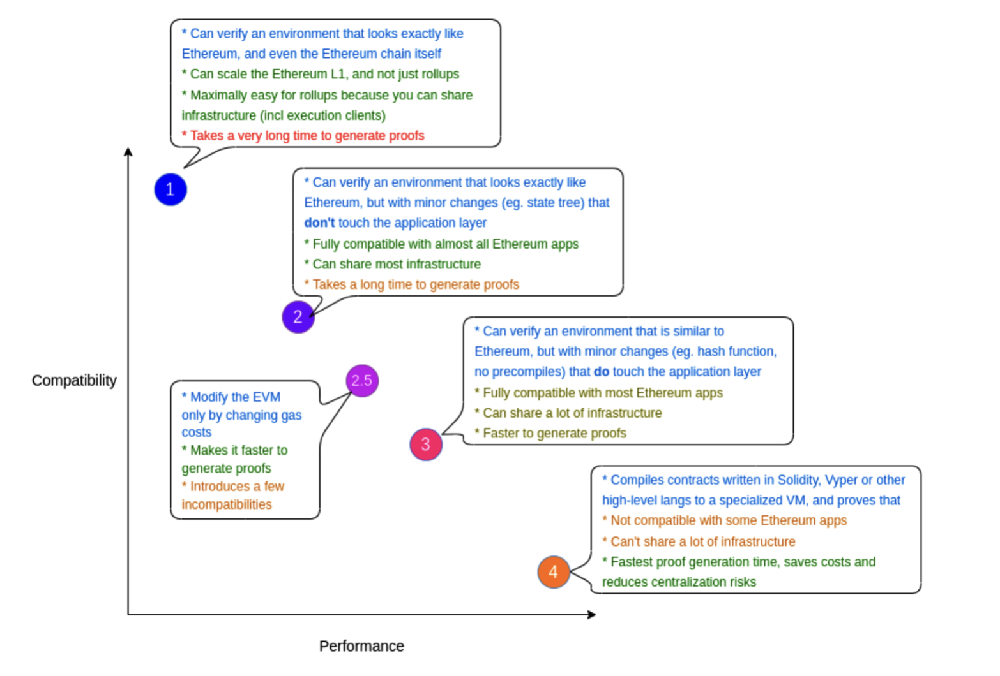

The emergence of various zkEVMs ignited the debate of how 'equivalent' is a given zkEVM to the Ethereum virtual machine (EVM).

Vitalik Buterin has since introduced some calibration to EVM-equivalence in his article, "[The different types of zkEVMs](https://vitalik.eth.limo/general/2022/08/04/zkevm.html)". He made a distinction among five types of zkEVMs, which boils down to the inevitable trade-off between Ethereum equivalence and the efficacy of the zero-knowledge proving scheme involved. For brevity, we refer to this proving scheme as the zk-prover or simply, prover.

The types of zkEVMs, as outlined by Vitalik, are as follows;

- **Type-1** zkEVMs strive for full Ethereum-equivalence. These types of zkEVMs do not change anything in the Ethereum stack except adding a zk-prover. They can therefore verify Ethereum and environments that are exactly like Ethereum.
- **Type-2** zkEVMs aim at full EVM-equivalence instead of Ethereum-equivalence. These zkEVMs make some minor changes to the Ethereum stack with the exception of the Application layer. As a result, they are fully compatible with almost all Ethereum apps, and thus offer the same UX as with Ethereum.
- **Type-2.5** zkEVMs endeavor for EVM-equivalence but make changes to gas costs. These zkEVMs achieve fast generation of proofs but introduces a few incompatibles.
- **Type-3** zkEVMs seek to be EVM-equivalent but make a few minor changes to the Application layer. These type of zkEVMs achieve faster generation of proofs, and are not compatible with most Ethereum apps.
- **Type-4** zkEVMs are high-level-language equivalent zkEVMs. These type of zkEVMs take smart contract code written in Solidity, Vyper or other high-level languages and compile it to a specialized virtual machine and prove it. Type-4 zkEVMs attain the fastest proof generation time.

The below figure gives a visual summary of the zkEVM types, contrasting compatibility with performance.

Ultimately, choosing which type of zkEVM to develop involves a trade-off between EVM-equivalence and performance.

The challenge this poses for developers who favor exact Ethereum-equivalence is to devise ingenious designs and clever techniques to implement faster zk-provers. Vitalik mentions one mitigation strategy to improve proof generation times: Cleverly engineered, and massively parallelized provers.
