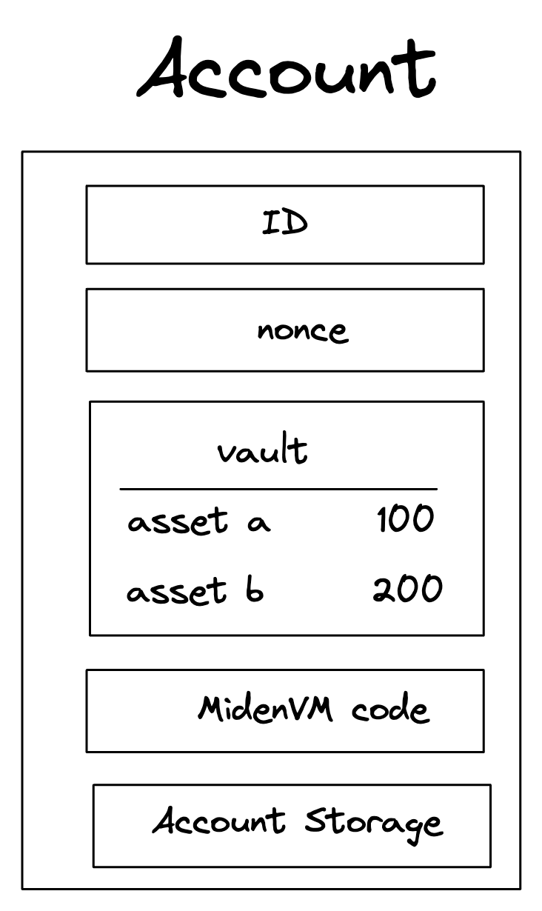

Miden aims to support expressive smart contracts via a Turing-complete language. For smart contracts the go-to solution is account-based state. In Miden, an account is an entity which holds assets and defines rules of how these assets can be transferred. They are basic building blocks representing a user or an autonomous smart contract.

## Account design

The diagram below illustrates basic components of an account. In Miden every account is a smart contract.

{ width="30%" }

In the above picture, you can see:

* **Account ID &rarr;** a unique identifier of an account which does not change throughout its lifetime.
* **Storage &rarr;** user-defined data which can be stored in an account.
* **Nonce &rarr;** a counter which must be incremented whenever the account state changes.
* **Vault &rarr;** a collection of assets stored in an account.
* **Code &rarr;** a collection of functions which define the external interface for an account.

### Account ID

~63 bits (1 field element) long identifier for the account. The four most significant bits specify its [account type](accounts.md#account-types) - regular, immutable, faucet - and the [storage mode](accounts.md#account-storage-modes) - public or private. 

### Account storage

Storage for user-defined data. `AccountStorage` is composed of two components.

The first component is a simple sparse Merkle tree of depth `8` which is index addressable. This provides the user with `256` `Word` slots.

Users requiring additional storage can use the second component a `MerkleStore`. It allows users to store any Merkle structures they need. The root of the Merkle structure can be stored as a leaf in a simple sparse Merkle tree. When `AccountStorage` is serialized it will check if any of the leafs in the simple sparse Merkle tree are Merkle roots of other Merkle structures. If any Merkle roots are found then the Merkle structures will be persisted in the `AccountStorage` `MerkleStore`.

### Nonce

Counter which must be incremented whenever the account state changes. Nonce values must be strictly monotonically increasing and can be incremented by any value smaller than 2^{32} for every account update.

### Vault

Asset container for an account.

An account vault can contain an unlimited number of [assets](assets.md). The assets are stored in a sparse
Merkle tree as follows:

* For fungible assets, the index of a node is defined by the issuing faucet ID, and the value
  of the node is the asset itself. Thus, for any fungible asset there will be only one node
  in the tree.
* For non-fungible assets, the index is defined by the asset itself, and the asset is also
  the value of the node.

An account vault can be reduced to a single hash which is the root of the sparse Merkle tree.

### Code

Interface for accounts. In Miden every account is a smart contract. It has an interface that exposes functions that can be called by note scripts. Functions exposed by the account have the following properties:

* Functions are actually roots of [Miden program MASTs](../vm/specification/assembly/index.md) (i.e., a 32-byte hash). Thus, function identifier is a commitment to the code which is executed when a function is invoked.
* Only account functions have mutable access to an account's storage and vault. Therefore, the only way to modify an account's internal state is through one of the account's functions.
* Account functions can take parameters and can create new notes.

!!! note
    Since code in Miden is expressed as MAST, every function is a commitment to the underlying code. The code cannot change unnoticed to the user because its hash would change. Behind any MAST root there can only be `256` functions*

## Account creation

For an account to exist it must be present in the [Account DB](state.md#account-database) kept by the Miden Node(s). However, new accounts can be created locally by users using a wallet.

The process is as follows:

* Alice grinds a new Account ID (according to the account types) using a wallet.
* Alice's Miden Client requests the Miden Node to check if new Account ID already exists.
* Alice shares the new Account ID to Bob (eg. when Alice wants to receive funds).
* Bob executes a transaction and creates a note that contains an asset for Alice.
* Alice consumes Bob's note to receive the asset in a transaction.
* Depending on the account storage mode (private vs. public) and transaction type (local vs. network) the Operator receives the new Account ID eventually and - if the transaction is correct - adds the ID to the Account DB.

## Account types

There are four types of accounts in Miden:

| | Regular updatable account | Regular immutable account | Faucet for fungible assets | Faucet for non-fungible assets |
|---|---|---|---|---|
| **Description** | For most users, e.g. a wallet. Code changes allowed, including public API. | For most smart contracts. Once deployed code is immutable. | Users can issue fungible assets and customize them. | Users can issue non-fungible assets and customize them. |
| **Code updatability** | yes | no | no | no |
| **Most significant bits** | `00` | `01` | `10` | `11` |

## Account storage mode

Account data - stored by the Miden node - can be public, private, or encrypted. The third and fourth most significant bits of the account ID specifies whether the account data is public `00`, encrypted `01`, or private `11`.

* Accounts with **public state**, where the actual state is stored onchain. These would be similar to how accounts work in public blockchains. Smart contracts that depend on public shared state should be stored public on Miden, e.g., DEX contract.
* Accounts with **private state**, where only the hash of the account is stored onchain. Users who want stay private and take care of their own data should choose this mode. The hash is defined as: `hash([account ID, 0, 0, nonce], [vault root], [storage root], [code root])`.

In the future we will also support **encrypted state** which will be onchain but encrypted. * Depending on the account storage mode (private vs. encrypted vs. public) and transaction type (local vs. network) the operator receives the new Account ID eventually and - if the transaction is correct - adds the ID to the Account DB
