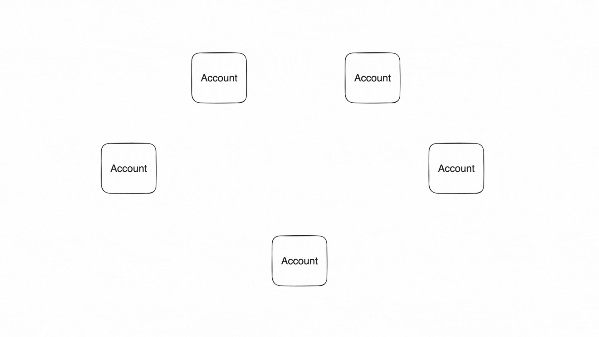

# Architecture

The Polygon Miden Architecture describes how the participants of the network interact. The architecture reflects the design goals for the rollup:

* High throughput.
* Privacy.
* Asset safety.

## Inspired by the actor model

The [actor model](https://en.wikipedia.org/wiki/Actor_model) inspired Miden to achieve concurrent and local state changes. In the model, actors are little state machines with inboxes, meaning each actor is responsible for their own state. Actors can send and receive messages to communicate with other actors. Messages can be read asynchronously.

## Core concepts in Miden

In Miden, there are accounts and notes which can hold assets. Accounts consume and produce notes in transactions. Transactions describe account state changes of single accounts.

### Accounts

[Accounts](accounts.md) can hold assets and define rules how assets can be transferred. Accounts can represent users or autonomous smart contracts. This chapter describes the design, the storage types, and the creation of an account.

### Notes

[Notes](notes.md) are messages that accounts send to each other. A note stores assets and a script that defines how this note can be consumed. This chapter describes the design, the storage types, and the creation of a note.

### Assets

[Assets](assets.md) can be fungible and non-fungible. They are stored in the owner’s account itself or in a note. This chapter describes asset issuance, customization, and storage.

### Transactions

[Transactions](transactions.md) describe production and consumption of notes by a single account. Executing a transaction always results in a STARK proof. This chapter describes the transaction design and the different transaction types.

##### Accounts produce and consume notes to communicate 

{ width="80%" }

## State and Execution

The state model captures all individual states of all accounts and notes. Finally, the execution model describes state progress in a sequence of blocks.

### State model

[State](state.md) describes everything that is the case at a certain point in time. Individual states of accounts or notes can be stored onchain and offchain. This chapter describes the three different state databases in Miden.

### Execution model

[Execution](execution.md) describes how the state progresses - on an individual level via transactions and at the global level expressed as aggregated state updates in blocks. This chapter describes the execution model and how blocks are built.

##### Operators capture and progress state 

{ width="80%" }

??? "Architecture tradeoffs"

      Want to know more on why we designed Miden as is?

      **Polygon Miden's architecture**

      Polygon Miden’s architecture departs considerably from typical blockchain designs to support privacy and parallel transaction exection. In traditional blockchains state and transactions must be transparent to be verifiable. This is necessary for block production and execution. User generated zero-knowledge proofs allow state transitions, e.g. transactions, to be verifiable without being transparent. 

      **Actor-based execution model**

      The actor model inspires Polygon Miden’s execution model. This is a well-known design paradigm in concurrent systems. In the actor model, actors are state machines responsible for maintaining their own state. In the context of Polygon Miden, each account is an actor. Actors communicate with each other by exchanging messages asynchronously. One actor can send a message to another, but it is up to the recipient to apply the requested change to their state. 
      
      Polygon Miden’s architecture takes the actor model further and combines it with zero-knowledge proofs. Now, actors not only maintain and update their own state, but they can also prove the validity of their own state transitions to the rest of the network. This ability to independently prove state transitions enables local smart contract execution, private smart contracts, and much more. And it is quite unique in the rollup space. Normally only centralized entities - sequencer or prover - create zero-knowledge proofs, not the users. 

      **Hybrid state model**

      The actor-based execution model requires a radically different approach to recording the system's state. Actors and the messages they exchange must be treated as first-class citizens. Polygon Miden addresses this by combining the state models of account-based systems like Ethereum and UTXO-based systems like Bitcoin and Zcash.
