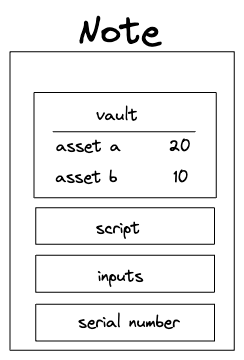
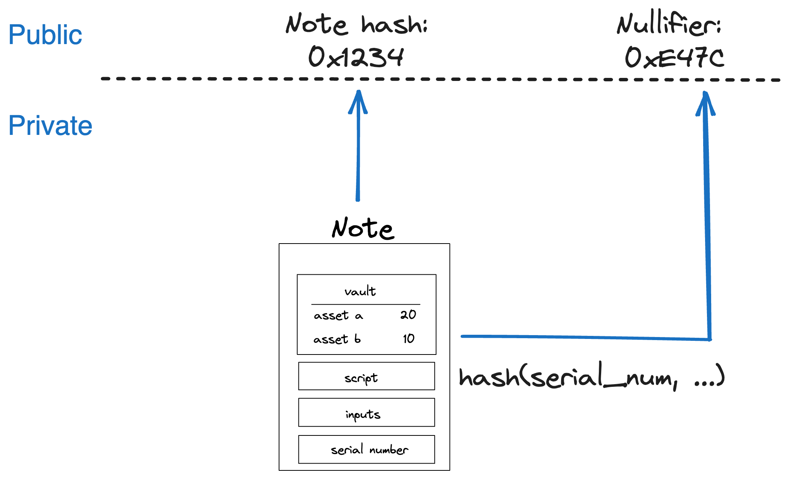

Miden aims to achieve parallel transaction execution and privacy. The UTXO-model combined with client-side proofs provide those features. In Miden, an note is a way of transferring assets between accounts. Notes can be consumed and produced asynchronously and privately.

## Note design

The diagram below illustrates the contents of a note:

As shown in the above picture:

* **Vault &rarr;** a set of assets that are stored in note.
* **Script &rarr;** it must be executed in a context of some account to claim the assets.
* **Inputs &rarr;** these are placed onto the stack before a note's script is executed.
* **Serial number &rarr;** a note's unique identifier.

### Vault

Asset container for a note. A note vault can contain up to `255` assets stored in an array. The entire vault can be reduced to a single hash which is computed by sequentially hashing the list of the vault's assets.

### Script

Unlike an account, a note has a single executable script. This script will be executed in a [transaction](transactions.md). This script is also the root of a [Miden program MAST](../vm/specification/assembly/index.md). A script is always executed in the context of a single account, and thus, may invoke account's functions. A note's script can call zero or more of an account's function.

!!! note
    Since code in Miden is expressed as MAST, every function is a commitment to the underlying code. The code cannot change unnoticed to the user because its hash would change.*

### Inputs

A note script can take parameters (passed via the stack) as inputs.

### Serial number

A note's unique serial number identifies the note and this is needed to create the note's hash and nullifier. The serial number is used to break linkability between note hash and note nullifier.

## Note metadata

For every note the Miden operator stores metadata in the note DB. This metadata includes:

* A **user-defined tag** as a means to quickly grab all notes for a certain application or use case.
* A **sender** to be able to provide also ERC20 contract functionality.
* The **number of assets** contained in the note.

## Note storage modes

Similar to accounts, there are two storage modes for notes in Miden. Notes can be stored privately in the [Notes DB](state.md/#note-database) with only the note hash. Or notes can be stored publicly with all data.

Privately stored notes can only be consumed if the note data is known to the consumer. That means, there must be some off-chain communication to transmit the note's data from the sender to the recipient.

## Note hash

The note hash is computed as:

`hash(hash(hash(hash(serial_num, [0; 4]), script_hash), input_hash), vault_hash)`

This achieves the following properties:

- Every note can be reduced to a single unique hash.
- To compute a note's hash, we do not need to know the note's `serial_num`. Knowing the hash
    of the `serial_num` (as well as `script_hash`, `input_hash` and `note_vault`) is sufficient.
- Moreover, we define `recipient` as: `hash(hash(hash(serial_num, [0; 4]), script_hash), input_hash)`. This allows computing the note hash from recipient and note vault.
- We compute the hash of `serial_num` as `hash(serial_num, [0; 4])` to simplify processing within
the VM.

## Note nullifier

The nullifier is the note's index in the [Nullifier DB](notes.md/#note-nullifier). The Nullifier DB stores the information whether a note was already consumed.

The nullifier is computed as `hash(serial_num, script_hash, input_hash, vault_hash)`.

This has the following properties:

- Every note can be reduced to a single unique nullifier.
- We cannot derive a note's hash from its nullifier.
- To compute the nullifier, we must know all components of the note: `serial_num`, `script_hash`, `input_hash`, and `vault_hash`.

To know a note’s nullifier, one needs to know all details of the note. That means if a note is private and the operator stores only the note's hash, only those with the note details know if this note has been consumed already. Zcash first introduced this approach.

{ width="80%" }

## Note lifecycle

For a note to exist it must be present in the [Notes DB](state.md/#note-database) kept by the Miden node(s). New notes are being produced when executing a transaction. They can be produced locally by users in local transactions or by the operator in a network transaction.

The life-cycle of a note is as follows:

* A new note is produced when a transaction is executed - regardless of the transaction type.
* Operator will receive the note hash and if the note is public, it'll also receive the corresponding note's data.
* Operator verifies the correctness of the underlying transaction before adding the note hash to the Notes DB.
* The note can now be consumed in a separate transaction - to consume the note, the note's data must be known.
* A note is consumed when the its nullifier in the [Nullifier DB](state.md/#nullifier-database) is set to `1`.
* Operator will receive the note's nullifier together with a transaction proof.
* After successful verification, the Operator sets the corresponding entry in the Nullifier DB to `1`.
