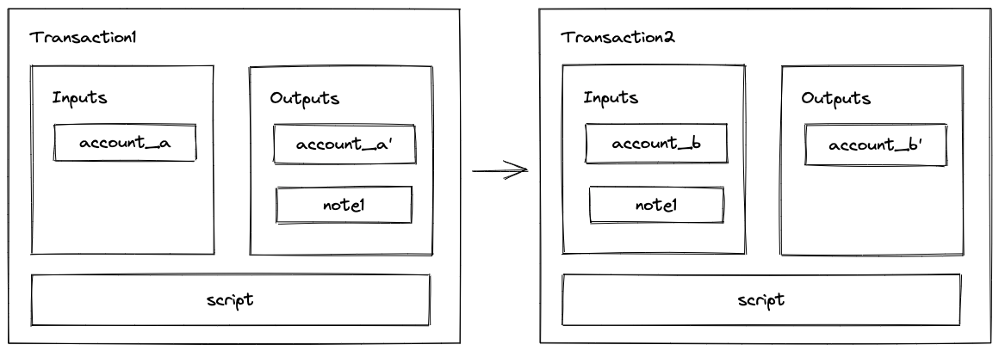
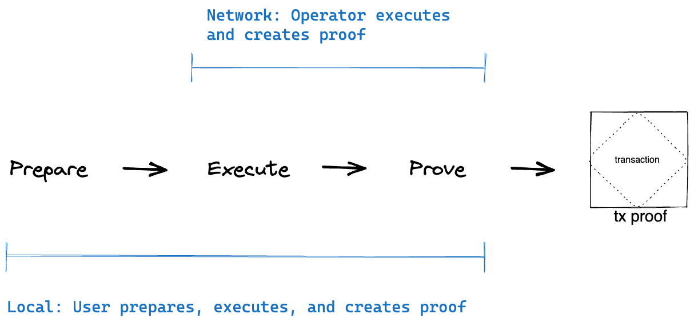

Asset transfers between accounts are done by executing transactions. Miden aims for parallel and private transaction execution. Therefore, a transaction is always performed against a single account which provides asynchronicity. And, every transaction causes a provable state-change and a STARK proof thereof. Thus, when executed locally, it provides privacy.

## Transaction design

Transactions can be described as state-transition function T that takes an account and `0 to n` notes to map it to another version of that account and produces `0 to n` notes

$$
T(A, \sum_{\substack{
   0 \leq i < 1024
  }}
 N(i))) \to (A', \sum_{\substack{
   0 \leq j < 4096
  }}
 N(j))
, where  $ A \in { Accounts }$, $N \in { Notes }, 0 < i + j  $$

A transaction must include an executable program in addition to inputs and outputs. The transaction program has a well-defined structure and must perform the following functions:

1. Create a uniform vault for all inputs.
2. Run scripts for all input notes (scripts are run one after the other).
3. Run a user-defined script if desired.
4. Create a uniform vault for all outputs.
5. Ensure that the assets in the unified input and output vaults are the same.

### Inputs and outputs

As inputs, a transaction accepts the state of one single account and up to `1023` notes for consumption. Optionally, it also takes a user defined script which is executed after all input notes have been consumed. The transaction's output will consist of that single account and up to `4096` newly created notes.

### Program

In addition to specifying inputs and outputs, a transaction must also include an executable program. The transaction program has a well-defined structure which must do the following:

A user-defined transaction script can also be included in a transaction.

The last point ensures that a transaction does not create or destroy any assets. A transaction can also include a user-defined transaction script. A transaction script is different to the [note scripts](notes.md#script) that are executed during a transaction.

## Execution steps

Transaction execution consists of several steps. These steps are described below:

1. **Prologue**: during this step we build a single unified vault all all transaction inputs (account + notes).
2. **Execution**: during this step we first execute scripts of all input notes (one after another), and then execute an optional user-defined script (called tx script).
3. **Epilogue**: during this step we build a single unified vault of all transaction outputs (account + notes), and make sure it contains the same assets as the input vault.

## Asset transfer using two transactions

Under this model transferring assets between accounts requires two transactions as shown in the diagram below.

{ width="80%" }

The first transaction invokes a function on `account_a` (e.g., "send" function) which creates a new note and also updates the internal state of `account_a`. The second transaction consumes the note which invokes a function on `account_b` (e.g., "receive" function), which also updates the internal state of `account_b`.

It is important to note that both transactions can be executed asynchronously: first `transaction1` is executed, and then, some time later, `transaction2` can be executed. This opens up a few interesting possibilities:

* Owner of `account_b` may wait until there are many notes sent to them and process all incoming notes in a single transaction.
* A note script may include a clause which allows the source account to consume the note after some time. Thus, if `account_b` does not consume the note after the specified time, the funds can be returned. This mechanism could be used to **make sure funds sent to non-existent accounts are not lost**.
* Neither sender nor the recipient need to know who the other side is. From the sender's perspective they just need to create `note1` (and for this they need to know the assets to be transferred and the root of the note's script). They don't need any information on who will eventually consume the note. From the recipient's perspective, they just need to consume `note1`. They don't need to know who created it.
* Both transactions can be executed "locally". For example, we could generate a ZKP proving that `transaction1` was executed and submit it to the network. The network can verify the proof without the need for executing the transaction itself. Same can be done for `transaction2`. Moreover, we can mix and match. For example, `transaction1` can be executed locally, but `transaction2` can be executed on the network, or vice-versa.

## Local vs. network transactions

There are two types of transactions in Miden: local transactions and network transactions.

{ width="80%" }

### Local

Clients executing the transactions also generate the proofs of their correct execution. So, no additional work needs to be performed by the network. Local transactions are useful for several reasons:

1. They are cheaper (i.e., lower fees) as ZKPs are already generated by the clients.
2. They allow fairly complex computations because the proof size doesn't grow linearly with the complexity of the computation.
3. They enable privacy as neither the account state nor account code are needed to verify the ZKP.

### Network 

The operator will execute the transaction and generate the proofs. Network transactions are useful for two reasons:

1. Clients may not have sufficient resources to generate ZK proofs.
2. Executing many transactions against the same public account by different clients would be challenging as the account state would change after every transaction. In this case, the Miden Node / Operator acts as a "synchronizer" as they can execute transactions sequentially and feed the output of the previous transaction into the subsequent one.
