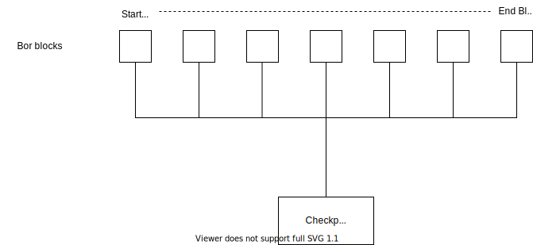

Checkpoints are vital components of the Polygon network, representing snapshots of the Bor chain state. These checkpoints are attested by a majority of the validator set before being validated and submitted on Ethereum contracts.

Heimdall, an integral part of this process, manages checkpoint functionalities using the `checkpoint` module. It coordinates with the Bor chain to verify checkpoint root hashes when a new checkpoint is proposed.

## Checkpoint life-cycle and types

### Life-cycle

Heimdall selects the next proposer using Tendermint's leader selection algorithm. The multi-stage checkpoint process is crucial due to potential failures when submitting checkpoints on the Ethereum chain caused by factors like gas limit, network traffic, or high gas fees.

Each checkpoint has a validator as the proposer. The outcome of a checkpoint on the Ethereum chain (success or failure) triggers an `ack` (acknowledgment) or `no-ack` (no acknowledgment) transaction, altering the proposer for the next checkpoint on Heimdall.

#### Flow chart representations

- [Checkpoint Life-cycle Flowchart](../../../img/pos/checkpoint-flowchart.svg)
- [Checkpoint Module Flow](../../../img/pos/checkpoint-module-flow.svg)

### Types and structures

#### Checkpoint block header

```go
type CheckpointBlockHeader struct {
 Proposer        types.HeimdallAddress `json:"proposer"`
 StartBlock      uint64                `json:"startBlock"`
 EndBlock        uint64                `json:"endBlock"`
 RootHash        types.HeimdallHash    `json:"rootHash"`
 AccountRootHash types.HeimdallHash    `json:"accountRootHash"`
 TimeStamp       uint64                `json:"timestamp"`
}
```

#### Root hash calculation



The `RootHash` is calculated as a Merkle hash of Bor block hashes from `StartBlock` to `EndBlock`. The process involves hashing each block's number, time, transaction hash, and receipt hash, then creating a Merkle root of these hashes.

```matlab
blockHash = keccak256([number, time, tx hash, receipt hash])
```

Pseudocode for the root hash for `1` to `n` Bor blocks:

```go
B(1) := keccak256([number, time, tx hash, receipt hash])
B(2) := keccak256([number, time, tx hash, receipt hash])
.
.
.
B(n) := keccak256([number, time, tx hash, receipt hash])

// checkpoint is Merkle root of all block hash
checkpoint's root hash = Merkel[B(1), B(2), ....., B(n)]
```

Here are some snippets of how checkpoint is created from Bor chain block headers.

Source: [https://github.com/maticnetwork/heimdall/blob/develop/checkpoint/types/merkel.go#L60-L114](https://github.com/maticnetwork/heimdall/blob/develop/checkpoint/types/merkel.go#L60-L114)

```go
// Golang representation of block data used in checkpoint
blockData := crypto.Keccak256(appendBytes32(
 blockHeader.Number.Bytes(),
 new(big.Int).SetUint64(blockHeader.Time).Bytes(),
 blockHeader.TxHash.Bytes(),
 blockHeader.ReceiptHash.Bytes(),
))

// array of block hashes of Bor blocks
headers := [blockData1, blockData2, ..., blockDataN]

// merkel tree
tree := merkle.NewTreeWithOpts(merkle.TreeOptions{EnableHashSorting: false, DisableHashLeaves: true})
tree.Generate(convert(headers), sha3.NewLegacyKeccak256())

// create checkpoint's root hash
rootHash := tree.Root().Hash
```

### AccountRootHash

`AccountRootHash` is the hash of the validator account-related information that needs to pass to the Ethereum chain at each checkpoint.

```jsx
eachAccountHash := keccak256([validator id, withdraw fee, slash amount])
```

Pseudocode for the account root hash for `1` to `n` Bor blocks:

```go
B(1) := keccak256([validator id, withdraw fee, slash amount])
B(2) := keccak256([validator id, withdraw fee, slash amount])
.
.
.
B(n) := keccak256([validator id, withdraw fee, slash amount])

// account root hash is Merkle root of all block hash
checkpoint's account root hash = Merkel[B(1), B(2), ....., B(n)]
```

Golang code for the account hash can be found here: [https://github.com/maticnetwork/heimdall/blob/develop/types/dividend-account.go#L91-L101](https://github.com/maticnetwork/heimdall/blob/develop/types/dividend-account.go#L91-L101)

```go
// DividendAccount contains Fee, Slashed amount
type DividendAccount struct {
 ID            DividendAccountID `json:"ID"`
 FeeAmount     string            `json:"feeAmount"`     // string representation of big.Int
 SlashedAmount string            `json:"slashedAmount"` // string representation of big.Int
}

// calculate hash for particular account
func (da DividendAccount) CalculateHash() ([]byte, error) {
 fee, _ := big.NewInt(0).SetString(da.FeeAmount, 10)
 slashAmount, _ := big.NewInt(0).SetString(da.SlashedAmount, 10)
 divAccountHash := crypto.Keccak256(appendBytes32(
  new(big.Int).SetUint64(uint64(da.ID)).Bytes(),
  fee.Bytes(),
  slashAmount.Bytes(),
 ))

 return divAccountHash, nil
}
```

## Messages in checkpoint module

### MsgCheckpoint

`MsgCheckpoint` handles checkpoint verification on Heimdall, utilizing RLP encoding for Ethereum chain verification. It prioritizes transactions with high gas consumption to ensure only one `MsgCheckpoint` transaction per block.

```go
// MsgCheckpoint represents checkpoint transaction
type MsgCheckpoint struct {
 Proposer        types.HeimdallAddress `json:"proposer"`
 StartBlock      uint64                `json:"startBlock"`
 EndBlock        uint64                `json:"endBlock"`
 RootHash        types.HeimdallHash    `json:"rootHash"`
 AccountRootHash types.HeimdallHash    `json:"accountRootHash"`
}
```

### MsgCheckpointAck

`MsgCheckpointAck` manages successful checkpoint submissions, updating the checkpoint count and clearing the `checkpointBuffer`.

```go
// MsgCheckpointAck represents checkpoint ack transaction if checkpoint is successful
type MsgCheckpointAck struct {
 From        types.HeimdallAddress `json:"from"`
 HeaderBlock uint64                `json:"headerBlock"`
 TxHash      types.HeimdallHash    `json:"tx_hash"`
 LogIndex    uint64                `json:"log_index"`
}
```

### MsgCheckpointNoAck

`MsgCheckpointNoAck` deals with unsuccessful checkpoints or offline proposers, allowing a timeout period before selecting a new proposer.

```go
// MsgCheckpointNoAck represents checkpoint no-ack transaction
type MsgCheckpointNoAck struct {
 From types.HeimdallAddress `json:"from"`
}
```

## Parameters and CLI commands

### Parameters

The checkpoint module contains the following parameters:

|Key                   |Type  |Default value     |
|----------------------|------|------------------|
|CheckpointBufferTime  |uint64|1000 * time.Second|

### CLI commands

Commands are available for various actions such as sending checkpoints, sending `ack` or `no-ack` transactions, and querying parameters.

### Printing all parameters

```go
heimdallcli query checkpoint params --trust-node
```

Expected Result:

```yaml
checkpoint_buffer_time: 16m40s
```

### Send Checkpoint

Following command sends checkpoint transaction on Heimdall:

```yaml
heimdallcli tx checkpoint send-checkpoint \
 --start-block=<start-block> \
 --end-block=<end-block> \
 --root-hash=<root-hash> \
 --account-root-hash=<account-root-hash> \
 --chain-id=<chain-id>
```

### Send `ack`

Following command sends ack transaction on Heimdall if checkpoint is successful on Ethereum:

```yaml
heimdallcli tx checkpoint send-ack \
 --tx-hash=<checkpoint-tx-hash>
 --log-index=<checkpoint-event-log-index>
 --header=<checkpoint-index> \
  --chain-id=<chain-id>
```

### Send `no-ack`

Following command send no-ack transaction on Heimdall:

```yaml
heimdallcli tx checkpoint send-noack --chain-id <chain-id>
```

## REST APIs

Heimdall provides several REST APIs for interacting with the checkpoint module, including endpoints for preparing messages, querying checkpoints, and more.

|Name                  |Method|Endpoint          |
|----------------------|------|------------------|
|It returns the prepared msg for ack checkpoint|POST   |/checkpoint/ack|
|It returns the prepared msg for new checkpoint|POST   |/checkpoint/new|
|It returns the prepared msg for no-ack checkpoint|POST   |/checkpoint/no-ack|
|Checkpoint by number  |GET   |/checkpoints/<checkpoint-number\>|
|Get current checkpoint buffer state|GET   |/checkpoints/buffer|
|Get checkpoint counts |GET   |/checkpoints/count |
|Get last no-ack details|GET   |/checkpoints/last-no-ack|
|Get latest checkpoint |GET   |/checkpoints/latest|
|All checkpoints       |GET   |/checkpoints/list  |
|It returns the checkpoint parameters|GET   |/checkpoints/parama|
|It returns the prepared checkpoint|GET   |/checkpoints/prepare|
|Get ack count, buffer, validator set, validator count and last-no-ack details|GET   |/overview         |

For more details and the response format of these APIs, visit [Heimdall API Documentation](https://heimdall-api.polygon.technology/swagger-ui/#/checkpoint).
