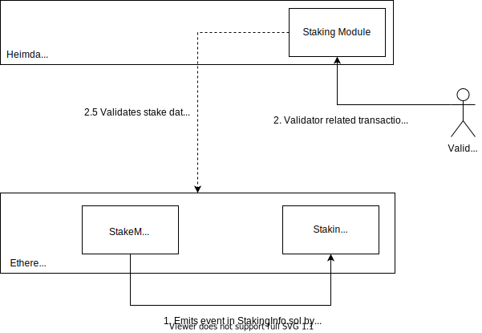

# Staking

Staking module manages validator related transactions and state for Heimdall. Note that a validator stakes their tokens on the Ethereum chain and becomes a validator. Respective validators send the transactions on Heimdall using necessary parameters to acknowledge the Ethereum stake change. Once the majority of the validators agree on the change on the stake, this module saves the validator information on Heimdall state.

## Messages



### MsgValidatorJoin

`MsgValidatorJoin` handles the staking when a new validator joins the system. Once validator calls `stake` or `stakeFor` in `StakingManager.sol` on Ethereum, and the new `Staked` event is emitted.

Source: [https://github.com/maticnetwork/contracts/blob/develop/contracts/staking/StakingInfo.sol#L27-L34](https://github.com/maticnetwork/contracts/blob/develop/contracts/staking/StakingInfo.sol#L27-L34)

```jsx
/**
 * Staked event - emitted whenever new validator 
 * 
 * @param signer           Signer address for the validator
 * @param validatorId      Validator id
 * @param activationEpoch  Activation epoch for validator
 * @param amount           Staked amount
 * @param total            Total stake
 * @param signerPubKey     Signer public key (required by Heimdall/Tendermint)
 */
event Staked(
    address indexed signer,
    uint256 indexed validatorId,
    uint256 indexed activationEpoch,
    uint256 amount,
    uint256 total,
    bytes signerPubkey
);
```

`activationEpoch` is the checkpoint count from where a validator will become active on Heimdall.

Stake call on smart contract fails if slots are unavailable. Validator slots are the way to restrict a number of validators in the system.  Slots are managed on Ethereum smart contracts.

Here is `ValidatorJoin` message for Heimdall transaction:

```go
type MsgValidatorJoin struct {
 From         hmTypes.HeimdallAddress `json:"from"`
 ID           hmTypes.ValidatorID     `json:"id"`
 SignerPubKey hmTypes.PubKey          `json:"pub_key"`
 TxHash       hmTypes.HeimdallHash    `json:"tx_hash"`
 LogIndex     uint64                  `json:"log_index"`
}
```

### MsgStakeUpdate

`MsgStakeUpdate` handles the stake update when a validator the re-stakes or new delegation comes in. In either case, the new `StakeUpdate` event is emitted.

```jsx
/**
 * Stake update event - emitted whenever stake gets updated 
 * 
 * @param validatorId      Validator id
 * @param newAmount        New staked amount
 */
event StakeUpdate(
 uint256 indexed validatorId, 
 uint256 indexed newAmount
);
```

Here is `MsgStakeUpdate` message for Heimdall transaction:

```go
// MsgStakeUpdate represents stake update
type MsgStakeUpdate struct {
 From     hmTypes.HeimdallAddress `json:"from"`
 ID       hmTypes.ValidatorID     `json:"id"`
 TxHash   hmTypes.HeimdallHash    `json:"tx_hash"`
 LogIndex uint64                  `json:"log_index"`
}
```

### MsgValidatorExit

`MsgValidatorExit` handles the validator exit process after a validator initiates the exit process on Ethereum. It emits `SignerUpdate` event.

```jsx
/**
 * Unstake init event - emitted whenever validator initiates the exit
 * 
 * @param user                Signer
 * @param validatorId         Validator id
 * @param deactivationEpoch   Deactivation epoch for validator
 * @param amount              Unstaked amount
 */
event UnstakeInit(
    address indexed user,
    uint256 indexed validatorId,
    uint256 deactivationEpoch,
    uint256 indexed amount
);
```

Here is `MsgValidatorExit` message for Heimdall transaction:

```go
type MsgValidatorExit struct {
 From     hmTypes.HeimdallAddress `json:"from"`
 ID       hmTypes.ValidatorID     `json:"id"`
 TxHash   hmTypes.HeimdallHash    `json:"tx_hash"`
 LogIndex uint64                  `json:"log_index"`
}
```

### MsgSignerUpdate

`MsgSignerUpdate` handles the signer update when a validator updates signer key on Ethereum. It emits `SignerUpdate` event.

```jsx
/**
 * Signer change event - emitted whenever signer key changes
 * 
 * @param validatorId      Validator id
 * @param oldSigner        Current old signer
 * @param newSigner        New signer
 * @param signerPubkey     New signer public key
 */
event SignerChange(
    uint256 indexed validatorId,
    address indexed oldSigner,
    address indexed newSigner,
    bytes signerPubkey
);
```

Here is `MsgSignerUpdate` message for Heimdall transaction:

```go
// MsgSignerUpdate signer update struct
type MsgSignerUpdate struct {
 From            hmTypes.HeimdallAddress `json:"from"`
 ID              hmTypes.ValidatorID     `json:"id"`
 NewSignerPubKey hmTypes.PubKey          `json:"pubKey"`
 TxHash          hmTypes.HeimdallHash    `json:"tx_hash"`
 LogIndex        uint64                  `json:"log_index"`
}
```

## CLI Commands

### Validator details

**By signer address**

```bash
heimdallcli query staking validator-info \
 --validator=<signer-address> \
 --chain-id <chain-id>
```

This command should display the following output:

```json
{
    "ID":1,
    "startEpoch":0,
    "endEpoch":0,
    "power":10,
    "pubKey":"0x04b12d8b2f6e3d45a7ace12c4b2158f79b95e4c28ebe5ad54c439be9431d7fc9dc1164210bf6a5c3b8523528b931e772c86a307e8cff4b725e6b4a77d21417bf19",
    "signer":"0x6c468cf8c9879006e22ec4029696e005c2319c9d",
    "last_updated":0,
    "accum":0
}
```

**By validator address**

```bash
heimdallcli query staking validator-info \
 --id=<validator-id> \
 --chain-id=<chain-id>
```

This command should display the following output:

```json
{
    "ID":1,
    "startEpoch":0,
    "endEpoch":0,
    "power":10,
    "pubKey":"0x04b12d8b2f6e3d45a7ace12c4b2158f79b95e4c28ebe5ad54c439be9431d7fc9dc1164210bf6a5c3b8523528b931e772c86a307e8cff4b725e6b4a77d21417bf19",
    "signer":"0x6c468cf8c9879006e22ec4029696e005c2319c9d",
    "last_updated":0,
    "accum":0
}
```

### Validator join

This command sends validator join command through CLI:

```bash
heimdallcli tx staking validator-join \
 --signer-pubkey <signer-public-key> \
 --tx-hash <tx-hash>   \
 --log-index <log-index> \ 
 --chain-id <chain-id>
```

`tx-hash` value must be the same as Ethereum TX hash which emitted `Staked` event and `log-index` must be the same at which index the event is emitted.

## REST APIs

|Name                  |Method|Endpoint          |
|----------------------|------|------------------|
|Get Heimdall validator set|GET   |/staking/validator-set|
|Get validator details |GET   |/staking/validator/validator-id|

All query APIs will result in following format:

```json
{
 "height": "1",
 "result": {
  ...   
 }
}
```
