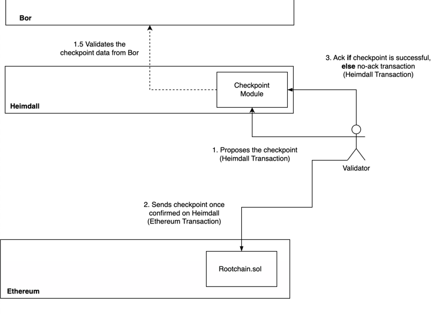
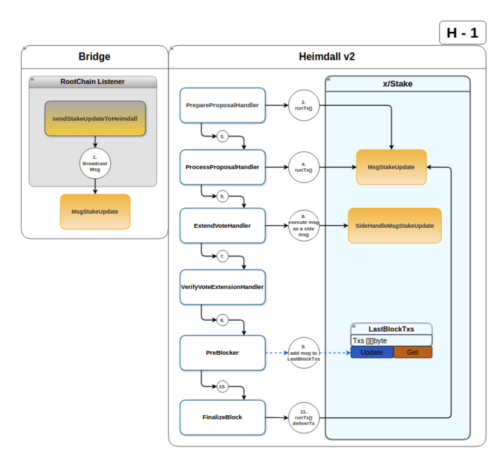

# Checkpoint Module

Checkpoints are vital components of the Polygon network, representing snapshots of the Bor chain state. These checkpoints are attested by a majority of the validator set before being validated and submitted on Ethereum contracts.

Heimdall, an integral part of this process, manages checkpoint functionalities using the `checkpoint` module. It coordinates with the Bor chain to verify checkpoint root hashes when a new checkpoint is proposed.

## Overview

Heimdall selects the next proposer using CometBFT’s leader selection algorithm.  
The multi-stage checkpoint process is crucial due to potential failures when submitting checkpoints on the Ethereum chain caused by factors like gas limit, network traffic, or high gas fees.
Each checkpoint has a validator as the proposer.  
The outcome of a checkpoint on the Ethereum chain (success or failure) triggers an ack (acknowledgment) or no-ack (no acknowledgment) transaction,  
altering the proposer for the next checkpoint on Heimdall.



## Flow

### Checkpoint Proposal

A checkpoint proposal is initiated by a proposer, a validator with POL tokens staked on the L1 Ethereum root chain.  
The checkpointing process is managed by the `bridge processor` which generates a `MsgCheckpoint` and broadcasts it as a transaction.

- The proposer derives the root hash from the Bor chain contract.
- Due to Bor’s finality time, the root hash may not always reflect the latest Bor tip.

### Checkpoint Processing in Heimdall

Once the checkpoint message is included in a Heimdall block,
it undergoes processing through the message handling system.  
Each validator node independently verifies the checkpoint
by checking the Bor root hash provided in the message against its local Bor chain.

### ABCI++ Processing Flow for the checkpoint submission on Heimdall

- `Prepare Proposal`: During the proposal phase, the checkpoint message `MsgCheckpoint` is included in the proposed block only if dry-running this tx does not return any errors.
- `Process Proposal`: The proposal is validated to ensure correctness.
- `Pre-Commit`: As part of the voting process, validators execute a side transaction to verify the checkpoint against their local Bor data.
  If the checkpoint is valid, validators include a vote extension confirming their approval.
- `Verify Vote`: Injected votes are verified.  
  • `Next block - Finalize`: In the next block, the finalized votes are processed, and the checkpoint is considered approved if a sufficient majority supports it.  
  The `preBlocker` triggers post-tx handlers performing the Heimdall state changes when the checkpoint is finally saved in the checkpoint buffer as the checkpoint that needs to be further bridged to the Ethereum L1 root chain.

### Submission to Ethereum (L1)

Once approved, the checkpoint is added to a checkpoint buffer and an event is emitted. The bridge system, which listens for these events, submits the checkpoint data along with validator signatures to the Ethereum root chain.

### Acknowledgment from Ethereum (L1)

After the checkpoint is successfully included on the Ethereum chain, an acknowledgment `MsgCpAck` is sent back to Heimdall from the bridge processor.  
This acknowledgment, once processed through the ABCI++ flow with side and post-tx handlers: updates the state, flushes processed checkpoints from the buffer, and increments the number of ACK counters to track confirmations of checkpoints.  
Additionally, the selection of the next checkpoint proposer is adjusted based on the updated state.

### Missing Checkpoint Acknowledgment from Ethereum (L1)

The `MsgCpNoAck` message is broadcast by the bridge processor to indicate that a checkpoint was potentially transferred to the Ethereum chain but has not received an acknowledgment.  
A background routine periodically checks for time elapsed and publishes the No-ACK signal. No-ACK is sent if a sufficient amount of time has passed since:

- the last checkpoint was created on the Heimdall-v2 chain and
- the last No-ACK was issued.  
  To conclude, the No-ACKs are triggered only when a checkpoint acknowledgment is overdue, ensuring they are not sent too frequently.  
  This message is broadcasted only by the proposer. This entire flow ensures that checkpoints are securely proposed, verified, and finalized across the Heimdall and Ethereum chains in a decentralized manner.



### Messages

#### MsgCheckpoint

`MsgCheckpoint` defines a message for creating a checkpoint on the Ethereum chain.

```protobuf
message MsgCheckpoint {
  option (cosmos.msg.v1.signer) = "proposer";
  option (amino.name) = "heimdallv2/checkpoint/MsgCheckpoint";
  option (gogoproto.equal) = true;
  option (gogoproto.goproto_getters) = true;
  string proposer = 1 [
    (amino.dont_omitempty) = true,
    (cosmos_proto.scalar) = "cosmos.AddressString"
  ];
  uint64 start_block = 2 [ (amino.dont_omitempty) = true ];
  uint64 end_block = 3 [ (amino.dont_omitempty) = true ];
  bytes root_hash = 4 [ (amino.dont_omitempty) = true ];
  bytes account_root_hash = 5 [ (amino.dont_omitempty) = true ];
  string bor_chain_id = 6 [ (amino.dont_omitempty) = true ];
}
```

#### MsgCpAck

`MsgCpAck` defines a message for creating the ack tx of a submitted checkpoint.

```protobuf
message MsgCpAck {
  option (cosmos.msg.v1.signer) = "from";
  option (amino.name) = "heimdallv2/checkpoint/MsgCpAck";
  option (gogoproto.equal) = false;
  option (gogoproto.goproto_getters) = true;
  string from = 1 [
    (amino.dont_omitempty) = true,
    (cosmos_proto.scalar) = "cosmos.AddressString"
  ];
  uint64 number = 2 [ (amino.dont_omitempty) = true ];
  string proposer = 3 [
    (amino.dont_omitempty) = true,
    (cosmos_proto.scalar) = "cosmos.AddressString"
  ];
  uint64 start_block = 4 [ (amino.dont_omitempty) = true ];
  uint64 end_block = 5 [ (amino.dont_omitempty) = true ];
  bytes root_hash = 6 [ (amino.dont_omitempty) = true ];
  bytes tx_hash = 7 [ (amino.dont_omitempty) = true ];
  uint64 log_index = 8 [ (amino.dont_omitempty) = true ];
}

```

#### MsgCheckpointNoAck

`MsgCpNoAck` defines a message for creating the no-ack tx of a checkpoint.

```protobuf
message MsgCpNoAck {
  option (cosmos.msg.v1.signer) = "from";
  option (amino.name) = "heimdallv2/checkpoint/MsgCpNoAck";
  option (gogoproto.equal) = false;
  option (gogoproto.goproto_getters) = true;
  string from = 1 [
    (amino.dont_omitempty) = true,
    (cosmos_proto.scalar) = "cosmos.AddressString"
  ];
}
```

## Interact with the Node

### Tx Commands

#### Send checkpoint

```bash
heimdalld tx checkpoint send-checkpoint --proposer=<proposer-address> --start-block=<start-block-number> --end-block=<end-block-number> --root-hash=<root-hash> --account-root=<account-root> --bor-chain-id=<bor-chain-id> --auto-configure=true/false
```

#### Send checkpoint ack

```bash
heimdalld tx checkpoint send-ack --tx-hash=<checkpoint-tx-hash> --log-index=<log-index> --header=<header> --proposer=<proposer-address> --auto-configure=true/false
```

#### Send checkpoint no-ack

```bash
heimdalld tx checkpoint checkpoint-no-ack --from <from>
```

## CLI Query Commands

One can run the following query commands from the checkpoint module:

- `get-params` - Get checkpoint params
- `get-overview` - Get checkpoint overview
- `get-ack-count` - Get checkpoint ack count
- `get-checkpoint` - Get checkpoint based on its number
- `get-checkpoint-latest` - Get the latest checkpoint
- `get-checkpoint-buffer` - Get the checkpoint buffer
- `get-last-no-ack` - Get the last no ack
- `get-next-checkpoint` - Get the next checkpoint
- `get-current-proposer` - Get the current proposer
- `get-proposers` - Get the proposers
- `get-checkpoint-list` - Get the list of checkpoints

```bash
heimdalld query checkpoint get-params
```

```bash
heimdalld query checkpoint get-overview
```

```bash
heimdalld query checkpoint get-ack-count
```

```bash
heimdalld query checkpoint get-checkpoint
```

```bash
heimdalld query checkpoint get-checkpoint-latest
```

```bash
heimdalld query checkpoint get-checkpoint-buffer
```

```bash
heimdalld query checkpoint get-last-no-ack
```

```bash
heimdalld query checkpoint get-next-checkpoint
```

```bash
heimdalld query checkpoint get-current-proposer
```

```bash
heimdalld query checkpoint get-proposers
```

```bash
heimdalld query checkpoint get-checkpoint-list
```

## GRPC Endpoints

The endpoints and the params are defined in the [checkpoint/query.proto](/proto/heimdallv2/checkpoint/query.proto) file.
Please refer to them for more information about the optional params.

```bash
grpcurl -plaintext -d '{}' localhost:9090 heimdallv2.checkpoint.Query/GetCheckpointParams
```

```bash
grpcurl -plaintext -d '{}' localhost:9090 heimdallv2.checkpoint.Query/GetCheckpointOverview
```

```bash
grpcurl -plaintext -d '{}' localhost:9090 heimdallv2.checkpoint.Query/GetAckCount
```

```bash
grpcurl -plaintext -d '{}' localhost:9090 heimdallv2.checkpoint.Query/GetCheckpointLatest
```

```bash
grpcurl -plaintext -d '{}' localhost:9090 heimdallv2.checkpoint.Query/GetCheckpointBuffer
```

```bash
grpcurl -plaintext -d '{}' localhost:9090 heimdallv2.checkpoint.Query/GetLastNoAck
```

```bash
grpcurl -plaintext -d '{"bor_chain_id": <>}' localhost:9090 heimdallv2.checkpoint.Query/GetNextCheckpoint
```

```bash
grpcurl -plaintext -d '{}' localhost:9090 heimdallv2.checkpoint.Query/GetCurrentProposer
```

```bash
grpcurl -plaintext -d '{}' localhost:9090 heimdallv2.checkpoint.Query/GetProposers
```

```bash
grpcurl -plaintext -d '{}' localhost:9090 heimdallv2.checkpoint.Query/GetCheckpointList
```

```bash
grpcurl -plaintext -d '{"tx_hash": <>}' localhost:9090 heimdallv2.checkpoint.QueryGetCheckpointSignatures
```

```bash
grpcurl -plaintext -d '{"number": <>}' localhost:9090 heimdallv2.checkpoint.Query/GetCheckpoint
```

## REST Endpoints

The endpoints and the params are defined in the [checkpoint/query.proto](/proto/heimdallv2/checkpoint/query.proto) file.
Please refer to them for more information about the optional params.

```bash
curl localhost:1317/checkpoints/params
```

```bash
curl localhost:1317/checkpoints/overview
```

```bash
curl localhost:1317/checkpoints/count
```

```bash
curl localhost:1317/checkpoints/latest
```

```bash
curl localhost:1317/checkpoints/buffer
```

```bash
curl localhost:1317/checkpoints/last-no-ack
```

```bash
curl localhost:1317/checkpoints/prepare-next
```

```bash
curl localhost:1317/checkpoint/proposers/current
```

```bash
curl localhost:1317/checkpoint/proposers/{times}
```

```bash
curl localhost:1317/checkpoints/list
```

```bash
curl localhost:1317/checkpoints/signatures/{tx_hash}
```

```bash
curl localhost:1317/checkpoints/{number}
```
