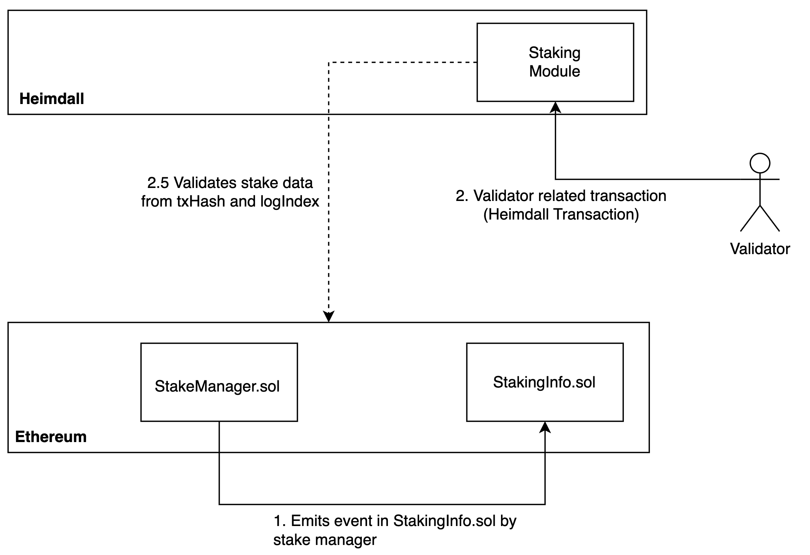
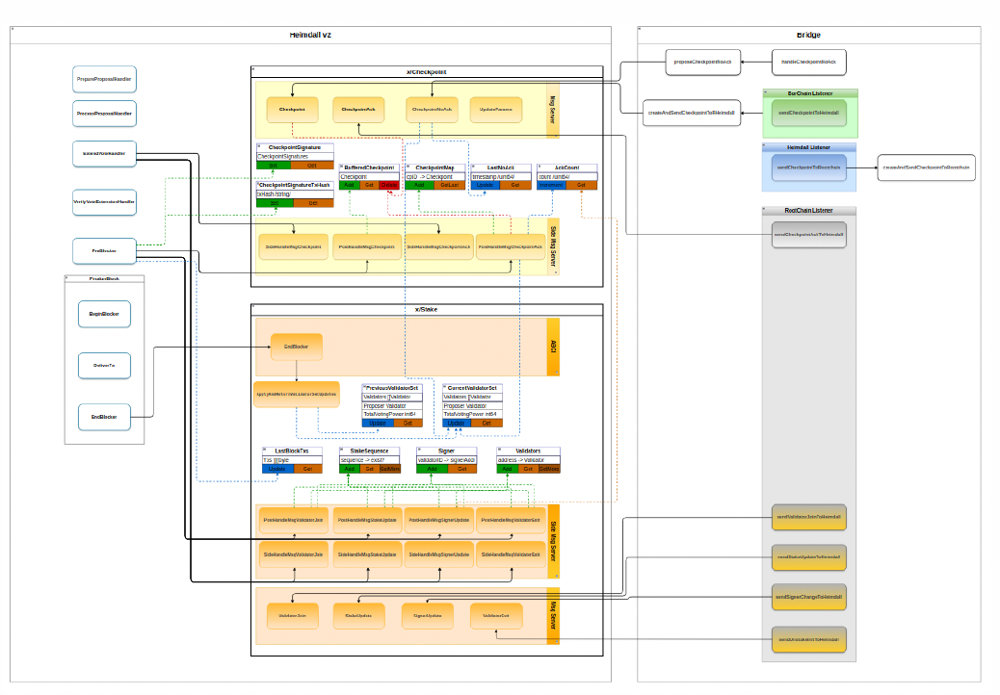

# Stake module

## Overview

This module manages the validators' related transactions and state for Heimdall.  
Validators stake their tokens on the Ethereum chain
and send the transactions on Heimdall using the necessary parameters to acknowledge the Ethereum stake change.  
Once the majority of the validators agree on the change on the stake,
this module saves the validator information on Heimdall state.  



## Flow

The x/stake module manages validator-related transactions and validator set management for Heimdall.

Validators stake their tokens on the Ethereum chain to participate in consensus. To synchronize these changes with Heimdall, the bridge processor broadcasts the corresponding transaction for an Ethereum-emitted event, choosing from one of the following messages each with the necessary parameters:

- `MsgValidatorJoin`: This message is triggered when a new validator joins the system by interacting with `StakingManager.sol` on Ethereum. The action emits a `Staked` event to recognize and process the validator’s participation.  
- `MsgStakeUpdate`: Used to handle stake modifications, this message is sent when a validator re-stakes or receives additional delegation. Both scenarios trigger a `StakeUpdate` event on Ethereum, ensuring Heimdall accurately updates the validator’s stake information.  
- `MsgValidatorExit`: When a validator decides to exit, they initiate the process on Ethereum, leading to the emission of a `UnstakeInit` event. This message ensures that Heimdall records the validator’s departure accordingly.  
- `MsgSignerUpdate`: This message is responsible for processing changes to a validator’s signer key. When a validator updates their signer key on Ethereum, it emits a `SignerUpdate` event, prompting Heimdall to reflect the new signer key in its records.

Each of these transactions in Heimdall follows the same processing mechanisms, leveraging ABCI++ phases.

During the `PreCommit` phase, side transaction handlers are triggered, and a vote is injected after validating the Ethereum-emitted event and ensuring its alignment with the data in the processed message.

Once a majority of validators confirm that the action described in the message has occurred on Ethereum, the x/stake module updates the validator’s state in Heimdall during the `FinalizeBlock`’s `PreBlocker` execution.  

### Replay Prevention Mechanism
Heimdall employs a replay prevention mechanism in the post-tx handler functions to ensure that validator update messages derived from Ethereum events are not processed multiple times.

This mechanism prevents replay attacks by assigning a unique sequence number to each transaction and verifying whether it has already been processed.  
The sequence number is constructed using the Ethereum block number and log index, following the formula:

- `sequence = (block number × DefaultLogIndexUnit) + log index`
where:  
- `msg.BlockNumber` represents the Ethereum block where the event was emitted.  
- `msg.LogIndex` is the position of the log entry within that block.  
- `DefaultLogIndexUnit` ensures uniqueness when combining block numbers and log indexes.

Before processing a transaction, Heimdall checks its stake keeper to determine if the sequence number has been recorded.

If the sequence is found, the transaction is rejected as a duplicate.  Once the post-tx handler completes successfully, the sequence is stored, ensuring that any future message with the same sequence is recognized and ignored.  

This approach guarantees that Heimdall only processes each valid Ethereum signer update once, preventing unintended state changes due to replayed messages.  

### Updating the Validator Set
In the x/stake `EndBlocker`, Heimdall updates the validator set (through the `ApplyAndReturnValidatorSetUpdates`function), ensuring consensus reflects the latest validator changes.

Before any updates, the current block’s validator set is stored as the previous block’s set. The system retrieves all existing validators, the current validator set, and the acknowledgment count from the x/checkpoint state.

Using `GetUpdatedValidators`, a list of validators that require updates (`setUpdates`) is identified and applied through `UpdateWithChangeSet`, storing the new set under `CurrentValidatorSetKey`.

To maintain fair block proposer selection, Heimdall implements a proposer priority system, ensuring all validators have a fair chance to propose new blocks.

The proposer priority is dynamically adjusted using `IncrementProposerPriority(times int)`, which prevents any validator from monopolizing block proposals.

This function limits priority differences by re-scaling priorities (`RescalePriorities(diffMax)`) and shifting values based on the average proposer priority (`shiftByAvgProposerPriority()`).

During each round, the validator with the highest priority is selected as the proposer, after which their priority is adjusted to prevent indefinite accumulation.  
These mechanisms collectively ensure efficient and fair validator rotation, maintaining a balanced consensus process while preventing priority overflows and unfair selection biases.



## Messages

### MsgValidatorJoin

`MsgValidatorJoin` defines a message for a node to join the network as validator.

Here is the structure for the transaction message:

```protobuf
//  MsgValidatorJoin defines a message for a new validator to join the network
message MsgValidatorJoin {
  option (cosmos.msg.v1.signer) = "from";
  option (amino.name) = "heimdallv2/stake/MsgValidatorJoin";
  option (gogoproto.equal) = false;
  option (gogoproto.goproto_getters) = true;
  string from = 1 [
    (amino.dont_omitempty) = true,
    (cosmos_proto.scalar) = "cosmos.AddressString"
  ];
  uint64 val_id = 2 [ (amino.dont_omitempty) = true ];
  uint64 activation_epoch = 3 [ (amino.dont_omitempty) = true ];
  string amount = 4 [
    (gogoproto.nullable) = false,
    (gogoproto.customtype) = "cosmossdk.io/math.Int",
    (amino.dont_omitempty) = true
  ];
  bytes signer_pub_key = 5 [ (amino.dont_omitempty) = true ];
  bytes tx_hash = 6 [ (amino.dont_omitempty) = true ];
  uint64 log_index = 7 [ (amino.dont_omitempty) = true ];
  uint64 block_number = 8 [ (amino.dont_omitempty) = true ];
  uint64 nonce = 9 [ (amino.dont_omitempty) = true ];
}
```

### MsgStakeUpdate

`MsgStakeUpdate` defines a message for a validator to perform a stake update on Ethereum network.

```protobuf
message MsgStakeUpdate {
  option (cosmos.msg.v1.signer) = "from";
  option (amino.name) = "heimdallv2/stake/MsgStakeUpdate";
  option (gogoproto.equal) = false;
  option (gogoproto.goproto_getters) = true;
  string from = 1 [
    (amino.dont_omitempty) = true,
    (cosmos_proto.scalar) = "cosmos.AddressString"
  ];
  uint64 val_id = 2 [ (amino.dont_omitempty) = true ];
  string new_amount = 3 [
    (gogoproto.nullable) = false,
    (amino.dont_omitempty) = true,
    (gogoproto.customtype) = "cosmossdk.io/math.Int"
  ];
  bytes tx_hash = 4 [ (amino.dont_omitempty) = true ];
  uint64 log_index = 5 [ (amino.dont_omitempty) = true ];
  uint64 block_number = 6 [ (amino.dont_omitempty) = true ];
  uint64 nonce = 7 [ (amino.dont_omitempty) = true ];
}
```

### MsgSignerUpdate

`MsgSignerUpdate` defines a message for updating the signer of the existing validator.

```protobuf
message MsgSignerUpdate {
  option (cosmos.msg.v1.signer) = "from";
  option (amino.name) = "heimdallv2/stake/MsgSignerUpdate";
  option (gogoproto.equal) = false;
  option (gogoproto.goproto_getters) = true;
  string from = 1 [
    (amino.dont_omitempty) = true,
    (cosmos_proto.scalar) = "cosmos.AddressString"
  ];
  uint64 val_id = 2 [ (amino.dont_omitempty) = true ];
  bytes new_signer_pub_key = 3 [ (amino.dont_omitempty) = true ];
  bytes tx_hash = 4 [ (amino.dont_omitempty) = true ];
  uint64 log_index = 5 [ (amino.dont_omitempty) = true ];
  uint64 block_number = 6 [ (amino.dont_omitempty) = true ];
  uint64 nonce = 7 [ (amino.dont_omitempty) = true ];
}
```

### MsgValidatorExit

`MsgValidatorExit` defines a message for a validator to exit the network.

```protobuf
message MsgValidatorExit {
  option (cosmos.msg.v1.signer) = "from";
  option (amino.name) = "heimdallv2/stake/MsgValidatorExit";
  option (gogoproto.equal) = false;
  option (gogoproto.goproto_getters) = true;
  string from = 1 [
    (amino.dont_omitempty) = true,
    (cosmos_proto.scalar) = "cosmos.AddressString"
  ];
  uint64 val_id = 2 [ (amino.dont_omitempty) = true ];
  uint64 deactivation_epoch = 3 [ (amino.dont_omitempty) = true ];
  bytes tx_hash = 4 [ (amino.dont_omitempty) = true ];
  uint64 log_index = 5 [ (amino.dont_omitempty) = true ];
  uint64 block_number = 6 [ (amino.dont_omitempty) = true ];
  uint64 nonce = 7 [ (amino.dont_omitempty) = true ];
}
```

## Interact with the Node

### Tx Commands

#### Validator Join
```bash
heimdalld tx stake validator-join --proposer {proposer address} --signer-pubkey {signer pubkey with 04 prefix} --tx-hash {tx hash} --block-number {L1 block number} --staked-amount {total stake amount} --activation-epoch {activation epoch} --home="{path to home}"
```

#### Signer Update
```bash
heimdalld tx stake signer-update --proposer {proposer address} --id {val id} --new-pubkey {new pubkey with 04 prefix} --tx-hash {tx hash}  --log-index {log index} --block-number {L1 block number} --nonce {nonce} --home="{path to home}"
```

#### Stake Update
```bash
heimdalld tx stake stake-update [valAddress] [valId] [amount] [txHash] [logIndex] [blockNumber] [nonce]
```

#### Validator Exit
```bash
heimdalld tx stake validator-exit [valAddress] [valId] [deactivationEpoch] [txHash] [logIndex] [blockNumber] [nonce]
```

### CLI Query Commands

One can run the following query commands from the stake module:

* `current-validator-set` - Query all validators that are currently active in the validators' set
* `signer` - Query validator info for given validator address
* `validator` - Query validator info for a given validator id
* `validator-status` - Query validator status for given validator address
* `total-power` - Query total power of the validator set
* `is-old-tx` - Check if a tx is old (already submitted)

```bash
heimdalld query stake current-validator-set
```

```bash
heimdalld query stake signer [val_address]
```

```bash
heimdalld query stake validator [id]
```

```bash
heimdalld query stake validator-status [val_address]
```

```bash
heimdalld query stake total-power
```

```bash
heimdalld query stake is-old-tx [txHash] [logIndex]
```

### GRPC Endpoints

The endpoints and the params are defined in the [stake/query.proto](/proto/heimdallv2/stake/query.proto) file.
Please refer to them for more information about the optional params.

```bash
grpcurl -plaintext -d '{}' localhost:9090 heimdallv2.stake.Query/GetCurrentValidatorSet
```

```bash
grpcurl -plaintext -d '{"val_address": <>}' localhost:9090 heimdallv2.stake.Query/GetSignerByAddress
```

```bash
grpcurl -plaintext -d '{"id": <>}' localhost:9090 heimdallv2.stake.Query/GetValidatorById
```

```bash
grpcurl -plaintext -d '{"val_address": <>}' localhost:9090 heimdallv2.stake.Query/GetValidatorStatusByAddress
```

```bash
grpcurl -plaintext -d '{}' localhost:9090 heimdallv2.stake.Query/GetTotalPower
```

```bash
grpcurl -plaintext -d '{"tx_hash": <>, "log_index": <>}' localhost:9090 heimdallv2.stake.Query/IsStakeTxOld
```

```bash
grpcurl -plaintest -d '{"times": <>}' localhost:9090 heimdallv2.stake.Query/GetProposersByTimes
```

## REST APIs

The endpoints and the params are defined in the [stake/query.proto](/proto/heimdallv2/stake/query.proto) file.
Please refer to them for more information about the optional params.

```bash
curl localhost:1317/stake/validators-set
```

```bash
curl localhost:1317/stake/signer/{val_address}
```

```bash
curl localhost:1317/stake/validator/{id}
```


```bash
curl localhost:1317/stake/validator-status/{val_address}
```

```bash
curl localhost:1317/stake/total-power
```

```bash
curl localhost:1317/stake/is-old-tx?tx_hash=<tx-hash>&log_index=<log-index>
```

```bash
curl localhost:1317/stake/proposers/{times}
```
