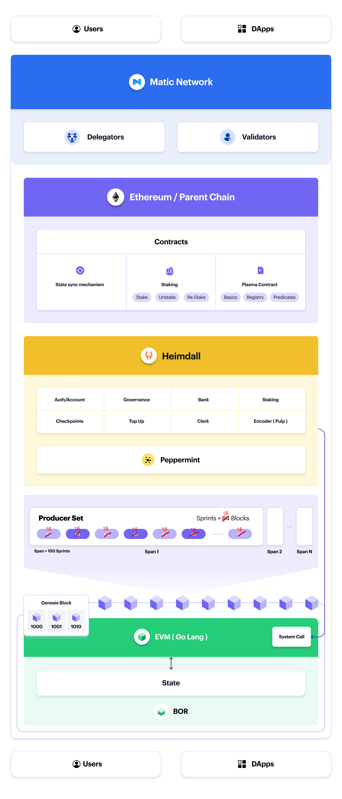

# Architecture

This section provides architectural details of Polygon PoS from a node perspective. 

Due to the proof-of-stake consensus, Polygon PoS consists of a consensus layer called Heimdall and execution layer called Bor.

Nodes on Polygon are therefore designed with a two-layer implementation represented by Bor (the block producer layer) and Heimdall (the validator layer).

In particular, and on the execution client side, it delineates on snapshots and state syncing, network configurations, and frequently used commands when running PoS nodes.

On the consesus client side, one finds descriptions on how Heimdall handles; authentication of account addresses, management of validators' keys, management of gas limits, enhancement of transaction verifications, balance transfers, staking and general chain management.   

<!-- 

 -->

