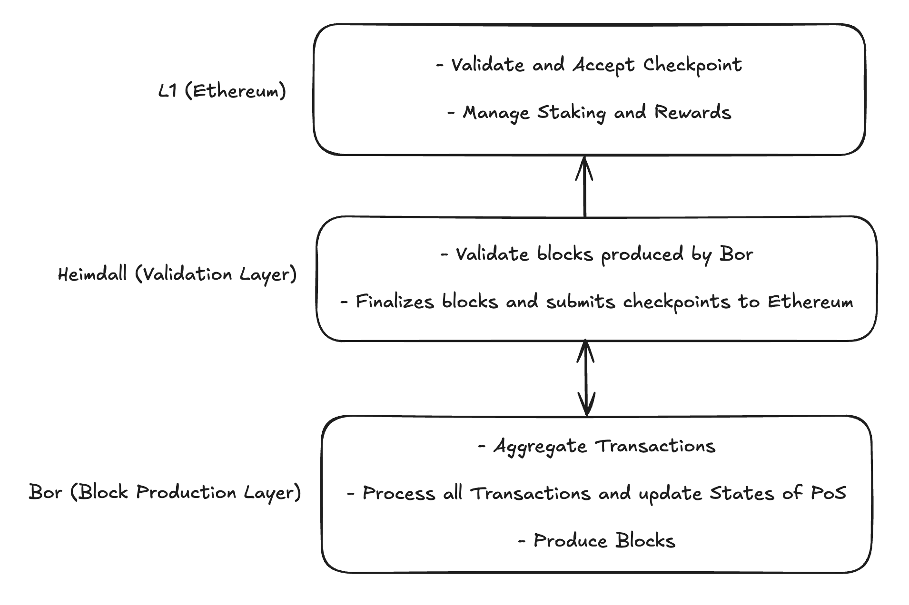
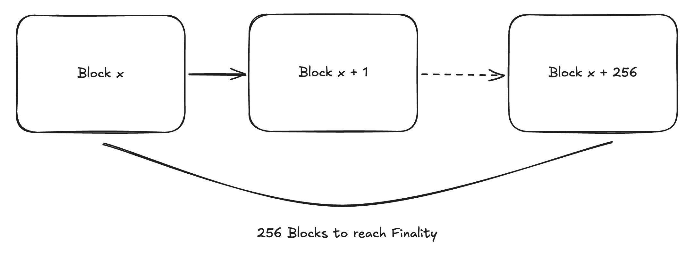
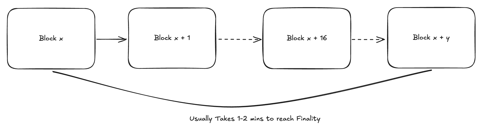
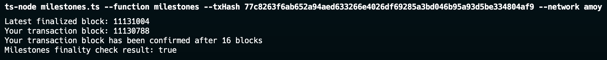
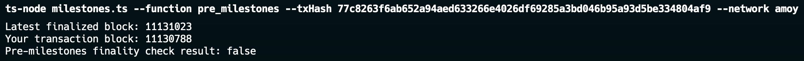
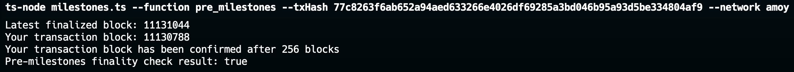

!!! info "5 Second Finality in Polygon"

    NOTE: With the upgrade to Heimdall v2, deterministic finality on PoS is now achieved in between 2-5 seconds thanks to the 1-2 seconds block time in Heimdall, meaning miletones are voted on and finalized much faster.

## How to Get Finalized Block

Simply use the standard `eth_getBlockByNumber` JSON-RPC method with the `"finalized"` block parameter to retrieve information about the most recently finalized block in Polygon PoS. Finalized blocks are considered highly secure and irreversible, making them crucial for applications requiring strong transaction certainty. 

To get the finalized block, you can use the following JSON-RPC call: 


```
{
  "method": "eth_getBlockByNumber",
  "params": ["finalized", true],
  "id": 1,
  "jsonrpc": "2.0"
}
```

## Introduction to Bor and Heimdall in Polygon PoS

### What is Bor?

Bor is the execution layer in the Polygon Proof-of-Stake (PoS) network. It is
responsible for:

- Aggregating transactions into blocks.
- Managing the execution of smart contracts.
- Maintaining the state of the Polygon network, such as account balances.

### What is Heimdall?

Heimdall acts as the proof of stake layer and uses Tendermint BFT consensus. It
decides which validators should be producing blocks in Bor in each span (based
on their stake). It also:

- Submits checkpoints to the Ethereum mainnet, securing the Polygon chain.
- Helps in arriving at finality of Bor blocks using Milestones.
- Plays a key role in state sync mechanism from L1 to Bor.

### How Do They Work Together?

Heimdall determines the validators that should be part of the next span. Bor
fetches these details from Heimdall and the selected validators start producing
blocks based on the consensus rules. Heimdall also periodically aggregates Bor
blocks and submits checkpoints to L1 (Ethereum) to secure the network.

Heimdall is also responsible for the finality of blocks produced by Bor which is
achieved through a mechanism called Milestones. And we will be diving deeper
into Milestones in this tutorial.



For more on Bor and Heimdall check out the official
[documentation](https://docs.polygon.technology/pos/architecture/#architectural-overview)
for more details on Bor and Heimdall.

## The Evolution of Finality: Before and After Milestones

There are two main types of finality in blockchains: probabilistic and
deterministic. Probabilistic finality means that there is a chance of a
reorganization (reorg) where a different chain might become the canonical chain.
Deterministic finality means that there is no chance of a reorganization. A
popular chain with probabilistic finality is Bitcoin. A popular chain with
deterministic finality is Ethereum.

### Before Milestones

In the traditional setup:

- Finality was **probabilistic** until a checkpoint was submitted to L1. Users
  and developers had to wait for many blocks (some applications waited 256
  blocks) to be created before they could be reasonably sure that a transaction
  was final. This meant that there was always a small chance of a reorganization
  (reorg), where a different chain might become the canonical chain.

- Checkpoints to Ethereum: Heimdall would submit checkpoints to Ethereum after
  every 256 blocks (minimum), anchoring Polygon’s state to the security of
  Ethereum. However, finality on the Polygon chain itself was slow and uncertain
  until this checkpoint was confirmed.



_Finality achieved after 256 blocks (approx. 10 minutes)._

### After Milestones

With the introduction of milestones:

- Finality is **deterministic** even before a checkpoint is submitted to L1.
  After a certain number of blocks (minimum 12), a milestone is proposed and
  validated by Heimdall. Once 2/3+ of the network agrees, the milestone is
  finalized, and all transactions up to that milestone are considered final,
  with no chance of reorganization.

- Separation of Checkpoints and Milestones: Checkpoints still occur every 256
  blocks (minimum) and are submitted to Ethereum. However, milestones provide
  much faster finality on the Polygon chain itself, using Heimdall layer for
  finalization, improving the user experience significantly.



_Finality achieved after at least 12 blocks confirmation and 4 blocks of buffer,
as well as a consensus period among the validators (approx. 1-2 minute)_

## Using the Milestone API

Here's a simple code example to check if a transaction has reached finality
using the milestone mechanism.

```ts
// Import Relevant Libraries
import { createPublicClient, http, Hash } from 'viem'
import { polygon, polygonAmoy } from 'viem/chains'
import { program } from 'commander'
```

Here's the implementation of Checking Transaction Finality BEFORE Milestones Implementation:

```ts
async function pre_milestones_checkFinality(client: any, txHash: string): Promise<boolean> {
  const tx = await client.getTransaction({ hash: `0x${txHash}` })
  if (!tx || !tx.blockNumber) return false
  const latestBlock: Block = await client.getBlock({ blockTag: 'finalized' })

  console.log(`Latest finalized block: ${latestBlock.number}`)
  console.log(`Your transaction block: ${tx.blockNumber}`)

  // Checking whether there has been 256 blocks since the transaction was included in a block
  if (latestBlock.number !== null && latestBlock.number - tx.blockNumber >= 256) {
    console.log("Your transaction block has been confirmed after 256 blocks");
    return true
  } else {
    return false
  }
}
```

Here's the implementation of Checking Transaction Finality AFTER Milestones Implementation:

```ts
async function milestones_checkFinality(client: any, txHash: string): Promise<boolean> {
  const tx = await client.getTransaction({ hash: `0x${txHash}` })
  if (!tx || !tx.blockNumber) return false
  const latestBlock: Block = await client.getBlock({ blockTag: 'finalized' })

  console.log(`Latest finalized block: ${latestBlock.number}`)
  console.log(`Your transaction block: ${tx.blockNumber}`)

  // Checking whether the finalized block number via milestones has reached the transaction block number.
  if (latestBlock.number !== null && latestBlock.number > tx.blockNumber) {
    console.log("Your transaction block has been confirmed after 16 blocks");
    return true
  } else {
    return false
  }
}
```

> Please note that this is just a demo purpose to show the previous
> implementations, since Milestones has already been implemented in the
> protocol, therefore, 16 blocks is the minimum time for finality, the
> `pre_milestones_checkFinality` function is not needed anymore in actual
> implementation. Just use the `milestones_checkFinality` function to check your
> transaction finality.

### Running the Code Locally

- Step 1: Copy the code into a file named `milestones.ts`.

- Step 2: Install the required dependencies by running:

  ```bash
  npm install
  ```

- Step 3: Run the code using Node.js with the required command-line arguments:

  ```bash
  npx ts-node milestones.ts --txHash <transaction_hash> --function <function_name> --network <network_name>
  ```

  Replace <transaction_hash> with the actual transaction hash, <function_name>
  with either pre_milestones or milestones, and <network_name> with either
  polygon or amoy.

- Step 4: Observe the output to determine if your transaction has been finalized
  based on the selected milestone mechanism and network.

### Results

The results should show whether the transaction has been finalized based on the
selected milestone mechanism and network. Usually Milestones will take 1-2
minutes to finalize the transaction. Result as follows:



Here's a screenshot of the `pre_milestones_checkFinality` function, where it
shows that the new blocks are not yet 256:



Here's a screenshot of the `pre_milestones_checkFinality` function, where it
shows that the new blocks are 256:



### Experimenting Further

Modify the code to check different transactions and networks to see how finality
is achieved with milestones on various Polygon networks.

## Resources/References

- [Polygon PoS Documentation](https://docs.polygon.technology/pos/overview)
- [Polygon PoS Faster Finality Announcement](https://polygon.technology/blog/faster-finality-with-the-aalborg-upgrade-for-polygon-proof-of-stake-network)
- [PIP-11: Deterministic finality via Milestones](https://forum.polygon.technology/t/pip-11-deterministic-finality-via-milestones/11918)