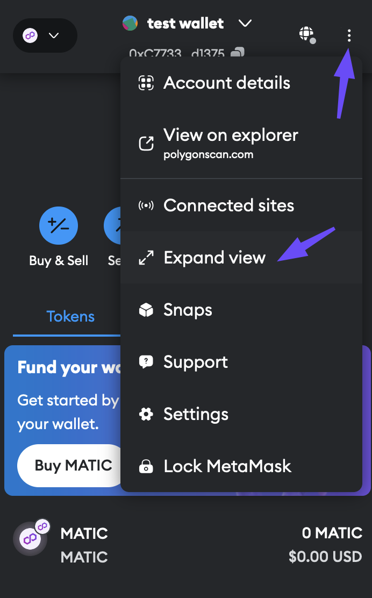

# Overview

The POL token represents a significant technical upgrade for the Polygon network. As the new native gas and staking token, POL will serve as the fundamental unit of value within Polygon ecosystem. 

POL token's introduction aligns with Polygon’s broader vision of becoming an aggregated network of blockchains, enabling enhanced interoperability and scalability. By transitioning to POL, Polygon aims to optimize network efficiency, improve security, and provide a more robust foundation for future development.

# Steps to migrate to POL

## MATIC tokens on Polygon PoS

If your MATIC tokens are stored in your wallet on the Polygon PoS chain, you won't need to manually migrate them — they'll be automatically converted to POL at a 1:1 ratio.

However, you'll need to update the native token symbol in your wallet's network settings. If the token symbol isn't updated, the wallet may continue to display MATIC as the token name instead of POL.

Here’s how to do this in MetaMask.

1. Within your browser, open your MetaMask wallet in the expanded mode by selecting on the **Expand view** option from the options menu in the top-right corner.

    

    {width=50%}
    

2. Select the options menu again from the wallet's expanded view, and then select **Settings** from the drop-down list.

    

3. Select the **Networks** tab from left sidebar to bring up the network settings. Switch to **Polygon Mainnet** if you're currently on another network. The list of configuration options on the right shows the **Currency symbol** which is currently set to **MATIC**.

    

4. Change the **Currency symbol** to **POL**, and select **Save** at the bottom. You can ignore the warning in yellow in this case.

    

    {width=50%}
    

## MATIC tokens on Ethereum

If your MATIC tokens are on Ethereum, you can use [Polygon Portal's migration interface](https://portal.polygon.technology/pol-upgrade) to migrate your MATIC tokens to POL. The process is as follows:

1. Navigate to Polygon Portal's migration interface: https://portal.polygon.technology/pol-upgrade
2. Switch to Ethereum network in your wallet and connect to the Portal UI.
3. Approve the migration action by granting the upgrade contract permission to access your MATIC tokens.
4. Perform the migration action to receive POL in your wallet.

## MATIC tokens on zkEVM

If your MATIC tokens are on the zkEVM chain, use Polygon Portal to bridge your tokens to Ethereum, and then follow the steps described in the [MATIC tokens on Ethereum section](#matic-tokens-on-ethereum).

## Read more about POL

1. [Detailed blog post on MATIC to POL migration](https://polygon.technology/blog/save-the-date-matic-pol-migration-coming-september-4th-everything-you-need-to-know)
2. [POL token reference doc](https://docs.polygon.technology/pos/concepts/tokens/pol/)

