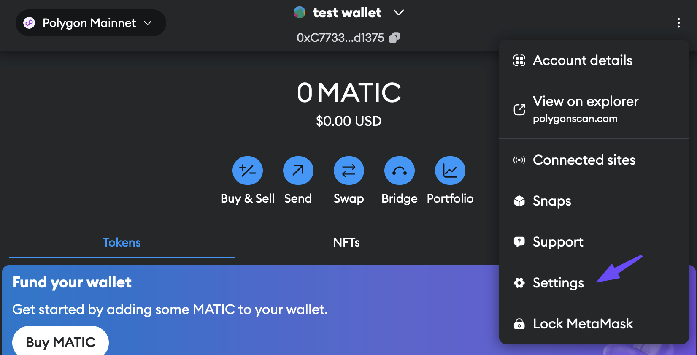
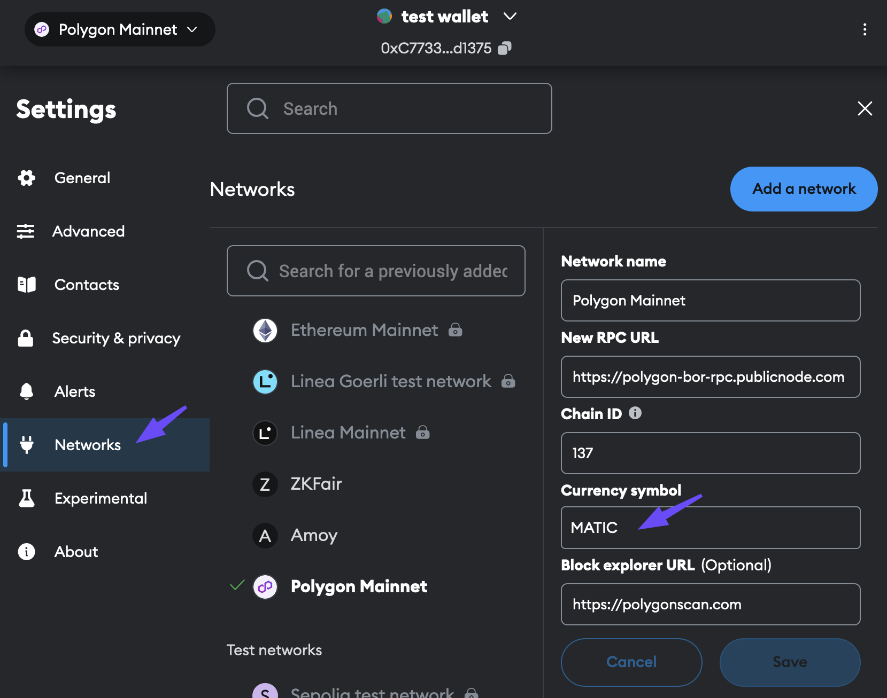
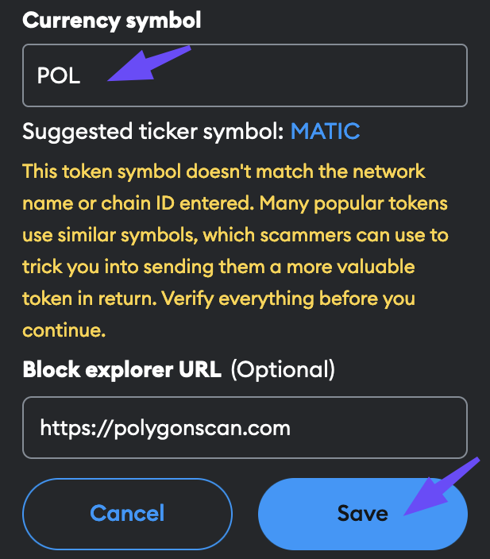

## Overview

The technical upgrade from MATIC to POL marks a critical juncture for the Polygon networks, enhancing utility and aligning with the vision as an aggregated network of blockchains. 

POL will serve as a hyperproductive token: the native gas and staking token on Polygon PoS, as well as supporting the network's future expansion and security as an aggregated network.

## Steps to migrate to POL

### MATIC tokens on Ethereum

!!! info "Stakers and delegators"

    

2. Select the options menu again from the wallet's expanded view, and then select **Settings** from the drop-down list.

    

3. Select the **Networks** tab from left sidebar to bring up the network settings. Switch to **Polygon Mainnet** if you're currently on another network. The list of configuration options on the right shows the **Currency symbol** which is currently set to **MATIC**.

    

4. Change the **Currency symbol** to **POL**, and select **Save** at the bottom. You can ignore the warning in yellow in this case.

    

    {width=50%}
    

The process to change the token symbol may vary depending on the wallet you're using. Please refer to the docs specific to your wallet and follow the outlined steps accordingly.

### MATIC tokens on Polygon zkEVM

If your MATIC tokens are on the zkEVM chain, use [Polygon Portal](https://portal.polygon.technology/bridge) to bridge your tokens to Ethereum, and then follow the steps described in the [MATIC tokens on Ethereum section](#matic-tokens-on-ethereum).

## Read more about POL

1. [Detailed blog post on MATIC to POL migration](https://polygon.technology/blog/save-the-date-matic-pol-migration-coming-september-4th-everything-you-need-to-know)
2. [POL token reference doc](../concepts/tokens/pol.md)

