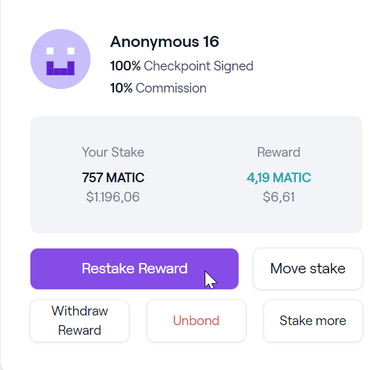
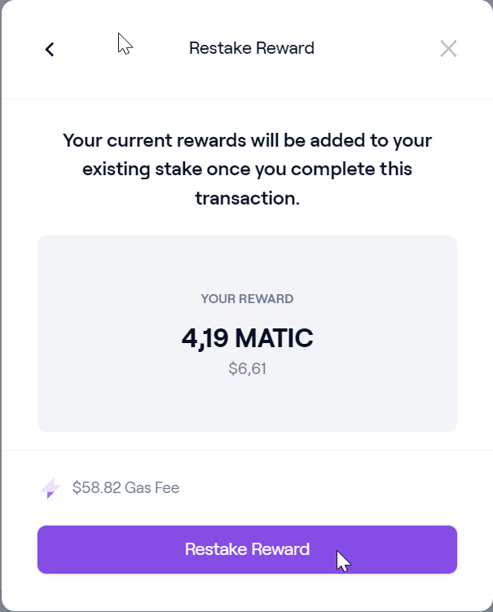
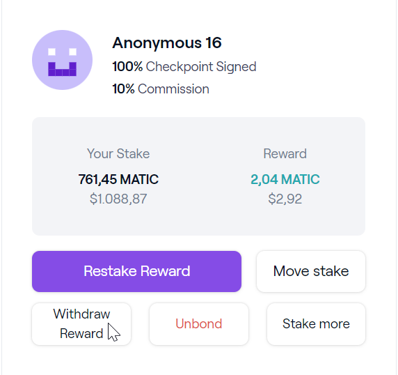
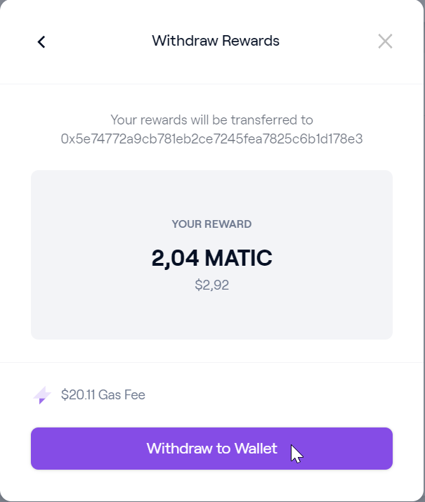
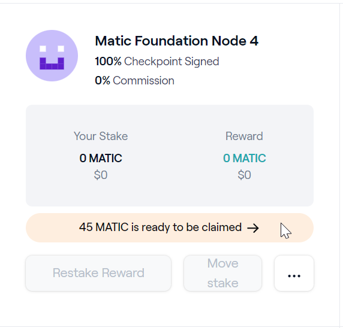
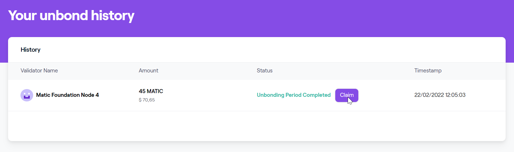
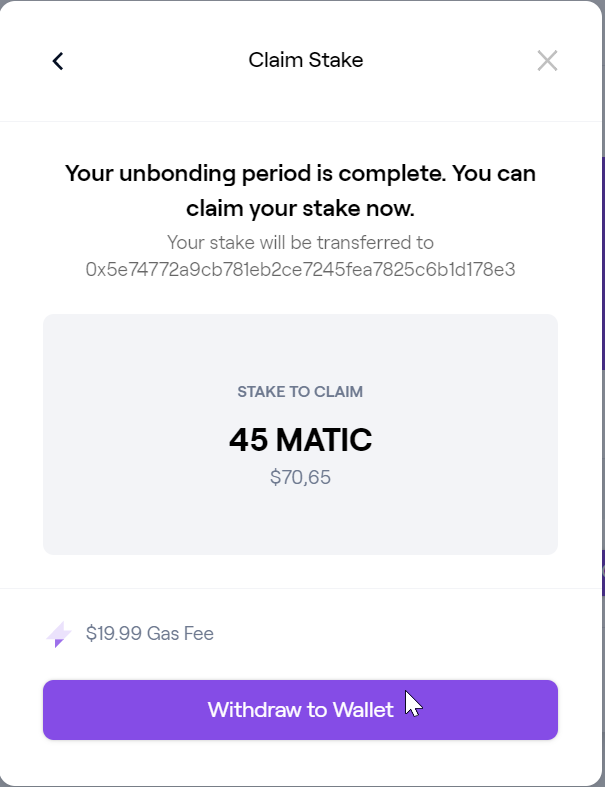
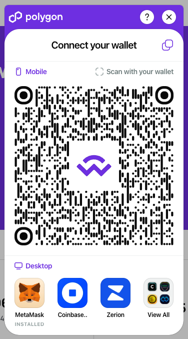
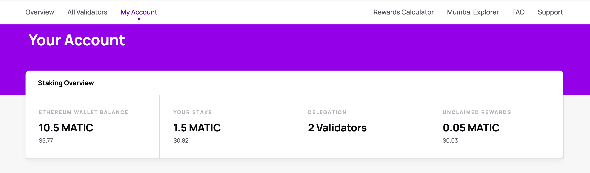
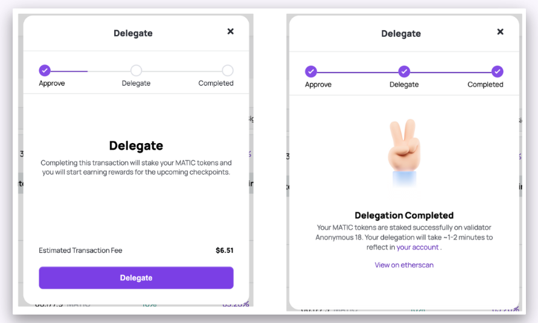

# How to delegate

This is a step-by-step guide to help you become a delegator in the Polygon network.

The only prerequisite is to have your POL tokens and ETH on the Ethereum mainnet address.

!!! info "Staking MATIC"

    Polygon network is transitioning from MATIC to POL, which will serve as the gas and staking token on Polygon PoS. Use the links below to learn more:

    - [Migrate from MATIC to POL](../get-started/matic-to-pol.md)
    - [POL token specs](../concepts/tokens/pol.md)
    
    It is advisable to [migrate your MATIC tokens to POL](../get-started/matic-to-pol.md), but if you continue to delegate MATIC tokens, you'll receive the staking rewards in the form of POL tokens.

## Access the dashboard

  1. In your wallet (e.g. MetaMask), choose the Ethereum mainnet.
    

    {width=50%}
    

  
  2. Log in to [Polygon Staking](https://staking.polygon.technology/).

  3. Once you log in, you will see overall statistics along with the list of validators.
    

    
    

!!! note
    If you are a validator, use a different non-validating address to log in as delegator.

## Delegate to a validator

  1. Select **Become a Delegator**, or scroll down to a specific validator and select **Delegate**.
    

    
    

  2. Select POL or MATIC from the drop-down list and enter the token amount to delegate. It is recommended to migrate your MATIC tokens to POL and delegate POL tokens. If you choose MATIC, you'll still receive your staking rewards in POL. Then, select **Continue**.
    

    {width=50%}
    

    
  3. Approve the delegate transaction from your wallet and select **Delegate**.
    

    {width=50%}
    

    
After the delegation transaction completes, you will see the **Delegation Completed** message.
    

    {width=50%}
    

## View your delegations

To view your delegations, select **My Account**.

## Withdraw rewards

  1. Select **My Account**.
    

    {width=70%}
    

    
  2. Under your delegated validator, select **Withdraw Rewards**.
    

    
    

This will withdraw the POL token rewards to your Ethereum address.

## Restake rewards

  1. Select **My Account**.
    

    {width=70%}
    

  2. Under your delegated validator, click **Restake Reward**.
    
    

This will restake the POL token rewards to the validator and increase your delegation stake.

## Unbond from a validator

  1. Select **My Account**.
    

    {width=70%}
    

  2. Under your delegated validator, select **Unbond**.
    
    

  This will withdraw your rewards from the validator and your entire stake from the validator.

  Your withdrawn rewards will show up immediately in your Ethereum wallet.

  Your withdrawn stake funds will remain locked for *80 checkpoints*.
    
{width=50%}

!!! note
    
    The fund locking for the unbonding period is in place to ensure there is no malicious behaviour on the network.

## Move stake from one node to another node

Moving stake from one node to another node is a single transaction. There are no delays or unbonding periods during this event.
  
  1. Select **My Account** and login to the staking dashboard.

  2. Select **Move Stake** under your delegated validator.

  3. Select an external validator and select **Stake here**.
    
    

  4. Provide the stake amount and select **Move Stake**.
    

    {width=50%}
    

    

This will move the stake. The dashboard will update *after 12 block confirmations*.

## Common queries and solutions

### What is the staking dashboard URL?

The staking dashboard URL is https://staking.polygon.technology/.

### What is the minimum stake amount?

There is no minimum stake amount to delegate. However, you can always start with 1 POL token.

### How to stake tokens on Polygon?

For staking, you would need to have funds on the Ethereum mainnet (more information [here](https://etherscan.io/gastracker)). Log into your wallet on the Ethereum network using the [staking dashboard](https://staking.polygon.technology/). 

Please watch this video for a graphical illustration of how this works:

<video loop width="100%" height="100%" controls="true" >
  <source type="video/mp4" src="../../../img/pos/staking.mp4"></source>
  
Your browser does not support the video element.

</video>

### Why does my transaction take so long?

All staking transactions of Polygon PoS take place on Ethereum for security reasons.

The time taken to complete a transaction depends on the gas fees that you have allowed and also the network congestion of Ethereum mainnet at that point in time. You can always use the **Speed Up** option to increase the gas fees so that your transaction can be completed soon.

### I've staked my POL tokens. How can I stake more?

Navigate to the **Your Delegations** page and choose one of the stakes. Then click on **Stake More**.

Please watch this video for a graphical illustration of how this works:

<video loop width="100%" height="100%" controls="true" >
  <source type="video/mp4" src="../../../img/pos/staking-more.mov"></source>
  
Your browser does not support the video element.

</video>

<!-- 
<video width="70%" height="70%" controls="true" >
  <source type="video/mp4" src="../../../img/pos/staking-more.mov"></source>
  
Your browser does not support the video element.

</video> -->

### Why am I not able to stake?

Check if you have funds on the Main Ethereum Network, to delegate your tokens. All staking happens on the Ethereum Network only.

### I am unable to view the staking tab. How do I access staking?

You just need to access **https://staking.polygon.technology/**, where you will see the following landing page:

### How do I know which validator to select for better rewards?

It depends on your understanding and research on which validator you would want to stake on. You can find the list of validators here : https://staking.polygon.technology/validators

### How to unbond?

To unbond from a validator, navigate to **My Account**, where you'll find **Your Delegations**.
There you will see an **Unbond** button for each of the validators. Click on the **Unbond** button for the validator that you want to unbond from.

Please watch the video for a graphical illustration of how this works:

<video loop width="100%" height="100%" controls="true" >
  <source type="video/mp4" src="../../../img/pos/unbond.mp4"></source>
  
Your browser does not support the video element.

</video>

### What is the unbonding period?

The unbonding period on Polygon PoS is 80 checkpoints. Every checkpoint takes approximately *30 minutes*. However, some checkpoints could be delayed due to congestion on Ethereum. This period applies to the originally delegated amount and re-delegated amounts. It does not apply to any rewards that were not re-delegated.

### How to restake rewards?

Go to **My Account** to check **Your Delegations**. Clicking on **Restake Reward** will ask you for confirmation from your wallet account. Once you confirm the transaction in your wallet, the restake transaction is completed.

#### Step 1

  

  {width=50%}
  

#### Step 2

  

  {width=50%}
  

Please watch the video for a graphical illustration of how this works:

<video width="100%" height="100%" controls="true" >
  <source type="video/mp4" src="../../../img/pos/restake.mp4"></source>
  
Your browser does not support the video element.

</video>

### I want to restake rewards but I am unable to.

You'll need to have a minimum of **2 POL** to restake rewards.

### How to withdraw rewards?

You can claim your rewards by clicking on the **My Account**, all the delegators for a validator are displayed. Click on the **Withdraw Reward** button and the rewards will be transferred to your delegated account in wallet.

#### Step 1

  {width=50%}

#### Step 2

  {width=50%}

Please watch the video for a graphical illustration of how this works:

<video width="100%" height="100%" controls="true" >
  <source type="video/mp4" src="../../../img/pos/claim-rewards.mp4"></source>
  
Your browser does not support the video element.

</video>

### I want to withdraw rewards but I am unable to.

You'll need to have a minimum of **2 POL** available to withdraw rewards.

### How to claim stake?

Once the unbonding period is complete, the **Claim Stake** button will be enabled and you can then claim your staked tokens. The tokens will be transferred to your account.

#### Step 1

  {width=50%}

#### Step 2

  

#### Step 3

  {width=50%}

Please watch the video for a graphical illustration of how this works:

<video width="100%" height="100%" controls="true" >
  <source type="video/mp4" src="../../../img/pos/claiming-stake.mov"></source>
  
Your browser does not support the video element.

</video>

### Which wallets are currently supported?

We have recently upgraded the wallet support to WalletConnect v2.0. Now you can choose from a plethora of wallets, including Metamask, Coinbase, and others, on both desktop and mobile devices to log in.
  
  

  {width=50%}
  

 
### Are hardware wallets supported?

Yes, hardware wallets are supported. You can use the **Connect Hardware Wallet** option on MetaMask and connect your hardware wallet and then continue the delegation process.

### Why can’t I stake directly from Binance?

Staking through Binance is not yet supported. There will be an announcement if and when Binance starts supporting it.

### I have completed my delegation, where can I check details?

Once you have completed your delegation, wait for 12 block confirmations on Ethereum (approx. 3-5 minutes), then on the dashboard, you can click on **My Account**.

### Where can I check my rewards?

On the dashboard, you can click on the **My Account** option on the left-hand side.

### Do I need ETH to pay for gas fees?

Yes. You should maintain at least ~0.05-0.1 ETH balance for gas fees to be safe.

### Do I need to deposit POL tokens to the Polygon mainnet network for staking?

No. All your funds need to be on the main Ethereum network.

### When I try to do the transaction my **Confirm** button is disabled.

Please check if you have enough ETH for the gas fees.

### When do rewards get distributed?

The rewards are distributed whenever a checkpoint is submitted.

Currently, 71795 POL tokens are distributed proportionately on each successful checkpoint submission to each delegator based on their stake relative to the overall staking pool of all validators and delegators. Also, the percentage for the reward distributed to each delegator will vary with each checkpoint depending on the relative stake of the delegator, validator and the overall stake.

Note that there is a 10% proposer bonus that accrues to the validator who submits the checkpoint, but over time, the effect of the extra bonus is nullified over multiple checkpoints by different validators.

The checkpoint submission is done by one of the validators approximately every 30 minutes. This time is approximate and may vary based on validator consensus on the Polygon Heimdall layer. This may also vary based on Ethereum Network. Higher congestion in the network may result in delayed checkpoints.

You can track checkpoints on the staking contract [here](https://etherscan.io/address/0x86e4dc95c7fbdbf52e33d563bbdb00823894c287)

### Why do rewards keep getting decreased at every checkpoint?

Actual rewards earned will depend on the actual total locked supply in the network at each checkpoint. This is expected to vary significantly as more POL tokens get locked in the staking contracts.

Rewards will be higher, to begin with, and will keep decreasing as the locked supply % goes up. This change in locked supply is captured at every checkpoint, and rewards are calculated based on this.

### How can I claim my rewards?

You can claim your rewards instantly by clicking on the **Withdraw Reward** button. This will transfer the rewards accumulated to your delegated account on Metamask.

<!-- 
### What is the unbonding period?

The unbonding period on Polygon is 80 checkpoints. This period applies to the originally delegated amount and re-delegated amounts - it does not apply to any rewards that were not re-delegated. -->

### Will I keep receiving rewards after I unbond?

No. Once you unbond, you will stop receiving rewards.

### How many transactions does the delegation require?

The delegation action takes place in 2 successive transactions. The first transaction to *approve* the request, and the second to *deposit* the approved token amount.

 

### What does re-delegate rewards mean?

Re-delegating your rewards simply means that you want to increase your stake by restaking the rewards you have accumulated.

### Can I stake to any validator?

Yes, you can delegate to any validator except the ones which are offline.

### Can I move the stake to another validator?

Yes, you just have to access **Your Delegations**, click on **Move Stake**, and then choose your new validator.

Please watch the video for a graphical illustration of how this works:

<video width="100%" height="100%" controls="true" >
  <source type="video/mp4" src="../../../img/pos/moving.mp4"></source>
  
Your browser does not support the video element.

</video>

### Which browser is compatible with the Polygon earnings calculator?

Chrome, Firefox, and Brave.

### My MetaMask is stuck at confirming after login, what do I do? Or nothing happens when I try to login?

Check for the following:

- If you’re using Brave, please turn off the option for **Use Crypto Wallets** in the settings panel.
- Check if you are logged into Metamask
- Check if you are logged into MetaMask with Trezor/Ledger. You need to additionally turn on permission to call contracts on your Ledger device, if not enabled already.
- Check your system timestamp. If the system time is not correct, you will need to correct it.

### How do I send funds from Binance or other exchanges to Polygon wallet?

The Polygon Wallet Suite is a web application. 

First, you must withdraw your funds from Binance or any other exchange to your Ethereum address on Metamask. If you don't know how to use Metamask, google it a bit. There are plenty of videos and blogs to get started with it.

### When can I become a validator and how many tokens do I for that?

A user can earn a validator spot only by if the below conditions come into play:

1. When a validator decides to unstake from the network, or
2. Wait for the auction mechanism and replace the inactive validator.

The minimum stake depends on the auction process where one user outbids another.

### If I have earned rewards while delegating, and if I add additional funds to the same validator node, what happens?

If you have not re-delegated your rewards before delegating additional funds to the same validator node, your rewards will be withdrawn automatically.

In case you don't want that to happen, re-delegate your rewards before delegating additional funds.

### I have delegated my tokens via MetaMask on the dashboard. Do I need to keep my system or device on?

No. Once your delegation transactions are confirmed, and you can see your tokens reflected in the **Total Stake** and **New Reward** sections, then you are done. There is no need to keep your system or device on.

### I have unbonded, how long will it take to unbond?

The unbonding period is currently set to 80 checkpoints. Every checkpoint takes approximately 30 minutes. However, some checkpoints could be delayed upto ~1 hour due to congestion on Ethereum.

### I have unbonded, and I now see the **Claim Stake** button, but it is disabled.

The Claim Stake button will only be enabled when your unbonding period is complete. The unbonding period is currently set at 80 checkpoints.

### When will the **Claim Stake** button be enabled?

Under the **Claim Stake** button you should see a note on how many checkpoints are pending before the **Claim Stake** button is enabled. Every checkpoint takes approximately 30 minutes. However, some checkpoints could be delayed upto ~1 hour due to congestion on Ethereum.

{width=50%}

### Have the foundations nodes been turned off?

Yes, the foundation nodes had been turned off.

### Will there be any foundation nodes in the future?

No, there won't be any Foundation nodes in the future.

### How many transactions do I need to pay for gas when I perform a 'move stake' action?

The 'move stake' operation is performed in a single transaction. Since all transactions are executed on the Ethereum blockchain, you will need to spend some ETH for gas fees to complete the transaction.
