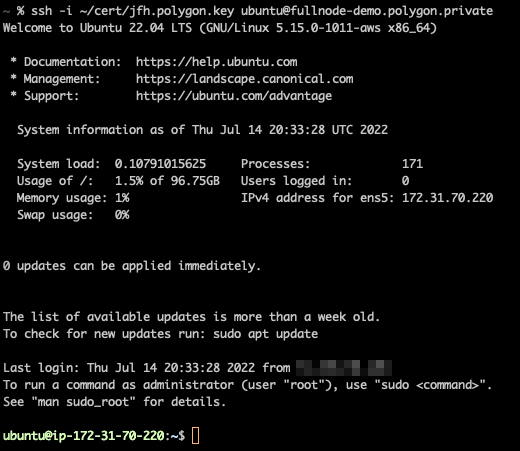
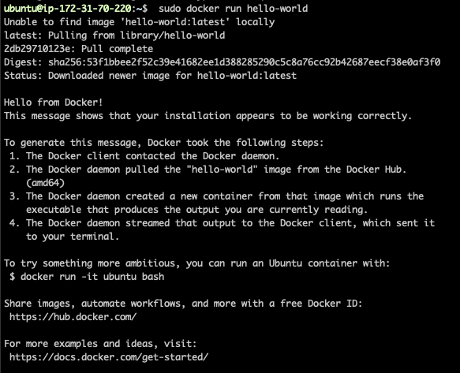
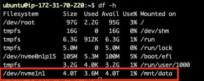
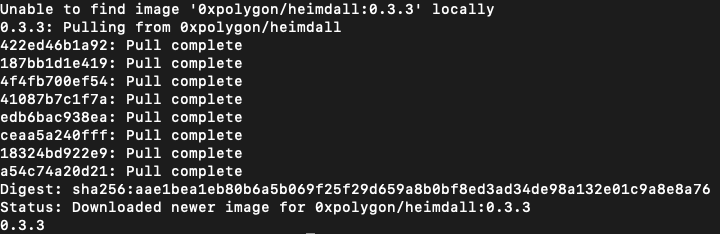

<!--
---
comments: true
---
-->

The Polygon team distributes official Docker images which can be used to run nodes on the Polygon PoS mainnet. These instructions are for running a full Node, but they can be adapted for running sentry nodes and validators as well.

## Initial setup

To get started, you'll need to have shell access with root privileges to a linux machine.



### Install Docker

It is likely that your operating system won’t have Docker installed by default. Please follow the instructions for your particular distribution found here: https://docs.docker.com/engine/install/

We’re following the instructions for Ubuntu. The steps are included below, but please refer to the official instructions in case they’ve been updated.

``` bash
sudo apt-get update
sudo apt-get install ca-certificates curl gnupg lsb-release
sudo mkdir -p /etc/apt/keyrings
curl -fsSL https://download.docker.com/linux/ubuntu/gpg | sudo gpg --dearmor -o /etc/apt/keyrings/docker.gpg
echo \
  "deb [arch=$(dpkg --print-architecture) signed-by=/etc/apt/keyrings/docker.gpg] https://download.docker.com/linux/ubuntu \
  $(lsb_release -cs) stable" | sudo tee /etc/apt/sources.list.d/docker.list > /dev/null
sudo apt-get update
sudo apt-get install docker-ce docker-ce-cli containerd.io docker-compose-plugin
```

At this point you should have Docker installed. In order to verify, you should be able to run the following command successfully:

``` bash
sudo docker run hello-world
```



In many cases, it’s inconvenient to run docker as `root` user so we’ll follow the post install steps [here](https://docs.docker.com/engine/install/linux-postinstall/) in order to interact with docker without needing to be `root`:

```bash
sudo groupadd docker
sudo usermod -aG docker $USER
```

Now you should be able to logout and log back in, and run docker commands without `sudo`.

### Disk setup

The exact steps required here may vary a lot based on your needs. Most likely you’ll have a root partition running your operating system on one device. You’ll probably want one or more devices for actually holding the blockchain data. For the rest of the walkthrough, we’re going to have that additional device mounted at `/mnt/data`.

In this example, we have a device with 4 TB of available space located at `/dev/nvme1n1`. We are going to mount that using the steps below:

```bash
sudo mkdir /mnt/data
sudo mount /dev/nvme1n1 /mnt/data
```

We use `df -h` to make sure the mount looks good.



Once we've verified that successfully, we might as well create the home directories on this mount for Bor and Heimdall.

```bash
sudo mkdir /mnt/data/bor
sudo mkdir /mnt/data/heimdall
```

Depending on your use case and operating system, you’ll likely want to create an entry in `/etc/fstab` in order to make sure your device is mounted when the system reboots.

In our case we're following some steps like this:

```bash
# Use blkid to get the UUID for the device that we're mounting
blkid

# Edit the fstab file  and add a line to mount your device
# UUID={your uuid}		/mnt/data	{your filesystem}	defaults	0	1
sudo emacs /etc/fstab

# use this to verify the fstab actually works
sudo findmnt --verify --verbose
```

At this point you should be able to reboot and confirm that the system loads your mount properly.

### Heimdall setup

At this point, we have a host with docker running on it and we have ample mounted storage to run our Polygon node software. So let’s get Heimdall configured and running.

First let’s make sure we can run Heimdall with docker. Run the following command:

```bash
docker run -it 0xpolygon/heimdall-v2:0.2.16 heimdalld version
```

If this is the first time you’ve run Heimdall with docker, it should pull the required image automatically and output the version information.



If you’d like to check the details of the Heimdall image or find a different tag, you can take a look at the repository on Docker Hub: https://hub.docker.com/repository/docker/0xpolygon/heimdall-v2

At this point, let’s run the Heimdall `init` command to set up our home directory.

```bash
docker run -v /mnt/data/heimdall:/heimdall-home:rw --entrypoint /usr/bin/heimdalld -it 0xpolygon/heimdall-v2:0.2.16 init test-moniker --chain-id=<CHAIN_ID> --home=/heimdall-home
```

Let’s break this command down a bit in case anything goes wrong.

* We’re using `docker run` to run a command via docker.

* The switch `-v /mnt/data/heimdall:/heimdall-home:rw` is very important. It’s mounting the folder that we created earlier `/mnt/data/heimdall` from our host system to `/heimdall-home` within the container as a docker volume.

* The `rw` allows the command to write to this docker volume. For all intents and purposes, from within the docker container, the home directory for Heimdall will be `/heimdall-home`.

* The argument `--entrypoint /usr/bin/heimdalld` is overriding the default entry point for this container.

* The switch `it` is used to run the command interactively.

* Finally, we’re specifying which image we want to run with `0xpolygon/heimdall-v2:0.2.16`.

* After that `init test-moniker --chain-id=<CHAIN_ID> --home=/heimdall-home` are arguments being passed to the heimdalld executable. `init` is the command we want to run, `test-moniker` is the name of the node and `--chain-id` is used to specify the chain (`heimdallv2-80002` for `amoy` and `heimdallv2-137` for `mainnet`), while `--home` defines the home directory of your heimdall service.  

After running the `init` command, your `/mnt/data/heimdall` directory should have some structure.  

Now we need to make a few updates before starting Heimdall.  

Download the genesis file and place it under `HEIMDALL_HOME/config/genesis.json` (replacing the one potentially already present there)
```bash
curl -L -o "<HEIMDALL_HOME>/config/genesis.json" <BUCKET_URL>
```

where `BUCKET_URL` is https://storage.googleapis.com/amoy-heimdallv2-genesis/migrated_dump-genesis.json for amoyand https://storage.googleapis.com/mainnet-heimdallv2-genesis/migrated_dump-genesis.json for mainnet

Replace `HEIMDALL_HOME` with the actual path to your Heimdall home directory.

Please note that the genesis file size is around 50MB for amoy and 3GB for mainnet.  
Hence, the download might take a while, and it’s recommended to use a stable and fast connection.  

Then, you can customize the configs under `HEIMDALL_HOME/config` (`app.toml`, `client.toml`, `config.toml`), based on your setup.  

Templates for each supported network are available [here](https://github.com/0xPolygon/heimdall-v2/tree/develop/packaging/templates/config)  

Make sure to configure your Ethereum and Bor connection parameters based on your infrastructure.  

## (Optional) Start Heimdall from snapshot

In case you want to start Heimdall from a snapshot,  
you can download it, and extract in the `data` folder.
Examples of snapshots can be found here https://all4nodes.io/Polygon, and they are managed by the community.

e.g.:
```bash
lz4 -dc polygon-heimdall-24404501-25758577.tar.lz4 | tar -x
```

## Starting Heimdall

Before we start Heimdall, we’re going to create a docker network so that the containers can easily network with each other based on names.  
In order to create the network, run the following command:

```bash
docker network create polygon
```

Now we’re going to start Heimdall. Run the following command:

```bash
docker run -p 26657:26657 -p 26656:26656 -v /mnt/data/heimdall:/heimdall-home:rw --net polygon --name heimdall --entrypoint /usr/bin/heimdalld -d --restart unless-stopped  0xpolygon/heimdall-v2:0.2.16 start --home=/heimdall-home
```

Many of the options in this command will look familiar. So let’s talk about what’s new.

* The `-p 26657:26657` and `-p 26656:26656` switches are port mappings. This will instruct docker to map the host port `26657` to the container port `26657` and the same for `26656`.

* The `--net polygon` switch is telling docker to run this container in the polygon network.

* `--name heimdall` is naming the container which is useful for debugging, but it’s all the name that will be used for other containers to connect to Heimdall.

* The `-d` argument tells docker to run this container in the background.

* The switch `--restart unless-stopped` tells docker to automatically restart the container unless it was stopped manually.

* Finally, `start` is being used to actually run the application instead of `init` which just set up the home directory.

At this point, it’s helpful to check and see what’s going on. These two commands can be useful:

```bash
# ps will list the running docker processes. At this point you should see one container running
docker ps

# This command will print out the logs directly from the heimdall application
docker logs -ft heimdall
```

At this point, Heimdall should start syncing. When you look at the logs, you should see a log of information being spit out that looks like this:

```
2022-12-14T19:43:23.687640820Z INFO [2022-12-14|19:43:23.687] Executed block                               module=state height=26079 validTxs=0 invalidTxs=0
2022-12-14T19:43:23.721220869Z INFO [2022-12-14|19:43:23.721] Committed state                              module=state height=26079 txs=0 appHash=CAEC4C181C9F82D7F55C4BB8A7F564D69A41295A3B62DDAA45F2BB41333DC20F
2022-12-14T19:43:23.730533414Z INFO [2022-12-14|19:43:23.730] Executed block                               module=state height=26080 validTxs=0 invalidTxs=0
2022-12-14T19:43:23.756646938Z INFO [2022-12-14|19:43:23.756] Committed state                              module=state height=26080 txs=0 appHash=CAEC4C181C9F82D7F55C4BB8A7F564D69A41295A3B62DDAA45F2BB41333DC20F
2022-12-14T19:43:23.768129711Z INFO [2022-12-14|19:43:23.767] Executed block                               module=state height=26081 validTxs=0 invalidTxs=0
2022-12-14T19:43:23.794323918Z INFO [2022-12-14|19:43:23.794] Committed state                              module=state height=26081 txs=0 appHash=CAEC4C181C9F82D7F55C4BB8A7F564D69A41295A3B62DDAA45F2BB41333DC20F
2022-12-14T19:43:23.802989809Z INFO [2022-12-14|19:43:23.802] Executed block                               module=state height=26082 validTxs=0 invalidTxs=0
2022-12-14T19:43:23.830960386Z INFO [2022-12-14|19:43:23.830] Committed state                              module=state height=26082 txs=0 appHash=CAEC4C181C9F82D7F55C4BB8A7F564D69A41295A3B62DDAA45F2BB41333DC20F
2022-12-14T19:43:23.840941976Z INFO [2022-12-14|19:43:23.840] Executed block                               module=state height=26083 validTxs=0 invalidTxs=0
2022-12-14T19:43:23.866564767Z INFO [2022-12-14|19:43:23.866] Committed state                              module=state height=26083 txs=0 appHash=CAEC4C181C9F82D7F55C4BB8A7F564D69A41295A3B62DDAA45F2BB41333DC20F
2022-12-14T19:43:23.875395744Z INFO [2022-12-14|19:43:23.875] Executed block                               module=state height=26084 validTxs=0 invalidTxs=0
```

If you’re not seeing any information like this, your node might not be finding enough peers. The other useful command at this point is an RPC call to check the status of Heimdall syncing:

```bash
curl localhost:26657/status
```

This will return a response like:

```json
{
  "latest_block_hash":"6217E7BDAABE4DF58F8FCA2AAF0BD41BD93A96983F533DA7A0034E514D15BC5B",
  "latest_app_hash":"BAA894A82E756A2797E3F608F6F7EED295549B8F7FB621E31542D206F5CA740C",
  "latest_block_height":26191190,
  "latest_block_time":"2025-08-06T12:50:35.062210407Z",
  "earliest_block_hash":"14C55F6E824DD1C1D3D9AB424D0A983953F6C2BCA0C9ED692AE2C43498D870CD",
  "earliest_app_hash":"E3B0C44298FC1C149AFBF4C8996FB92427AE41E4649B934CA495991B7852B855",
  "earliest_block_height":24404501,
  "earliest_block_time":"2025-07-10T15:20:00Z",
  "catching_up":false
}
```

In this initial setup phase, it’s important to pay attention to the `catching_up` field.  
If `catching_up` is true, it means that Heimdall is not fully synced. 

## Starting Bor

At this point, you should have a node that’s successfully running Heimdall. You should be ready now to run Bor.

Before we get started with Bor, we need to run the Heimdall rest server. This command will start a REST API that Bor uses to retrieve information from Heimdall. The command to start the server is:

```bash
docker run -p 1317:1317 -v /mnt/data/heimdall:/heimdall-home:rw --net polygon --name heimdallrest --entrypoint /usr/bin/heimdalld -d --restart unless-stopped 0xpolygon/heimdall:1.0.3 rest-server --home=/heimdall-home --node "tcp://heimdall:26657"
```

There are two options used in this command that are different and worth noting. Rather than running the `start` command, we’re running the `rest-server` command. Also, we’re passing `~–node “tcp://heimdall:26657”~` which tells the rest server how to communicate with Heimdall.

If this command runs successfully, when you run `docker ps`, you should see two commands containers running now. Additionally, if you run this command you should see some basic output:

```bash
curl localhost:1317/bor/span/1
```

Bor will rely on this interface. So if you don’t see JSON output, there is something wrong!

Now let’s download the `genesis` file for Bor specifically:

```bash
sudo curl -o /mnt/data/bor/genesis.json 'https://raw.githubusercontent.com/0xPolygon/bor/master/builder/files/genesis-mainnet-v1.json'
```

Let’s verify the `sha256 sum` again for this file:

```
# sha256sum genesis.json
4bacbfbe72f0d966412bb2c19b093f34c0a1bd4bb8506629eba1c9ca8c69c778  genesis.json
```

Now we need to create a default config file for starting Bor.

```bash
docker run -it  0xpolygon/bor:1.1.0 dumpconfig | sudo tee /mnt/data/bor/config.toml
```

This command is going to generate a `.toml` file with default settings. We’re going to make a few changes to the file, so open it up with your favorite editor and make a few updates. Note: we’re only showing the lines that are changed.

For reference, you can see the details for the Bor image here: [https://hub.docker.com/repository/docker/0xpolygon/bor](https://hub.docker.com/repository/docker/0xpolygon/bor)

``` bash
# Similar to moniker, you might want to update this with a name of your own choosing
identity = "docker.example"

# Setting this to the location of a mount that we'll make
datadir = "/bor-home"

# We'll want to specify some boot nodes
[p2p]
  [pep.discovery]
    bootnodes = ["enode://0cb82b395094ee4a2915e9714894627de9ed8498fb881cec6db7c65e8b9a5bd7f2f25cc84e71e89d0947e51c76e85d0847de848c7782b13c0255247a6758178c@44.232.55.71:30303", "enode://88116f4295f5a31538ae409e4d44ad40d22e44ee9342869e7d68bdec55b0f83c1530355ce8b41fbec0928a7d75a5745d528450d30aec92066ab6ba1ee351d710@159.203.9.164:30303"]

# Because we're running inside docker, we'll likely need to change the way we connect to heimdall
[heimdall]
  url = "http://heimdallrest:1317"

# Assuming you want to access the RPC, you'll need to make a change here as well
[jsonrpc]
  [jsonrpc.http]
    enabled = true
    host = "0.0.0.0"
```

At this point, we should be ready to start Bor. We’re going to use this command:

``` bash
docker run -p 30303:30303 -p 8545:8545 -v /mnt/data/bor:/bor-home:rw --net polygon --name bor -d --restart unless-stopped  0xpolygon/bor:1.1.0 server --config /bor-home/config.toml
```

If everything goes well, you should see log entries that look like this:

```bash
2022-12-14T19:53:51.989897291Z INFO [12-14|19:53:51.989] Fetching state updates from Heimdall     fromID=4 to=2020-05-30T23:47:46Z
2022-12-14T19:53:51.989925064Z INFO [12-14|19:53:51.989] Fetching state sync events               queryParams="from-id=4&to-time=1590882466&limit=50"
2022-12-14T19:53:51.997640841Z INFO [12-14|19:53:51.997] StateSyncData                            Gas=0       Block-number=12800 LastStateID=3 TotalRecords=0
2022-12-14T19:53:52.021990622Z INFO [12-14|19:53:52.021] Fetching state updates from Heimdall     fromID=4 to=2020-05-30T23:49:58Z
2022-12-14T19:53:52.022015930Z INFO [12-14|19:53:52.021] Fetching state sync events               queryParams="from-id=4&to-time=1590882598&limit=50"
2022-12-14T19:53:52.040660857Z INFO [12-14|19:53:52.040] StateSyncData                            Gas=0       Block-number=12864 LastStateID=3 TotalRecords=0
2022-12-14T19:53:52.064795784Z INFO [12-14|19:53:52.064] Fetching state updates from Heimdall     fromID=4 to=2020-05-30T23:52:10Z
2022-12-14T19:53:52.064828634Z INFO [12-14|19:53:52.064] Fetching state sync events               queryParams="from-id=4&to-time=1590882730&limit=50"
2022-12-14T19:53:52.085029612Z INFO [12-14|19:53:52.084] StateSyncData                            Gas=0       Block-number=12928 LastStateID=3 TotalRecords=0
2022-12-14T19:53:52.132067703Z INFO [12-14|19:53:52.131] ✅ Committing new span                    id=3                startBlock=13056 endBlock=19455 validatorBytes=f8b6d906822710940375b2fc7140977c9c76d45421564e354ed42277d9078227109442eefcda06ead475cde3731b8eb138e88cd0bac3d9018238a2945973918275c01f50555d44e92c9d9b353cadad54d905822710947fcd58c2d53d980b247f1612fdba93e9a76193e6d90482271094b702f1c9154ac9c08da247a8e30ee6f2f3373f41d90282271094b8bb158b93c94ed35c1970d610d1e2b34e26652cd90382271094f84c74dea96df0ec22e11e7c33996c73fcc2d822 producerBytes=f8b6d906822710940375b2fc7140977c9c76d45421564e354ed42277d9078227109442eefcda06ead475cde3731b8eb138e88cd0bac3d9018238a2945973918275c01f50555d44e92c9d9b353cadad54d905822710947fcd58c2d53d980b247f1612fdba93e9a76193e6d90482271094b702f1c9154ac9c08da247a8e30ee6f2f3373f41d90282271094b8bb158b93c94ed35c1970d610d1e2b34e26652cd90382271094f84c74dea96df0ec22e11e7c33996c73fcc2d822
2022-12-14T19:53:52.133545235Z INFO [12-14|19:53:52.133] Fetching state updates from Heimdall     fromID=4 to=2020-05-30T23:54:22Z
2022-12-14T19:53:52.133578948Z INFO [12-14|19:53:52.133] Fetching state sync events               queryParams="from-id=4&to-time=1590882862&limit=50"
2022-12-14T19:53:52.135049605Z INFO [12-14|19:53:52.134] StateSyncData                            Gas=0       Block-number=12992 LastStateID=3 TotalRecords=0
2022-12-14T19:53:52.152067646Z INFO [12-14|19:53:52.151] Fetching state updates from Heimdall     fromID=4 to=2020-05-30T23:56:34Z
2022-12-14T19:53:52.152198357Z INFO [12-14|19:53:52.151] Fetching state sync events               queryParams="from-id=4&to-time=1590882994&limit=50"
2022-12-14T19:53:52.176617455Z INFO [12-14|19:53:52.176] StateSyncData                            Gas=0       Block-number=13056 LastStateID=3 TotalRecords=0
2022-12-14T19:53:52.191060112Z INFO [12-14|19:53:52.190] Fetching state updates from Heimdall     fromID=4 to=2020-05-30T23:58:46Z
2022-12-14T19:53:52.191083740Z INFO [12-14|19:53:52.190] Fetching state sync events               queryParams="from-id=4&to-time=1590883126&limit=50"
2022-12-14T19:53:52.223836639Z INFO [12-14|19:53:52.223] StateSyncData                            Gas=0       Block-number=13120 LastStateID=3 TotalRecords=0
2022-12-14T19:53:52.236025906Z INFO [12-14|19:53:52.235] Fetching state updates from Heimdall     fromID=4 to=2020-05-31T00:00:58Z
2022-12-14T19:53:52.236053406Z INFO [12-14|19:53:52.235] Fetching state sync events               queryParams="from-id=4&to-time=1590883258&limit=50"
2022-12-14T19:53:52.269611566Z INFO [12-14|19:53:52.269] StateSyncData                            Gas=0       Block-number=13184 LastStateID=3 TotalRecords=0
2022-12-14T19:53:52.283199351Z INFO [12-14|19:53:52.283] Fetching state updates from Heimdall     fromID=4 to=2020-05-31T00:03:10Z
2022-12-14T19:53:52.283737573Z INFO [12-14|19:53:52.283] Fetching state sync events               queryParams="from-id=4&to-time=1590883390&limit=50"
2022-12-14T19:53:52.314141359Z INFO [12-14|19:53:52.314] StateSyncData                            Gas=0       Block-number=13248 LastStateID=3 TotalRecords=0
2022-12-14T19:53:52.325150782Z INFO [12-14|19:53:52.325] Fetching state updates from Heimdall     fromID=4 to=2020-05-31T00:05:22Z
2022-12-14T19:53:52.325171075Z INFO [12-14|19:53:52.325] Fetching state sync events               queryParams="from-id=4&to-time=1590883522&limit=50"
2022-12-14T19:53:52.354470271Z INFO [12-14|19:53:52.354] StateSyncData                            Gas=0       Block-number=13312 LastStateID=3 TotalRecords=0
2022-12-14T19:53:52.372354857Z INFO [12-14|19:53:52.372] Fetching state updates from Heimdall     fromID=4 to=2020-05-31T00:07:34Z
2022-12-14T19:53:52.372389214Z INFO [12-14|19:53:52.372] Fetching state sync events               queryParams="from-id=4&to-time=1590883654&limit=50"
2022-12-14T19:53:52.398246950Z INFO [12-14|19:53:52.398] StateSyncData                            Gas=0       Block-number=13376 LastStateID=3 TotalRecords=0
2022-12-14T19:53:52.413321099Z INFO [12-14|19:53:52.413] Fetching state updates from Heimdall     fromID=4 to=2020-05-31T00:09:46Z
2022-12-14T19:53:52.413345355Z INFO [12-14|19:53:52.413] Fetching state sync events               queryParams="from-id=4&to-time=1590883786&limit=50"
2022-12-14T19:53:52.437176855Z INFO [12-14|19:53:52.437] StateSyncData                            Gas=0       Block-number=13440 LastStateID=3 TotalRecords=0
2022-12-14T19:53:52.450356966Z INFO [12-14|19:53:52.450] Fetching state updates from Heimdall     fromID=4 to=2020-05-31T00:11:58Z
```

There are a few ways to check the sync state of Bor. The simplest is using `curl`:

```bash
curl 'localhost:8545/' \
--header 'Content-Type: application/json' \
-d '{
	"jsonrpc":"2.0",
	"method":"eth_syncing",
	"params":[],
	"id":1
}'
```

When you run this command, you'll see an output like this:

```json
{
  "jsonrpc": "2.0",
  "id": 1,
  "result": {
    "currentBlock": "0x2eebf",
    "healedBytecodeBytes": "0x0",
    "healedBytecodes": "0x0",
    "healedTrienodeBytes": "0x0",
    "healedTrienodes": "0x0",
    "healingBytecode": "0x0",
    "healingTrienodes": "0x0",
    "highestBlock": "0x1d4ee3e",
    "startingBlock": "0x0",
    "syncedAccountBytes": "0x0",
    "syncedAccounts": "0x0",
    "syncedBytecodeBytes": "0x0",
    "syncedBytecodes": "0x0",
    "syncedStorage": "0x0",
    "syncedStorageBytes": "0x0"
  }
}
```

This will indicate the `currentBlock` that’s been synced and also the `highestBlock` that we’re aware of. If the node is already synced, we should get `false`.

## Seeds and Bootnodes

The latest bor and heimdall seeds can be found [here](https://docs.polygon.technology/pos/reference/seed-and-bootnodes/). Using them will ensure that bor/heimdall is able to connect to peers quickly.
