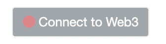
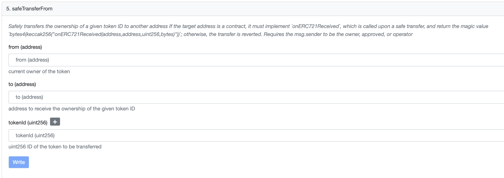

This guide will walk you through the process of changing the owner and signer address for your validator node.

## Change the owner address

1. Access StakingNFT smart contract.

      - Mainnet: https://etherscan.io/address/0x47Cbe25BbDB40a774cC37E1dA92d10C2C7Ec897F#writeContract
      - Amoy: https://sepolia.etherscan.io/address/0x72CF5618142Eb369E75ec6529A907e9A6Fe99bB7#writeContract

2. Click on the **Connect to Web3** button and login using the owner address of your validator node. 

      <center>
      {width=30%}
      </center>

3. You will see a list of functions appear. Click on **`safeTransferFrom`** function. This will be 5th function in the list. There will be 3 data fields that you will need to add information.

      <center>
      
      </center>

4. Here:

      - **from (address)** is your current owner address
      - **to (address**) is your new owner Address
      - **tokenId** is your validator ID

5. Fill in the relevant information and select **Write**. You will be prompted to sign a transaction. Ensure that you have sufficient ETH to make the transaction.

6. Upon signing the transaction your validator NFT will be transferred to the new owner address.

7. Log in to the [staking dashboard](https://staking.polygon.technology/) with the new owner address to verify the changes.

## Change the signer address

This guide refers to your current validator node as Node 1 and your new validator node as Node 2.

1. Log in to the [staking dashboard](https://staking.polygon.technology/) with the Node 1 address.

2. On your profile, select **Edit Profile**.

3. In the **Signer's address** field, enter the Node 2 address.

4. In the **Signer's public key** field, enter the Node 2 public key.

   To get the public key, run the following command on the validator node:

   ```sh
   heimdalld show-account
   ```

Selecting **Save** will save your new details for your node. This essentially means that Node 1 will be your address that controls the stake, where the rewards will be sent to, etc. And Node 2 will now be performing activities like signing blocks, signing checkpoints, etc.
